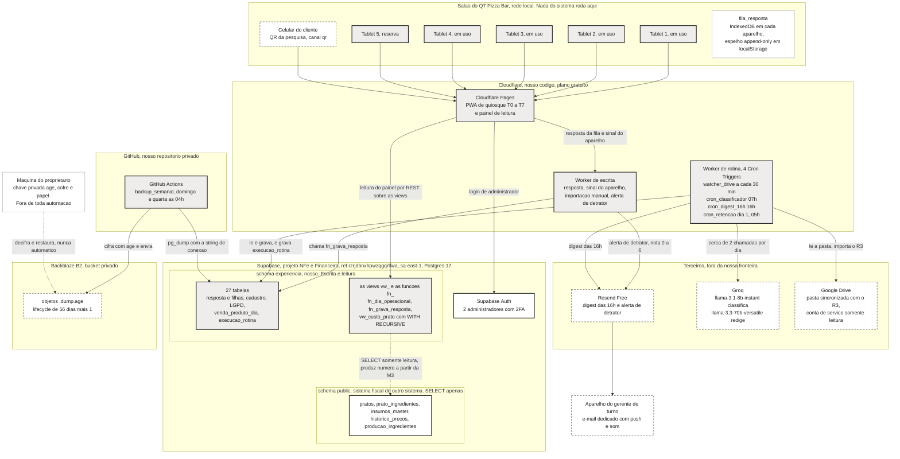
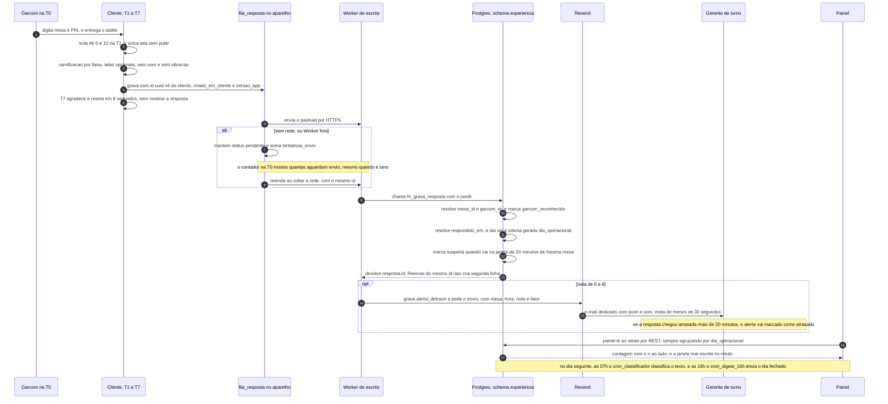

# Arquitetura de componentes

**Data:** 16/08/2026 · **Escopo:** desenho, não execução. **Nenhuma migration foi aplicada e nenhum DDL foi
executado para escrever este documento.** Todo SQL desta etapa é arquivo inerte no repositório até que a
condição 3 de `D2` (o `pg_dump` antes de qualquer migração) esteja cumprida e guardada fora do Supabase.

**Precedência:** este documento é nível 5 da tabela da seção 10 de [`00-canonico.md`](00-canonico.md). Ele não
renomeia nada da folha canônica, não cria número novo, e onde precisou de um nome que a folha não tem, o nome
está marcado com a nota **nome novo, não consta na folha canônica** e listado na seção 9.

---

## 1. A arquitetura em cinco linhas

1. O cliente responde num PWA de quiosque instalado em tablet próprio, e a resposta é gravada primeiro no
   próprio aparelho, em `fila_resposta`, antes de tentar sair da casa.
2. Um Worker no Cloudflare recebe essa fila e chama uma única função no Postgres, `fn_grava_resposta`, que
   resolve mesa, garçom, `respondido_em` e `dia_operacional` do lado do servidor e devolve idempotência pelo
   `id` gerado no cliente.
3. O banco é um schema dedicado, `experiencia`, dentro do projeto Supabase que já guarda o sistema fiscal, o
   que põe satisfação e custo por prato a um `JOIN` de distância e a nenhuma rotina de sincronização.
4. Quatro rotinas agendadas no Cloudflare e uma no GitHub Actions fazem tudo o que não é a resposta: importar
   a venda, classificar o texto, enviar o digest das 16h, anonimizar o dado pessoal e levar o `pg_dump`
   cifrado para fora do Supabase.
5. Tudo que é opcional (e-mail, LLM, Drive, backup, painel) pode cair sem parar a coleta, e cada parte
   opcional que cai tem que aparecer no e-mail das 16h ou em `execucao_rotina`.

**A filosofia, em uma frase:** nada que possa quebrar em silêncio fica no caminho da resposta, e o que quebra
fora dele é obrigado a dizer que quebrou.

---

## 2. Os componentes

### 2.1 Diagrama de componentes

Linha cheia e fundo claro é **nosso**. Linha tracejada é **de terceiro**. Cada caixa maior é uma **fronteira de
rede**: o que atravessa a borda atravessa a internet, sempre por HTTPS, exceto a conexão de `pg_dump`, que é
conexão Postgres com a string de conexão guardada em segredo do repositório.

**As cinco fronteiras de rede, ditas em texto porque diagrama não se busca por palavra:**

1. **A casa não hospeda nada.** Nenhuma máquina do salão escuta na rede, nenhum serviço abre porta, e o PC do
   caixa não é host de nada (ele desliga no fim do dia, o que está no briefing). Os tablets são clientes
   HTTPS de saída, e nada mais.
2. **O tablet nunca fala com o Supabase.** Ele só fala com o Cloudflare. Nenhuma credencial de banco vive no
   aparelho, e o bundle publicado não contém chave de serviço (`F58`).
3. **Cloudflare para Supabase** é a única travessia que carrega dado pessoal de cliente em volume, e ela é
   `sa-east-1` para `sa-east-1` na leitura e escrita do painel, e Cloudflare para São Paulo no Worker.
4. **Cloudflare para terceiro** acontece três vezes, sempre de dentro do Worker: Resend, Groq e Google Drive.
   Nenhum deles inicia conexão para nós. Não existe webhook de entrada em nenhum ponto do sistema.
5. **GitHub Actions é a única plataforma que fala Postgres direto**, porque precisa de `pg_dump`, e é também
   a única que fala com o Backblaze B2. O caminho de volta (decifrar e restaurar) sai da máquina do
   proprietário e nunca de um runner, porque a chave privada `age` não existe em plataforma nenhuma.

**Duas notas de leitura do diagrama, para ele não prometer o que o MVP não faz:**

- A aresta de `vw_custo_prato` para as tabelas de custo é tracejada de propósito. A **permissão** existe desde
  a primeira migration, porque é o que `D2` comprou, mas o **número** só aparece depois da entrega
  **Preencher `pratos` e `prato_ingredientes`**, na M3. Antes disso o painel escreve `ficha técnica ausente`
  em vez de custo zero, e escreve que a semântica de `rn`, `rendimento` e `rn_override` é `NÃO VERIFICADO`
  (`N46`).
- São **dois Workers e não um**, por uma razão só: o Worker de escrita está no caminho da resposta e não pode
  ser derrubado por deploy de rotina, nem competir com ela por invocação. Os quatro Cron Triggers ficam no
  Worker de rotina, com desvio pela expressão de cron, porque cada Worker a mais é um deploy a mais para
  esquecer. Nos dois arranjos o consumo é de **4 dos 5 Cron Triggers** que o plano gratuito dá (`N22`).

### 2.2 O caminho de uma resposta, do toque do cliente até o painel

**Quatro coisas que este caminho decide, e que valem mais que o diagrama:**

- **A resposta é considerada aceita no aparelho, não no servidor.** O cliente vê a `T7` mesmo sem rede, e é
  isso que impede que a falha de infraestrutura contamine exatamente a experiência que se está medindo
  (`F03`).
- **Quem resolve identidade é o servidor, sempre.** `mesa_digitada` e `garcom_pin_digitado` são preservados
  crus; `mesa_id`, `garcom_id` e `garcom_reconhecido` são resultado de resolução dentro de
  `fn_grava_resposta`. Mesa não reconhecida é `mesa_id is null`, PIN que não casa é
  `garcom_reconhecido = false`, e nos dois casos a resposta **entra** nos indicadores gerais.
- **O `dia_operacional` nasce coluna gerada de `respondido_em`, e não da hora do servidor.** É por isso que a
  resposta de 00h40 de quarta aparece como terça em toda tela e em todo e-mail, e é por isso que **não
  existe** consulta, view, função, Worker ou exportação que agrupe pela data crua de `criado_em`, o que a
  seção 9.3 da folha canônica lista como expressão proibida e é conferível por busca no repositório.
- **O que aparece na mesma noite é o alerta ao gerente, não o número do painel.** A folha canônica define
  `vw_hoje` sobre o **dia operacional fechado** (seção 6.2), e o corte fecha às 6h. Então a linha existe no
  banco em segundos e é consultável, mas o agregado da noite fecha de manhã. Isso está escrito aqui para não
  ser descoberto como bug.

### 2.3 O que o tablet precisa ler, e como ele lê sem credencial

O PWA precisa de quatro coisas que não estão no bundle: os itens ativos de `item_cardapio` para a `T3C2`, o
texto das perguntas sorteadas de `pergunta_banco`, a `versao_questionario` vigente e a versão vigente de
`consentimento_texto`. O Worker de escrita serve isso como um pacote único, que o service worker guarda em
cache, e é a mesma resposta HTTP para os cinco aparelhos.

Duas consequências declaradas, porque as duas são visíveis para quem opera:

1. **O sorteio da pergunta tem DUAS implementações, e isso é declarado e não acidental.** A afirmação
   anterior aqui — "vive no banco e não é copiado para o cliente" — nunca foi verdade: nada no
   sistema chama `fn_sorteia_pergunta`, e quem sorteia é o cliente. Elas existem porque o sorteio
   acontece no meio do fluxo, antes de a resposta existir, e o quiosque tem de funcionar sem rede.
   As duas implementam cinco das seis regras; a sexta (não repetir na mesma mesa na mesma noite) só
   existe no banco, porque depende do que outros aparelhos sortearam. Ver a seção 6.6 da folha
   canônica. Sem
   rede, o aparelho **pula as telas rotacionadas** e a resposta sai sem linha em
   `resposta_pergunta_sorteada`. A alternativa seria repetir as sete regras de sorteio dentro do PWA, o que
   criaria duas definições do mesmo sorteio, e duas definições é como se produz divergência que ninguém
   audita. A resposta offline é mais curta, e continua completa, porque completa é a nota (`F06`).
2. **A versão de consentimento gravada é a que foi exibida.** Se o texto mudar enquanto o aparelho estava sem
   rede, `versao_texto` aponta para a versão antiga, que é exatamente o que a prova de consentimento exige.

O sinal de vida do aparelho (`ultimo_sinal_em`, fila pendente e `versao_app` em `dispositivo`) é a segunda e
última escrita que o PWA provoca, a cada abertura e a cada 30 minutos (`F08`). Ela **não** cabe em
`fn_grava_resposta`, porque acontece sem resposta nenhuma. Proposta: uma função própria de escopo mínimo,
`fn_registra_sinal(jsonb) returns void` (**nome novo, não consta na folha canônica**), que só toca as colunas
de sinal de `dispositivo`. Com ela, a frase da folha canônica passa a ser "duas funções, e só duas, escrevem
por conta do PWA", e continua verdadeiro que o tablet não tem `INSERT` direto e não lê a base de clientes.

---

## 3. O que roda onde

Uma linha por componente. A coluna de descoberta é a mais importante da tabela, porque componente que cai sem
ser descoberto é o inimigo declarado do projeto.

| Componente | Plataforma | Plano | O que acontece se cair | Como se descobre que caiu |
|---|---|---|---|---|
| PWA de quiosque nos **5 tablets**, 4 em uso e 1 de reserva | Android com Fully Kiosk PLUS | Pagamento único, **8,90 EUR por aparelho**, 44,50 EUR no total | O aparelho para de coletar e os outros três seguem, então o total do dia parece normal | `ultimo_sinal_em` por aparelho em `vw_dispositivo_sinal` e linha nomeando o aparelho no e-mail das 16h, acima de **24 horas** sem contato |
| `fila_resposta` no aparelho | `IndexedDB` mais espelho em `localStorage` | Sem plano, é o navegador | Resposta pendente morre se os dados do navegador forem limpos. **É a única falha sem conserto do desenho** | Contador `X respostas aguardando envio` na `T0`, e fila acima de **5** por mais de **2 horas** no digest |
| Assets do PWA e do painel | Cloudflare Pages | Free, assets estáticos sem cobrança de banda | Aparelho já instalado continua abrindo pelo service worker. Aparelho novo não instala e o painel não abre | Falha visível na hora, ao abrir o painel no celular |
| Worker de escrita | Cloudflare Workers | Free, **100.000 requisições por dia**, **10 ms de CPU** | A resposta não sobe, fica em `fila_resposta`, e o alerta de detrator não sai naquela noite | Contador de fila na `T0`, mais a linha de fila pendente no digest |
| Worker de rotina, com **4 dos 5 Cron Triggers** | Cloudflare Workers Cron Triggers | Free, **5 por conta** | Digest, classificação, import e retenção param. A coleta continua inteira | Ausência do e-mail das 16h **dois dias seguidos**, e `vw_saude_rotina` sem execução nova |
| Banco, schema `experiencia` | Supabase Free, projeto `NFe e Financeiro`, `sa-east-1`, Postgres 17 | Free, **500 MB**, **pausa após 1 semana de inatividade**, **nenhum backup** | Nada grava e nada lê. A coleta sobrevive na fila local do aparelho | Ausência do digest, mais falha do `backup_semanal` com e-mail automático do GitHub |
| Login do painel | Supabase Auth | Free | Administrador não entra no painel. Coleta, alerta e digest seguem | Tentativa de login |
| Tabelas de custo lidas | mesmas Postgres, schema `public` | Mesmo projeto, **SELECT** apenas | `vw_custo_prato` não devolve custo | O painel escreve `ficha técnica ausente`, e nunca custo zero |
| E-mail | Resend Free | Free, **100 por dia**, **3.000 por mês**, log de **30 dias**. O digest usa 5 por dia | Digest e alerta não chegam. O keep-alive continua, porque consulta e envio são passos separados | `execucao_rotina` com o passo de envio em `erro`, e o alarme humano dos dois dias |
| LLM | Groq | Free, **14.400 por dia** no `llama-3.1-8b-instant` e **1.000 por dia** no `llama-3.3-70b-versatile` | Comentário sai sem categoria e o digest traz `diagnóstico indisponível hoje`, com os oito blocos completos | `execucao_rotina` de `cron_classificador` em `erro`, e a fila de não classificados em `/painel/saude` |
| Fonte do R3 | Pasta do Google Drive, conta de serviço somente leitura em uma pasta | Free | Bloco 7 não aparece e o cruzamento satisfação x faturamento some | `execucao_importacao.status = erro`, e cobrança no digest com arquivo ausente por **2 dias operacionais** |
| `backup_semanal` | GitHub Actions, repositório privado | Free, **2.000 minutos por mês**, consumo de cerca de **1,5%** | O dump da semana não sai. O dump anterior continua válido | E-mail automático de workflow falho, por causa do `set -euo pipefail`, e ausência de dump por **2 semanas** em `/painel/saude` |
| Destino do backup | Backblaze B2, bucket privado | Free, **primeiros 10 GB sempre grátis**, **sem cartão de crédito** | O envio falha e o job cai inteiro | Mesmo e-mail de workflow falho |
| Chave privada `age` | Gerenciador de senhas do proprietário mais cópia impressa no cofre do restaurante | Fora de toda plataforma, por desenho | **Nenhum backup é recuperável.** Não existe reanimação | **Só no teste de restauração.** É a única falha do sistema que não tem sintoma antes da hora em que ela importa |
| DNS do subdomínio, SPF e DKIM | Registrador do domínio do QT, **qual: NÃO VERIFICADO** | **NÃO VERIFICADO** | O digest cai em spam, e quem recebe conclui que o sistema não funciona | Ausência do e-mail, que é indistinguível de falha de rotina até alguém abrir a pasta de spam |

**Duas plataformas de execução, e não mais que duas** (`5.2` da folha canônica): Cloudflare para as quatro
rotinas e GitHub Actions para o backup, que precisa de `pg_dump`. Cada plataforma a mais é uma conta a mais
que expira em silêncio.

---

## 4. Decisões de arquitetura

Formato fixo: contexto, decisão, alternativas descartadas, consequência. Onde a decisão já é de `D1` a `D8`,
o registro aqui é a consequência de arquitetura dela, e não uma segunda decisão.

### ADR-01. Cloudflare Pages e Workers, e não Vercel

**Contexto.** O digest das 16h é obrigatório na primeira versão e o horário tem função operacional: chegar
**antes** de abrir, com a casa abrindo às 17h no sábado e no domingo. O agendamento é, portanto, requisito de
produto e não detalhe de hospedagem.

**Decisão.** Cloudflare Pages para os assets do PWA e do painel, Cloudflare Workers para a API e Cloudflare
Cron Triggers para as quatro rotinas.

**Alternativas descartadas.** **Vercel Hobby** sai por dois motivos independentes, e o primeiro é contratual:
o plano é `non-commercial, personal use only`, e um restaurante usando o sistema dele para operar é uso
comercial. O segundo é técnico: o cron do Hobby tem precisão de hora, mais ou menos 59 minutos, e expressão
mais frequente **falha no deploy**. Um relatório agendado para 16h chegando 16h59 transforma "leia antes de
abrir" em "leia enquanto abre". **Vercel Pro** resolve os dois e custa US$ 20 por desenvolvedor por mês, o
que contraria a decisão de custo do briefing. **Netlify Free** é tecnicamente possível, e os 15 créditos por
deploy de produção limitam o projeto a cerca de 20 deploys por mês. **`pg_cron` no Supabase Free** tem
detalhes de disponibilidade **NÃO VERIFICADO** e não entra como peça crítica. **GitHub Actions como cron
principal** sai porque o atraso de workflow agendado em horário de pico é conhecido e não tem garantia
documentada de pontualidade.

**Consequência.** Fica valendo o teto de **10 ms de CPU por invocação**, que é apertado. Espera de entrada e
saída não conta como CPU, então o Worker como orquestrador passa folgado, e o que estouraria é agregação em
memória. Daí a regra de desenho que atravessa o resto do sistema: **agregar no Postgres, em view, e deixar o
Worker só lendo o resultado.** Consequência secundária, que vai no README: subir este projeto no Vercel Hobby
"só para testar" é violação de termos, e é o erro mais fácil de cometer.

### ADR-02. Schema dedicado dentro de projeto existente, e não projeto novo

**Contexto.** A organização `QT Pizza Bar` é única e o teto de **2 projetos ativos** do plano gratuito **já
está atingido**, com `NFe e Financeiro` e `qt-avaliacoes` ativos e `Fichas Sensoriais` inativo. Ao mesmo
tempo, o custo de insumo já vive em Postgres dentro de `NFe e Financeiro`: `insumos_master` com 131 linhas e
`historico_precos` com 344.

**Decisão.** `D2`: a pesquisa vive no schema `experiencia`, dentro de `NFe e Financeiro`
(`rzrjdbnxhpwzqgqrlfwa`, `sa-east-1`), com papel próprio e RLS.

**Alternativas descartadas.** **Organização Supabase separada**, que era a recomendação do sumário executivo,
é inaplicável: existe uma organização e criar um quarto projeto no plano gratuito implica pausar outro.
**Viver em `qt-avaliacoes` com rotina diária copiando custo** cai por duas razões: adiciona uma peça móvel
num sistema que ninguém vai manter, e coloca dado pessoal de cliente brasileiro em `us-east-1`, que é
transferência internacional sem nenhum ganho. Região não se troca depois de criada.

**Consequência.** O diferencial nº 1 fica a um `JOIN` de distância e não existe rotina de sincronização de
custo. Em troca vêm quatro condições inegociáveis que atravessam tudo: nenhuma escrita fora do schema,
migration versionada sempre, `pg_dump` antes de qualquer migração, e `qt-avaliacoes` só pausado depois de
conferida a integridade das 74 linhas. E vem um risco novo, que fica registrado como risco: a restrição de
uso do Supabase é aplicada a **todos** os projetos da organização, com HTTP 402 em toda a API, então uma
consulta mal escrita da pesquisa é um problema do sistema fiscal também. É por isso que o consumo do schema
precisa ser visível no digest, e não descoberto num 402.

### ADR-03. PWA instalado, e não aplicativo nativo

**Contexto.** Cinco tablets Android de entrada, comprados fora, sem gestão de frota, sem loja de aplicativo
própria e sem ninguém para publicar atualização. O aparelho fica em modo quiosque com licença Fully Kiosk
PLUS, que é o que garante reabertura automática após reboot.

**Decisão.** PWA instalado pelo navegador, servido pelo Cloudflare Pages, com service worker e
`fila_resposta` em `IndexedDB`.

**Alternativas descartadas.** **APK com sideload** exige desativar o Play Protect, que é exatamente o atrito
que o app do fornecedor atual impõe hoje, e cria a tarefa de reinstalar cinco aparelhos a cada versão.
**Publicação em loja** exige conta de desenvolvedor, certificado e política de atualização, para um público de
cinco aparelhos da própria casa. **Aplicativo instalado pelo cliente**, que seria a porta para push, exige que
o cliente de uma pizzaria de bairro instale algo, o que não acontece.

**Consequência.** Atualizar o sistema é um deploy, e o aparelho pega a versão nova sozinho, o que casa com a
restrição de manutenção zero. O preço é que o navegador manda no armazenamento: despejo por pressão de disco
apaga o origin inteiro de uma vez, e limpar os dados do navegador com fila pendente mata a resposta. Daí o
espelho em `localStorage`, o `navigator.storage.persist()` na instalação, e o contador visível na `T0`. E daí
também a `versao_app` gravada em toda resposta, porque com cinco aparelhos é possível ter cinco versões
diferentes coletando na mesma noite.

### ADR-04. View de custo, e não cópia de custo

**Contexto.** O custo por prato não é soma plana: `producao_ingredientes.producao_id` aponta para
`insumos_master.id`, e insumo de tipo `producao_interna` tem lista própria de ingredientes. Numa pizzaria isso
não é detalhe, porque massa e molho são sub-receitas e são a maior parte do custo. Soma plana dá número
errado, subestimado ou zero.

**Decisão.** Uma view no schema `experiencia`, `vw_custo_prato`, com `WITH RECURSIVE`, lendo
`pratos`, `prato_ingredientes`, `insumos_master`, `historico_precos` e `producao_ingredientes` em modo
**somente leitura**, resolvendo o preço vigente numa data de referência por `historico_precos.data` e
`valor_unit_normalizado`, com `preco_unitario_fixo` como reserva.

**Alternativas descartadas.** **Copiar custo para uma tabela do schema `experiencia` por rotina diária** cria
uma peça móvel, duas fontes do mesmo número e a possibilidade de o painel cruzar satisfação com custo velho,
que é pior que não cruzar porque tem aparência de número certo. **Recalcular CMV dentro do sistema de
pesquisa** duplicaria a regra de cálculo que já vive nas skills, contra a instrução do briefing de manter a
ficha técnica separada. **Soma plana de `prato_ingredientes`** é expressão proibida pela folha canônica.

**Consequência.** O sistema de experiência **consome** custo e nunca o produz, e nunca escreve nas cinco
tabelas. O preço a pagar é que a view herda uma pendência: a semântica exata de `rn`, `rendimento` e
`rn_override` e a precedência entre eles é **NÃO VERIFICADO** (`N46`). Portanto a view sai com premissa
declarada e o painel escreve que o número não está conferido enquanto o proprietário não confirmar. Errar aqui
produz número com aparência de certo, que é pior que número ausente.

### ADR-05. O e-mail das 16h é o batimento cardíaco do sistema

**Contexto.** A restrição mais dura do projeto é que ninguém vai manter o sistema. Monitoramento que exige
alguém abrir uma tela não existe, porque ninguém abre. E o Supabase Free pausa o projeto após uma semana de
inatividade.

**Decisão.** `cron_digest_16h` acumula três funções na mesma peça: é o entregável diário, é o keep-alive do
banco e é o alarme de falha do sistema. Dentro dele, **a consulta ao banco e o envio do e-mail são passos
separados**, gravados em `execucao_rotina` separadamente. A regra de operação única do README é a que a folha
canônica registra em `N42`: **se o e-mail das 16h não chegar dois dias seguidos, algo quebrou.**

**Alternativas descartadas.** **Serviço de monitoramento externo** seria uma quarta plataforma com conta e
credencial próprias, para vigiar um sistema que já produz um sinal diário de graça. **Tela de saúde como
alarme** é a Central de Sincronização do fornecedor atual com outro nome: uma tela que alguém precisa lembrar
de abrir. **Alerta por push próprio** exige app instalado, que o ADR-03 já descartou.

**Consequência.** A ausência do e-mail é informação, e a presença dele também: o e-mail de `Nada a relatar`
tem no máximo **10 linhas** e existe para o digest não virar ruído ignorado no terceiro mês. O risco que vem
junto é o pior do projeto inteiro, e fica escrito: o digest **errar em silêncio**, saindo bonito com número
plausível e errado. As travas são de conteúdo, não de infraestrutura: um dia sem dado sai como um dia sem
dado, com essas palavras; casa fechada sai como `casa fechada` e não como `nenhuma resposta coletada`; e
comentário sem classificação sai sem categoria com aviso, nunca omitido. A falha correlacionada também fica
dita: se o Worker de rotina cair, o alarme cai junto com o sistema que ele vigia, e o único sinal que sobra
vem de fora, no e-mail automático de workflow falho do GitHub. Ele não é um segundo alarme desenhado por nós,
é sinal de outra plataforma, e é justamente por ser de outra plataforma que ele serve.

### ADR-06. O PIN do garçom é dado da resposta, e não autenticação

**Contexto.** A resposta pode ser gravada offline e enviada horas depois, então não existe validação no
momento do toque. E o tablet circula pelo salão, na mão de equipe que varia toda semana com extras.

**Decisão.** O PIN digitado na `T0` é gravado cru em `garcom_pin_digitado`, e a resolução acontece no
servidor: `garcom_id` quando casa, `garcom_reconhecido = false` quando não casa. A resposta com PIN não
reconhecido **entra** nos indicadores gerais e **não** entra no corte por garçom.

**Alternativas descartadas.** **Login de verdade por garçom**, com sessão e credencial, exigiria validação
online no momento do toque, o que a fila offline não permite, e colocaria credencial de equipe num aparelho
que circula. **Hash do PIN no tablet** é pior que não validar: guarda o material de ataque no aparelho mais
exposto do sistema, para comprar uma validação que a fila já impede de ser confiável. **Rejeitar a resposta
com PIN inválido** jogaria fora dado de satisfação legítimo por erro de digitação de um dígito.

**Consequência.** O PIN não protege nada, ele atribui atendimento, e isso está escrito no README para ninguém
tratar como segurança. Erro de digitação atribui a resposta a outro garçom existente, e não há como
distinguir isso de uso legítimo: é o motivo pelo qual o corte por garçom é **trimestral**, com `n` mínimo de
**20**, e para conversa de desenvolvimento, nunca para punição. A contagem de PIN não reconhecido por dia
aparece no painel e vira linha no e-mail quando passa de **3 no dia**.

### ADR-07. Groq, e não Gemini

**Contexto.** O que vai para o LLM é comentário aberto de cliente de restaurante, que com frequência contém
nome de garçom, nome de quem escreveu e situação identificável. O volume é minúsculo: **cerca de 2 chamadas
por dia, com teto de 10 em noite cheia**, mais **1 por dia** para redigir o diagnóstico.

**Decisão.** Groq, com `llama-3.1-8b-instant` para classificar e `llama-3.3-70b-versatile` para redigir.
Escolhido por **contrato de privacidade, e não por limite**: a cláusula do Groq proíbe usar entradas e saídas
para treino ou ajuste de modelo.

**Alternativas descartadas.** **Gemini no tier gratuito** sai pelo próprio termo, que pede literalmente para
não enviar informação pessoal, declara que o conteúdo é usado para desenvolver produtos e prevê revisão
humana. Os limites do tier gratuito dele, além disso, são **NÃO PUBLICADO** desde que a Google os retirou da
documentação. **Cerebras** tem crédito que expira em 30 dias e exige método de pagamento verificado.
**OpenRouter em modelos gratuitos** fica como camada de contingência, não como escolha. **Tier pago** de
qualquer fornecedor contraria o custo de R$ 0 declarado no briefing.

**Consequência.** O consumo fica em **menos de 0,1% da cota diária gratuita**, o que dá folga absurda e torna
o limite irrelevante para a decisão. Como free tier de LLM não é base contratual estável, a arquitetura paga
o seguro na forma de um **módulo único** com prompt, chamada e parser num só lugar, com `provedor`, `modelo` e
`versao_prompt` em `configuracao`, mais um modo de resposta fixa para testar o digest sem gastar cota. Trocar
de fornecedor custa uma configuração e um adaptador. E a regra que vale para qualquer fornecedor, presente ou
futuro: nenhum identificador direto vai no payload, com teste automatizado que reprova se o texto casar com
padrão de telefone brasileiro ou de e-mail.

### ADR-08. Backup no Backblaze B2, e não em artefato do GitHub Actions

**Contexto.** O plano gratuito do Supabase **não tem backup nenhum**. Sem um dump fora dele, "anos de
histórico" é promessa sem piso. E o dump leva a base de clientes inteira para fora do Supabase, o que faz
dele um compartilhamento de dado pessoal sob LGPD, e não um detalhe de operação.

**Decisão.** `D7`: bucket privado no Backblaze B2, com lifecycle nativa de `daysFromUploadingToHiding = 56` e
`daysFromHidingToDeleting = 1`, alimentado por `backup_semanal` no GitHub Actions, domingo e quarta.

**Alternativas descartadas.** **Artefato do GitHub Actions** era a primeira inclinação, por ter zero
credencial externa, e foi derrubado por texto dos Termos Adicionais, que veda `any other activity unrelated
to the production, testing, deployment, or publication of the software project associated with the
repository`, com punição que inclui suspensão de conta. A interpretação é **NÃO VERIFICADO**, e é defensável
argumentar que o backup do app é relacionado à produção dele. O que decide não é a probabilidade, é a
consequência: essa punição levaria **o repositório e os backups no mesmo evento**, que é exatamente o modo de
falha de fornecedor único pelo qual o Supabase Storage foi corretamente reprovado. **Cloudflare R2** é
tecnicamente o melhor produto e está fora por exigir forma de pagamento; ele volta à disputa no dia em que o
proprietário aceitar PayPal, Google Pay ou Apple Pay. **Supabase Storage** guarda o backup do banco no mesmo
fornecedor do banco, o que não é backup. **Bucket em nuvem que pede cartão** transforma estouro de cota em
fatura, quando o pior caso aceitável é o job falhar.

**Consequência.** Uma conta nova, dois segredos no repositório e uma regra de lifecycle configurada uma vez.
A credencial do B2 é presa ao bucket, com `writeFiles` e `listBuckets`, **sem** `readFiles`, **sem**
`deleteFiles` e **sem expiração**: se o segredo vazar, o atacante escreve lixo e não lê nem apaga nada. A
ausência de expiração é obrigatória, porque chave com prazo faria o backup morrer calado. Retenção de **8
semanas**, e a segunda função das duas execuções semanais está no ADR-10.

### ADR-09. Cifragem assimétrica com `age`, chave pública no runner

**Contexto.** O pacote que sai do runner contém nome, e-mail, WhatsApp e data de nascimento de cliente. O
runner é uma máquina de terceiro, efêmera, cujos segredos são legíveis por qualquer administrador do
repositório.

**Decisão.** `age` no modo assimétrico. A chave **pública** fica no repositório, como variable
`AGE_PUBLIC_KEY`. A chave **privada** nunca entra no GitHub em nenhuma forma, e vive em duas cópias offline:
gerenciador de senhas do proprietário e uma cópia impressa em papel no cofre do restaurante.

**Alternativas descartadas.** **`gpg` simétrico**, ou qualquer chave simétrica, é o erro que esta decisão
existe para não cometer: a mesma senha cifra e decifra, então o GitHub passaria a guardar o pacote cifrado e a
chave que o abre no mesmo lugar, e quem tivesse admin do repositório leria a base de clientes. **Cifragem no
destino, pelo provedor de armazenamento**, deixa o dado em claro no caminho e nas mãos do provedor.
**Nenhuma cifragem** é inaceitável para dado pessoal saindo do Supabase.

**Consequência.** O runner **escreve backup e não consegue ler nenhum, nem os que ele mesmo escreveu**, que é
exatamente a propriedade desejada. O preço é o único ponto do sistema que depende de disciplina humana: sem a
chave privada, nenhum backup é recuperável, e é por isso que existe a cópia em papel. Essa é também a única
falha do sistema sem sintoma prévio, e o teste de restauração é a única forma de descobri-la antes da hora em
que ela importa: uma restauração antes do go-live é piso, uma por trimestre é o recomendado por cima, e a
divergência entre as duas leituras está declarada de propósito na folha canônica.

### ADR-10. Não existe rotina dedicada a manter o banco acordado

**Contexto.** Projeto gratuito do Supabase é pausado após **1 semana de inatividade**, e projeto pausado é
sistema morto sem ninguém para reanimar. A tentação óbvia é criar uma rotina que só toca o banco.

**Decisão.** Nenhuma rotina é criada só para manter o banco acordado, e **não existe rotina
`cron_keepalive`**, que é expressão proibida. Entre a criação do schema e a entrada do digest, quem segura o
banco acordado é a escrita do próprio `backup_semanal` em `execucao_rotina`, **duas vezes por semana, domingo
e quarta**. Depois que o digest das 16h existe, ele passa a ser o keep-alive, e o backup segue sendo backup.

**Alternativas descartadas.** **Uma quinta rotina só de ping** seria a quinta peça a quebrar em silêncio, e
uma peça cuja única falha visível é a que ela existe para prevenir. **Uma execução semanal única de backup**
encostaria no limite: a pausa acontece após uma semana de inatividade, e um domingo perdido já seria risco.
**Manter o banco acordado pelo tráfego da coleta** não funciona, porque a casa fecha segunda e pode fechar
mais dias por feriado, e porque a coleta pode ficar dias sem resposta sem que isso seja falha.

**Consequência.** Duas plataformas diferentes escrevem no banco em cadências diferentes, o que é redundância
de graça: se o Cloudflare cair inteiro, o GitHub Actions continua escrevendo duas vezes por semana; se o
GitHub cair, o digest escreve todo dia. A leitura de diagnóstico que vem junto está no procedimento de
reanimação: **projeto pausado quer dizer que o backup também parou**, porque as duas execuções semanais
existem justamente para isso, e são o mesmo problema. E sobra **1 Cron Trigger** dos 5, que não é para
keep-alive.

### ADR-11. Um único caminho de escrita do PWA, por função no banco

**Contexto.** O tablet é o componente mais exposto do sistema: fica na mão do cliente, circula pelo salão e
tem o bundle publicado legível por qualquer pessoa. E a mesma gravação precisa resolver identidade, decidir
`respondido_em`, gerar `dia_operacional`, marcar `suspeita` e disparar o alerta de detrator.

**Decisão.** O PWA envia o payload ao Worker de escrita, e o Worker chama `fn_grava_resposta(jsonb)`, que faz
tudo isso numa transação e devolve o `id`. A idempotência é o `id` uuid v4 **gerado no cliente**: reenvio do
mesmo `id` não cria segunda linha. O alerta de detrator dispara na gravação, e não em rotina.

**Alternativas descartadas.** **O tablet escrevendo direto no Supabase por REST** exigiria uma credencial no
aparelho com permissão de `INSERT` em várias tabelas, e essa credencial vaza pelo bundle. **`INSERT`
espalhado em várias tabelas pelo Worker**, sem função, faria a regra de resolução viver em código de
aplicação, onde uma segunda implementação aparece na primeira pressa. **Fila com sincronização
bidirecional** foi descartada por desenho: a fila é de mão única, o tablet só escreve, e não existe
resolução de conflito.

**Consequência.** O Worker fica fino, o que respeita os 10 ms de CPU, e as regras de gravação ficam num lugar
só, versionado por migration. O tablet não tem `INSERT` direto e não lê a base de clientes. A honestidade que
vem junto está na seção 2.3: o sinal de vida do aparelho é uma segunda escrita, sem resposta associada, e
precisa da própria função de escopo mínimo, `fn_registra_sinal` (**nome novo, não consta na folha canônica**).

### ADR-12. O arquivo bruto do R3 fica na linha de `execucao_importacao`, e não em bucket

**Contexto.** Um import que falha em parsear precisa deixar para trás o arquivo exato que falhou, senão o
diagnóstico é adivinhação e o reprocessamento é impossível. O tamanho esperado de um R3 é de dezenas de KB, e
o número real é **NÃO VERIFICADO**.

**Decisão.** O arquivo bruto é gravado em coluna de bytes na própria linha de `execucao_importacao`, **antes**
de ser interpretado, junto do hash, das linhas lidas e do erro.

**Alternativas descartadas.** **Bucket de Storage** é mais uma superfície, com credencial e política de acesso
próprias, e cria a pergunta de quem apaga o que lá dentro. **Não guardar o arquivo** transforma qualquer
mudança de layout do relatório num erro sem prova. **Guardar só o hash** identifica reimportação e não
permite reprocessar.

**Consequência.** O reprocessamento de um dia é uma consulta ao próprio banco, e a idempotência por data
continua valendo: reimportar o mesmo arquivo não duplica linha nenhuma. O preço fica declarado para não ser
descoberto como surpresa: **não existe poda desses bytes no MVP**, e eles contam nos 500 MB do plano
gratuito.

---

## 5. O modelo de falha

Esta é a seção que decide se a restrição de manutenção zero é premissa ou ficção. Três avisos antes da
tabela, e os três valem como regra de leitura:

- **Quem age é pendência do proprietário.** Quem responde em primeiro lugar, com nome, é a pendência da seção
  11 da folha canônica. Enquanto ninguém for nomeado, o dono é o proprietário **por omissão, e não por
  escolha**, o que é o pior arranjo possível para um sistema que ninguém vai manter. A coluna abaixo registra
  o dono proposto, não o decidido.
- **O procedimento é o mínimo, e nada além dele.** Quatro passos servem para quase tudo, na ordem: ler
  `execucao_rotina` no banco para saber se a rotina rodou e falhou ou não rodou; despausar o projeto pelo
  painel do Supabase; rodar a migration pendente a partir do repositório; restaurar o dump mais recente. O
  passo 1 é o que separa problema de e-mail de problema de banco, e sem ele os três seguintes são chute.
- **Duas falhas não têm reanimação, e estão marcadas como tal.** Fingir que têm seria a pior linha deste
  documento.

| Modo de falha | Como se manifesta | Como é detectado | Quem age, proposto | Procedimento mínimo de reanimação |
|---|---|---|---|---|
| **Queda de tablet**: quebrado, furtado, descarregado ou com tela morta | Um dos quatro pontos para de coletar. O total do dia continua parecendo normal, porque os outros três coletam | `ultimo_sinal_em` acima de **24 horas** em `vw_dispositivo_sinal`, e linha em destaque no e-mail das 16h nomeando o aparelho e a hora do último sinal | Gerente de turno | Pôr o **tablet de reserva** em serviço, registrar a troca em `dispositivo` (o novo em `em_uso`, o morto com `removido_em`), e conferir no digest do dia seguinte que o sinal voltou. A fila pendente do aparelho morto pode ser perda definitiva, e isso é declarado |
| **Tablet mudo**: ligado, mas app fechado, fixação de tela perdida, Wi-Fi caído ou navegador com dados limpos | Igual ao de cima, e mais insidioso, porque o aparelho está visível e aparentemente bem | Mesmo heartbeat por aparelho, mais respostas por dispositivo em `vw_coleta_dia`, mais o teto de **30 respostas por dispositivo por dia** que vira aviso no digest | Gerente de turno | Reabrir o app (a licença Fully Kiosk PLUS reabre após reboot), reativar a fixação de tela, e conferir o contador de fila na `T0`. Se o navegador limpou dados, a fila pendente daquele aparelho já se foi |
| **Banco pausado** por 1 semana de inatividade, ou restrito por HTTP 402 na organização inteira | Escrita falha e o PWA enfileira. Painel não abre. Digest não sai. No caso do 402, o **sistema fiscal cai junto** | Ausência do e-mail das 16h dois dias seguidos, mais falha do `backup_semanal` com e-mail automático do GitHub. As duas coisas juntas são a assinatura da pausa | Proprietário ou o segundo administrador | Despausar pelo painel do Supabase e conferir que o digest do dia seguinte chegou. É a falha mais provável do desenho e a única que não perde dado, porque a fila local segurou as respostas. No caso do 402, tratar como incidente do projeto inteiro, e não da pesquisa |
| **Falha de importação do R3**: arquivo não exportado, layout mudado, credencial da conta de serviço revogada | Bloco 7 do digest não aparece, e o cruzamento satisfação x faturamento fica como **lacuna explícita**, nunca como zero | `execucao_importacao.status = erro` com a mensagem, mais cobrança no digest quando o arquivo falta por **2 dias operacionais** | Proprietário, na mesma rotina em que já exporta o R3 | Usar o **botão de importar planilha** em `/painel/importar`, que tem o mesmo parser e funciona no celular. Se foi o layout, o arquivo bruto está guardado na linha de `execucao_importacao` e permite reprocessar depois de corrigir o parser |
| **Falha de LLM**: cota, política do fornecedor, API fora do ar | Comentário sem categoria e a linha `diagnóstico indisponível hoje`. O digest sai **completo**, com os oito blocos | `execucao_rotina` de `cron_classificador` em `erro`, e a fila de comentários não classificados em `/painel/saude` | Ninguém, no mesmo dia | Nenhuma ação urgente: o texto cru já está em `resposta_texto` e a classificação é retentada na próxima execução. Se a política mudou de vez, trocar `provedor` e `modelo` em `configuracao`, no módulo único |
| **Falha de e-mail**: Resend fora, cota estourada, SPF ou DKIM errados, endereço inválido | O digest não chega, e o alerta de detrator não chega. **O keep-alive continua**, porque a consulta e o envio são passos separados | `execucao_rotina` com o passo de envio em `erro` enquanto o passo de consulta está em `sucesso`. Esse par é a assinatura exata da falha de entrega | Proprietário | Conferir a pasta de spam antes de tudo, depois SPF e DKIM no subdomínio, depois a cota do dia. A próxima execução tenta de novo sozinha. Nada se perde, porque o dado do dia continua no banco |
| **Falha de backup**: senha do banco rotacionada, chave do B2 revogada, versão do `pg_dump` incompatível, cota do Actions | O job fica vermelho e nenhum objeto novo chega ao bucket | E-mail automático de workflow falho para o dono do repositório, garantido pelo `set -euo pipefail`, mais ausência de dump por **2 semanas** em `/painel/saude` | Proprietário ou o segundo administrador | Corrigir o segredo e rodar o workflow à mão. O dump anterior continua válido: perder uma execução não perde dado, perder oito semanas seguidas sim. A versão do cliente Postgres é **fixada no workflow**, e não herdada da imagem do runner |
| **Credencial expirada ou revogada**: conta de serviço do Drive, chave do Resend, chave do Groq, senha do Postgres | Depende de qual: import para, e-mail para, classificação para, ou tudo que não é a coleta para | Cada uma tem sintoma próprio nas linhas acima. A credencial do B2 é a única desenhada **sem expiração**, de propósito, porque chave com prazo faria o backup morrer calado | Proprietário | Gerar credencial nova, trocar o segredo na plataforma correspondente e rodar a rotina à mão uma vez. Nenhuma credencial do sistema é compartilhada entre duas funções, o que limita o estrago de um vazamento isolado |
| **Fila local apagada** com resposta pendente | A resposta simplesmente não existe em lugar nenhum | Nada. Só o contador da `T0` teria mostrado antes | Ninguém | **Não existe.** É a única falha de coleta sem conserto, e por isso existem o espelho em `localStorage`, o `navigator.storage.persist()` e o contador visível |
| **Chave privada `age` perdida** | Nada, até o dia em que alguém precisar restaurar | **Só no teste de restauração** | Proprietário | **Não existe.** Nenhum backup é recuperável. É o ponto do sistema que depende de disciplina humana, e o motivo da cópia impressa no cofre |
| **DNS, SPF ou DKIM quebrados** no subdomínio | O digest cai em spam, e a conclusão de quem recebe é que o sistema não funciona | Indistinguível de falha de rotina até alguém abrir a pasta de spam. `execucao_rotina` mostra envio em `sucesso`, o que aponta para entrega e não para o sistema | Proprietário | Corrigir os registros no DNS. É trabalho de uma vez, e é a diferença entre adoção e abandono na segunda semana |
| **Ninguém preenche `mesa_atendida_dia`** | O painel escreve `denominador ausente` e não mostra percentual nenhum | Cobrança no digest quando o campo fica **3 dias** vazio | Gerente de turno, no fechamento do caixa | Preencher os dias em falta no painel. Sem isso a conversão não existe, e "coletar mais que hoje" deixa de ser mensurável, que é o critério de sucesso nº 2 |

### 5.1 A falha que nenhum alarme pega

O digest sair no horário, bonito, com número plausível e errado. Nenhuma das doze linhas acima detecta isso,
porque todas dependem de algo ter falhado de forma observável. As três defesas são de conteúdo, e estão
espalhadas de propósito pelo desenho: **um dia sem dado sai escrito como um dia sem dado**; todo número do
digest vem com o `n` e com o comparável ao lado, e a seta não aparece quando a diferença é menor que a mínima
detectável; e o diagnóstico escrito pela IA não faz aritmética, recebendo só agregados já calculados, de modo
que o pior caso é uma frase mal escrita sobre números corretos. Se o diagnóstico trouxer um número que não
está em nenhum bloco do e-mail, é bug e o aceite reprova.

---

## 6. Como o sistema degrada

**A regra, que vale sobre qualquer linha da tabela:** o núcleo é coletar e guardar a resposta, e ele é feito
de quatro peças, `T0` a `T7` no aparelho, `fila_resposta`, o Worker de escrita e `fn_grava_resposta` no
Postgres. **Nenhuma peça opcional pode estar no caminho dessas quatro.** Toda linha abaixo é uma verificação
dessa regra.

| Falha | O que para de funcionar | O que continua funcionando |
|---|---|---|
| **Resend fora** | Digest das 16h e alerta de detrator em tempo real. Com isso, o alarme do sistema fica cego | Coleta, gravação, `alerta_detrator` gravado no banco, painel, keep-alive, backup. O alerta perdido reaparece no bloco 2 do digest do dia seguinte |
| **Groq fora ou sem cota** | Classificação frase por frase e o diagnóstico escrito | Tudo o mais. O digest sai com os oito blocos, os comentários aparecem **sem categoria** e com aviso, e o texto cru fica intacto para reprocessar. Teste de aceite existe para isso: apagar a chave e rodar o digest, que tem que sair |
| **Google Drive fora, ou ninguém exportou o R3** | Bloco 7 do digest, cruzamento satisfação x faturamento, e o denominador de venda por item | Coleta, painel, alerta, digest com sete blocos, e o botão de importar planilha como caminho manual permanente |
| **GitHub Actions ou B2 fora** | O `pg_dump` da semana, e o keep-alive de reserva | Tudo o que o usuário vê. O dump anterior continua válido no bucket, com retenção de 8 semanas |
| **Worker de rotina fora** | As quatro rotinas de uma vez: import, classificação, digest e retenção. E o keep-alive do digest | Coleta e alerta de detrator, porque eles vivem no **outro** Worker. E a escrita de `backup_semanal` continua acordando o banco duas vezes por semana |
| **Worker de escrita fora** | A subida da resposta e o alerta de detrator daquela noite | A coleta inteira, dentro do aparelho: as respostas entram em `fila_resposta` com `status` pendente, o cliente vê a `T7` normal, e o contador da `T0` mostra quantas aguardam. Ao voltar, sobem sozinhas, sem ação humana e sem duplicar |
| **Supabase pausado ou fora** | Painel, digest, alerta, import, classificação, retenção. Ou seja, tudo o que é leitura e tudo o que é rotina | **A coleta.** O aparelho aceita resposta, guarda na fila e agradece. É o teste mais duro da regra do núcleo, e é o motivo pelo qual a fila existe mesmo com a internet do salão sendo estável |
| **Cloudflare Pages fora** | Instalação em aparelho novo e abertura do painel | O aparelho já instalado continua abrindo pelo service worker, e continua coletando |
| **Internet da casa fora** | Tudo o que atravessa a fronteira | A coleta nos cinco aparelhos, cada um com a própria fila. O QR da pesquisa no celular do cliente para de funcionar, porque ele depende da rede dele ou da casa |
| **Ninguém executa os deveres humanos recorrentes** | Conversão sobre mesas atendidas, cruzamento com faturamento, rotação das perguntas em foco e a referência externa trimestral | Coleta, alerta ao gerente, distribuição em três faixas, corte por garçom e o e-mail das 16h. **O sistema roda sozinho, o painel completo não**, e das seis tarefas só as duas diárias têm alarme possível |

Duas leituras que essa tabela obriga a fazer, e as duas são desconfortáveis o bastante para ficar escritas:

1. **A degradação mais grave não é de disponibilidade, é de leitura.** Perder o Groq custa categoria de
   comentário. Perder o R3 custa o terceiro item obrigatório da primeira versão. Perder quem preenche
   `mesa_atendida_dia` custa o critério de sucesso nº 2. Nenhuma dessas três aparece como erro para quem
   olha o painel de longe, e é por isso que cada uma tem uma linha de cobrança escrita no digest.
2. **A única falha que atinge o núcleo é local ao aparelho.** Nada na nuvem consegue derrubar a coleta,
   porque a coleta não espera resposta da nuvem. O que a derruba é o navegador do tablet perder os dados, e
   isso não tem conserto, só prevenção.

---

## 7. Ambientes

### 7.1 O fato que decide, dito antes da proposta

**Não existe, e não vai existir, um projeto Supabase de teste.** O teto de **2 projetos ativos** da
organização já está atingido, e o slot que `qt-avaliacoes` libera ao ser pausado está prometido a trazer
`Fichas Sensoriais` de volta do estado inativo, que é um ganho declarado de `D2`. Gastar esse slot com um
ambiente de teste seria trocar um ativo real da casa por conveniência de construção.

Duas consequências imediatas: **branching do Supabase** não entra no caminho, porque a disponibilidade e o
preço dele no plano gratuito são **NÃO VERIFICADO** e porque ele criaria mais uma peça para alguém esquecer
ligada; e **não existe cópia do banco de produção com dado real de cliente em lugar nenhum**, o que é bom
para LGPD e ruim para depurar, e as duas metades dessa frase são verdadeiras.

### 7.2 O caminho prático, em três camadas

| Camada | O que é | Para que serve, e o que ela não cobre |
|---|---|---|
| **1. Banco local em contêiner** | Postgres 17 numa máquina local, com as migrations do repositório aplicadas **do zero**, na ordem, e depois o dump restaurado por cima | É onde toda migration é ensaiada antes de tocar `NFe e Financeiro`. Cobre schema, view, função, papel, RLS e o comportamento de `fn_dia_operacional` nos cinco casos de borda da folha canônica. **Não cobre** cota, latência de `sa-east-1`, Cron Trigger nem entrega de e-mail |
| **2. Schema de ensaio no mesmo projeto** | `experiencia_ensaio` (**nome novo, não consta na folha canônica**), criado por migration e derrubado por migration quando o ensaio termina | É a única forma de ensaiar `vw_custo_prato` contra as **tabelas de custo reais**, que é o que a camada 1 não tem. Regras que vêm com ele: **nunca** recebe dado pessoal de cliente, **nunca** é lido pelo painel, e ocupa os mesmos **500 MB** do plano gratuito, então sai assim que o ensaio acaba |
| **3. Pré-visualização na nuvem** | Deploy de pré-visualização do Cloudflare Pages por branch, apontando para um Worker de ensaio com variável de ambiente própria, que fala com a camada 2 | É onde o PWA é testado em tablet de verdade, com toque de verdade, que é a única forma de conferir alvo de 44 px, ausência de rolagem e transição abaixo de 2 segundos. Cota e disponibilidade da pré-visualização no plano gratuito: **NÃO VERIFICADO** |

**A economia elegante deste arranjo:** a camada 1 é o mesmo exercício que `backup_semanal` já obriga a fazer,
porque backup não testado não é backup. Restaurar o dump num banco vazio **é** montar o ambiente de teste.
Uma obrigação de sobrevivência paga um ambiente de desenvolvimento, e nenhuma das duas custa slot de projeto,
cartão de crédito nem plataforma nova.

### 7.3 O que não se testa em ambiente nenhum, e como se compensa

| O que | Por que não se testa | Como se compensa |
|---|---|---|
| O Cron Trigger das 16h acertando o minuto | Só existe em produção | Disparo manual do Worker de rotina, mais a conferência do horário real de chegada nos primeiros dias |
| A entrega do e-mail em caixa real, com SPF e DKIM | Depende do DNS do subdomínio definitivo, que depende do nome do produto (`P6`) | Envio real para um endereço de teste antes do go-live. Consome da cota de 100 por dia, e a folga é de 20 vezes |
| O push e o som no aparelho do gerente | Depende do aparelho da pessoa e da configuração dela | Teste único antes do go-live, com o aparelho bloqueado e na tela inicial, já exigido na definição de pronto. Se a casa recusar aparelho com push em serviço, fica registrado e o alerta em tempo real vira Fase 3 |
| A restauração do dump cifrado | Exige a chave privada `age`, que não existe em plataforma nenhuma | Uma restauração antes do go-live é piso, e uma por trimestre é o recomendado por cima. Sem dono nomeado, a linha honesta a escrever é "restauração única, e o backup fica sem verificação a partir do segundo trimestre" |
| O sistema sob serviço real, com garçom ocupado e noite cheia | Nenhum ambiente reproduz isso | O **ensaio de aceite de três noites de serviço real**, com o e-mail das 16h saindo nos três dias seguintes, que é o ambiente de teste de verdade deste projeto e acontece **antes** do e-mail de cancelamento |

---

## 8. O que explicitamente NÃO existe nesta arquitetura

Lista fechada, com o motivo ao lado. Ela existe para que ninguém preencha o vazio com invenção, e para que
quem propuser um desses itens no futuro tenha que argumentar contra um motivo escrito, e não contra um
esquecimento.

| O que não existe | Por que não existe |
|---|---|
| **Servidor, agente ou Raspberry Pi no salão** | Ponto de falha físico (cartão SD, energia, Wi-Fi) para uma tarefa que um cron na nuvem faz de graça. A casa não hospeda nada, e o PC do caixa desliga no fim do dia |
| **Aplicativo nativo, APK ou publicação em loja** | ADR-03. Exigiria desativar o Play Protect ou manter conta de desenvolvedor, e criaria a tarefa de reinstalar cinco aparelhos por versão |
| **Projeto Supabase novo, ou organização separada** | Teto de 2 ativos já atingido, e o `JOIN` com o custo é o motivo positivo de ficar onde está |
| **Rotina de cópia de custo, ou tabela própria de custo** | ADR-04. Duas fontes do mesmo número, e a chance de cruzar satisfação com custo velho |
| **Rotina `cron_keepalive`, ou qualquer sexta rotina** | ADR-10. São cinco rotinas, e uma sexta entra na folha canônica antes de existir em código |
| **API do Google Business Profile e API do iFood** | `D3`, nem no MVP nem na Fase 2. Somem a aprovação de terceiro, o prazo oficial de até 14 dias, a proibição dos termos do Maps de armazenar avaliação e a exigência de CNAE de tecnologia. O painel leva até os perfis por dois links, e nada mais |
| **Convite ao Google em qualquer tela da pesquisa** | `D6`: os dois QR são fisicamente separados, e o do Google não tem nota no caminho. Sem nota no caminho não existe filtro por nota, e é a separação física que garante a conformidade. A `T7` só agradece |
| **Vercel, em qualquer plano gratuito** | ADR-01. Uso comercial proibido no Hobby, e cron com precisão de hora |
| **Bucket de Storage, no Supabase ou fora** | ADR-12 para o R3, e ADR-08 para o backup. Cada bucket é uma superfície com credencial e política própria |
| **Endpoint REST próprio escrito à mão para leitura** | O Supabase já entrega REST autenticada. O Worker existe para escrever e orquestrar, não para reimplementar leitura |
| **Sincronização bidirecional, ou resolução de conflito na fila** | A fila é de mão única: o tablet só escreve. Idempotência pelo `id` do cliente resolve reenvio, que é o único conflito real |
| **Autenticação de garçom, hash de PIN ou lista de PIN no tablet** | ADR-06. O PIN atribui atendimento, não protege nada |
| **`fingerprinting` do celular do cliente** | Tratamento oculto: o titular não pode se opor ao que não sabe que existe. O aparelho identificado é o **da casa**, em `dispositivo` |
| **WhatsApp, push próprio e SMS como canal** | WhatsApp é Fase 3, push exige app instalado, e SMS cobra por mensagem, sendo a única linha que transformaria sucesso em fatura crescente |
| **Meta, ranking, semáforo ou bônus por nota** | `D8`, por dois motivos independentes: contamina o dado e é proibido por texto oficial do Google. É o item que mais provavelmente vai ser proposto no futuro, e o que deve ser barrado com mais firmeza |
| **Texto livre virando SQL, conversa com os dados no MVP** | Erra em silêncio, devolvendo número plausível e errado que ninguém vai auditar. Na M3 entra como conjunto fixo de perguntas com consulta escrita e revisada |
| **Raspagem de avaliação de concorrente** | Quebra em silêncio a cada mudança de página e esbarra nos termos do Maps. O substituto é anotar a nota de 4 pizzarias comparáveis, 1 vez por trimestre |
| **Chave simétrica no backup, e chave privada no runner** | ADR-09. Guardaria o pacote e a chave que o abre no mesmo lugar |
| **Artefato do GitHub Actions como destino do backup** | ADR-08. A punição prevista levaria repositório e backups no mesmo evento |
| **Cartão de crédito em qualquer conta do sistema** | Sem meio de pagamento, o pior caso de estouro de cota é o job falhar, nunca uma fatura. É o critério que tirou o Cloudflare R2 da disputa |
| **Terceira plataforma de execução** | Duas, e não mais que duas. Cada uma é uma conta que pode expirar em silêncio |
| **Multi-tenant, multi-unidade e comparação entre lojas** | Uma casa. Vinte e três das 54 funcionalidades do produto atual não fazem diferença para uma unidade, e é essa conta que se cancela |
| **DDL ad hoc pelo painel do Supabase** | Condição 2 de `D2`. O repositório é a única fonte de schema, e migration aplicada nunca é editada: correção é migration nova |

---

## 9. Nomes novos usados neste documento

Dois, e só dois. Os dois seguem a convenção da seção 8 da folha canônica (português sem acento, snake_case,
prefixo `fn_` para função) e **precisam entrar na folha canônica antes de aparecer em SQL ou em código**.

| Nome | O que é | Onde este documento o usa | Nota |
|---|---|---|---|
| `fn_registra_sinal(jsonb) returns void` | Função de escopo mínimo que atualiza só as colunas de sinal de `dispositivo`: `ultimo_sinal_em`, fila pendente e `versao_app` | Seções 2.3 e ADR-11 | **Nome novo, não consta na folha canônica.** Existe porque o heartbeat é uma escrita sem resposta associada, e portanto não cabe em `fn_grava_resposta`. Com ela, a regra passa a ser "duas funções, e só duas, escrevem por conta do PWA" |
| `experiencia_ensaio` | Schema temporário de ensaio, criado e derrubado por migration, no mesmo projeto | Seção 7.2 | **Nome novo, não consta na folha canônica.** Nunca recebe dado pessoal de cliente e nunca é lido pelo painel |

Os dois Workers do Cloudflare são citados neste documento por função (**Worker de escrita** e **Worker de
rotina**) e não por nome de deploy, de propósito: a folha canônica não fixa nome de Worker, e se o nome do
deploy for fixado, ele entra na folha primeiro.
