# Modelo de dados

**Data:** 17/08/2026 · **Escopo:** desenho, não execução. **Nenhuma migration foi aplicada e nenhum DDL foi
executado para escrever este documento.** Os catorze arquivos de
[`supabase/migrations/`](../../supabase/migrations/) são arquivo inerte no repositório até que a condição 3 de
`D2` esteja cumprida: o `pg_dump` do projeto `NFe e Financeiro` feito e guardado fora do Supabase.

**Precedência:** este documento é nível 5 da tabela da seção 10 de [`00-canonico.md`](00-canonico.md). Ele não
renomeia nada da folha canônica e não cria número novo. A folha canônica autoriza, na seção 3.4, que o modelo
de dados **acrescente** coluna, índice e restrição, com uma condição: o que ele acrescentar entra na folha na
mesma passada. Tudo que este documento acrescenta está listado na seção 9, nome por nome, para essa edição
poder ser feita de uma vez.

**A regra de julgamento, que decide todos os casos difíceis daqui:** ninguém vai manter este sistema depois de
pronto. Por isso a restrição está no banco e não na convenção de consulta, o domínio fechado está em `CHECK` e
não no comentário, e a coluna gerada existe para que a consulta certa seja mais fácil de escrever que a errada.

---

## 1. Os dois grãos, e por que eles não se juntam por comanda

O modelo tem **dois grãos**, e todo o resto é filha de um deles.

| Grão | Tabela raiz | Uma linha é | O que ela sabe | O que ela nunca vai saber |
|---|---|---|---|---|
| **A resposta** | `resposta` | uma resposta enviada por um cliente | nota, mesa digitada, PIN digitado, canal, dispositivo, idioma, instante do toque | quanto aquela mesa consumiu |
| **A venda do dia** | `venda_produto_dia` | um produto em um dia operacional | unidades e valor líquido por produto, na data que o R3 informa | quem consumiu, em que mesa, em que comanda |

As duas se encontram em **um lugar só: `dia_operacional`**. Não existe junção por comanda, por mesa nem por
horário, e as três razões são independentes, o que significa que resolver uma não libera as outras:

1. **Se o R3 traz comanda é `DESCONHECIDO`.** É a pergunta 4 do bloqueio `A1`, ao suporte da Altec, e o
   cronograma não espera por ela. Desenhar a junção contra um campo que talvez não exista é construir uma
   dependência que quebra no dia da primeira importação.
2. **A casa junta mesas e emite comandas individuais.** Mesmo com comanda no relatório, uma resposta não tem
   comanda: quem responde é uma pessoa da mesa, a mesa pode ser duas mesas juntadas, e as comandas podem ser
   quatro. Não existe função de um para um para descobrir.
3. **O corte do dia dentro do Altec é `NÃO VERIFICADO`** (seção 4.8 da folha canônica). Se o Altec fechar o dia
   à meia-noite, uma venda lançada às 00h30 cai no dia seguinte no R3 enquanto a resposta da mesma mesa cai no
   dia anterior na pesquisa, porque o corte da pesquisa é às 6h. A divergência possível fica escrita aqui, na
   tabela `venda_produto_dia` e na tela, em vez de ser corrigida por adivinhação.

**A consequência que vale como regra de leitura de todo o painel:** o cruzamento satisfação com faturamento é
**do dia**, e nenhuma tela promete mais que isso. `vw_satisfacao_venda_dia` põe os dois números lado a lado, em
tabela, com o `n` da pesquisa ao lado, e não existe gráfico de dispersão com linha de tendência, porque com
até 20 mesas por dia essa correlação é ruído (`F41`).

Há um terceiro grão que **não é do sistema** e por isso não está na lista: o do custo. `vw_custo_prato` tem
grão de um prato por data de referência, e ele vive nas cinco tabelas de `public`, que são de outro sistema e
somente leitura. Ele entra no modelo como leitura, nunca como escrita, e é a seção 5 inteira.

---

## 2. O modelo em diagrama

Regras de leitura, porque diagrama não se busca por palavra:

- As entidades com prefixo `public_` são as **cinco tabelas de custo**, que vivem no schema `public`, são de
  **outro sistema**, têm o nome no **plural** e são **somente leitura** para nós. Nenhuma seta sai delas para
  dentro do nosso schema, e nenhuma migration deste conjunto as altera.
- A ligação de `item_cardapio` para `public_pratos` é **pontilhada** porque é chave estrangeira **lógica**, sem
  `constraint`: o schema `experiencia` não cria dependência estrutural no schema fiscal.
- `resposta` e `venda_produto_dia` não se ligam por seta nenhuma. Elas se encontram por `dia_operacional`, que
  é valor e não relação, e é exatamente o assunto da seção 1.

```mermaid
erDiagram
  %% ---------------- Bloco A. Coleta ----------------
  resposta ||--o{ resposta_opcao : "opcoes marcadas"
  resposta ||--o{ resposta_item : "itens apontados"
  resposta ||--o| resposta_texto : "zero ou um comentario"
  resposta ||--o{ resposta_pergunta_sorteada : "perguntas do banco"
  resposta ||--o{ tela_evento : "telas exibidas"
  resposta ||--o| alerta_detrator : "nota 0 a 6"
  resposta ||--o{ classificacao_texto : "frases classificadas"
  resposta ||--o{ consentimento : "aceites"
  resposta |o--|| tentativa : "mesmo id, so no canal tablet"

  garcom      ||--o{ resposta : "garcom_id resolvido"
  garcom      ||--o{ tentativa : "garcom_id resolvido"
  garcom      ||--o{ convite_clique : "historico migrado"
  mesa        ||--o{ resposta : "mesa_id resolvido"
  mesa        ||--o{ tentativa : "mesa_id resolvido"
  dispositivo ||--o{ resposta : "dispositivo_id"
  dispositivo ||--o{ tentativa : "dispositivo_id"

  item_cardapio  ||--o{ resposta_item : "item apontado"
  item_cardapio  ||--o{ venda_produto_dia : "resolvido no import"
  pergunta_banco ||--o{ resposta_pergunta_sorteada : "sorteada"

  cliente             ||--o{ consentimento : "so na finalidade contato"
  cliente             ||--o{ exclusao_pedido : "pedido do titular"
  consentimento_texto ||--o{ consentimento : "versao aceita"

  execucao_importacao ||--o{ venda_produto_dia : "execucao que trouxe"

  resposta {
    uuid id PK "uuid v4 do CLIENTE, da idempotencia"
    timestamptz respondido_em "instante canonico"
    date dia_operacional "GERADA por fn_dia_operacional"
    smallint nota "0 a 10"
    text faixa "GERADA por fn_faixa_nps"
    text canal "tablet ou qr"
    boolean suspeita "marcacao, nunca rejeicao"
  }
  resposta_opcao {
    uuid resposta_id FK
    text dimensao "uma das nove"
    text fator "valido para a dimensao"
  }
  resposta_item {
    uuid resposta_id FK
    uuid item_cardapio_id FK "nulo em prefiro nao dizer"
    text fator "so fatores de comida"
  }
  resposta_texto {
    uuid resposta_id FK "UNIQUE, zero ou uma linha"
    text texto_cru "mascarado por cron_retencao"
    timestamptz mascarado_em "prova da varredura"
  }
  resposta_pergunta_sorteada {
    uuid resposta_id FK
    uuid pergunta_banco_id FK
    boolean respondida
    smallint opcao_indice "COLUNA NOVA"
  }
  tela_evento {
    uuid resposta_id FK
    text tela "T0 a T7"
    timestamptz entrou_em
    timestamptz saiu_em
    boolean pulou
  }
  tentativa {
    uuid id PK "igual ao da resposta quando respondeu"
    date dia_operacional
    text desfecho "respondeu ou recusou"
  }

  %% ---------------- Bloco B. Cadastro ----------------
  garcom {
    uuid id PK
    text pin "UNIQUE entre os vivos, nunca hash"
    timestamptz removido_em "saida sem apagar historico"
  }
  mesa {
    uuid id PK
    text numero "UNIQUE normalizado"
    text area "salao ou varanda"
    smallint capacidade "NAO VERIFICADO, N45"
  }
  dispositivo {
    uuid id PK
    text apelido "e o que o e-mail das 16h nomeia"
    text uso "em_uso ou reserva"
    timestamptz ultimo_sinal_em "o heartbeat"
    integer fila_pendente
  }
  item_cardapio {
    uuid id PK "do QT, nunca do PDV"
    text produto_id_pdv "id_altec, juncao preferida"
    text produto_nome_norm "juncao de reserva"
    uuid prato_id "FK LOGICA para public.pratos"
  }
  pergunta_banco {
    uuid id PK
    smallint numero "UNIQUE, o do banco de 20"
    text peso "alto, medio ou baixo"
    boolean ativa
    boolean em_foco
    date em_foco_desde
  }
  destinatario {
    uuid id PK
    text email "UNIQUE, um e-mail por dia"
    text papel "proprietario, gerencia, cozinha, salao"
  }
  mesa_atendida_dia {
    uuid id PK
    date dia_operacional "UNIQUE, o grao"
    smallint mesas "denominador da conversao da casa"
  }
  calendario_operacao {
    uuid id PK
    date dia_operacional "UNIQUE, o grao"
    boolean abre "sobrepoe o padrao semanal"
    text motivo "obrigatorio"
  }
  configuracao {
    uuid id PK
    text chave "UNIQUE"
    text valor
  }

  %% ---------------- Bloco C. Cliente e LGPD ----------------
  cliente {
    uuid id PK
    text email "UNIQUE parcial, dedup de contato"
    text whatsapp "UNIQUE parcial por digitos"
    timestamptz ultima_visita_em "de onde correm os 12 meses"
    timestamptz anonimizado_em "prova da retencao"
  }
  consentimento {
    uuid id PK
    uuid resposta_id FK "o elo resposta e cliente vive aqui"
    uuid cliente_id FK "nulo na finalidade pesquisa"
    text finalidade "pesquisa ou contato"
    text versao_texto FK "aponta para consentimento_texto.versao"
  }
  consentimento_texto {
    uuid id PK
    text versao "UNIQUE, append-only"
    timestamptz vigente_de
  }
  exclusao_pedido {
    uuid id PK
    text contato_informado
    timestamptz pedido_em
    timestamptz atendido_em "prova do cumprimento"
  }

  %% ---------------- Bloco D. IA na coleira ----------------
  classificacao_texto {
    uuid resposta_id FK
    smallint frase_ordem
    text dimensao "lista fechada em CHECK"
    text polaridade "positivo, negativo, neutro"
    text severidade "baixa, media, alta"
    boolean nomeia_pessoa "nunca vai para cozinha nem salao"
    text versao_prompt
  }

  %% ---------------- Bloco E. Dado do PDV ----------------
  venda_produto_dia {
    uuid id PK
    date dia_operacional "da data que o R3 informa"
    text produto_nome_norm "UNIQUE com o dia"
    numeric unidades
    numeric valor_liquido
  }
  execucao_importacao {
    uuid id PK
    text origem "watcher_drive ou painel"
    bytea arquivo_bruto "guardado ANTES de interpretar"
    text hash "indice, nunca UNIQUE"
    text status "sucesso ou erro"
  }

  %% ---------------- Bloco F. Operacao e saude ----------------
  execucao_rotina {
    uuid id PK
    text rotina "uma das cinco"
    text passo "consulta ou envio, COLUNA NOVA"
    text status "sucesso ou erro"
    text erro "truncado, nunca so booleano"
  }
  alerta_detrator {
    uuid id PK
    uuid resposta_id FK "UNIQUE, um alerta por resposta"
    smallint nota "0 a 6, em CHECK"
    timestamptz enviado_em "os 30 segundos se medem aqui"
    boolean atrasado "fila offline acima de 20 min"
    timestamptz contato_em "ACHADO: ninguem escreve nela"
  }

  %% ---------------- Bloco G. Historico migrado ----------------
  convite_clique {
    uuid id PK
    bigint id_origem "UNIQUE, o id das 74 linhas"
    text garcom "texto livre, cru"
    timestamptz criado_em "PRESERVADO da origem"
  }

  %% ---------------- Custo: public, outro sistema, SELECT apenas ----------------
  item_cardapio |o..o| public_pratos : "prato_id, FK logica sem constraint"
  public_pratos ||--o{ public_prato_ingredientes : "lista de materiais, nivel 1"
  public_insumos_master ||--o{ public_prato_ingredientes : "insumo_master_id"
  public_insumos_master ||--o{ public_producao_ingredientes : "producao_id, nivel 2"
  public_insumos_master ||--o{ public_historico_precos : "serie de preco"

  public_pratos {
    uuid id PK "EXTERNA, public, SELECT apenas"
    text id_altec "chave para o R3"
    numeric preco_venda "1 linha hoje"
    numeric cmv_meta
  }
  public_prato_ingredientes {
    uuid prato_id FK "EXTERNA, public, SELECT apenas"
    uuid insumo_master_id FK
    numeric quantidade "0 linhas hoje"
    numeric rn_override "sobrepoe o rn do insumo"
  }
  public_insumos_master {
    uuid id PK "EXTERNA, public, SELECT apenas"
    text tipo "comercial ou producao_interna"
    numeric rn "NAO VERIFICADO, N46"
    numeric rendimento "NAO VERIFICADO, N46"
    numeric preco_unitario_fixo "reserva, 1 de 131 tem"
  }
  public_historico_precos {
    uuid insumo_master_id FK "EXTERNA, public, SELECT apenas"
    date data "permite custo historico"
    numeric valor_unit_normalizado "a fonte de preco"
  }
  public_producao_ingredientes {
    uuid producao_id FK "EXTERNA, aponta para insumos_master.id"
    uuid insumo_master_id FK
    numeric quantidade "5 linhas hoje"
  }
```



Duas coisas que o diagrama mostra e vale dizer em texto:

- **`tentativa` e `resposta` compartilham o `id`.** Quando o desfecho é `respondeu`, a linha de `tentativa`
  nasce com o mesmo `id` da resposta, o que faz o par ser conferível por igualdade em vez de junção
  aproximada. Não existe coluna `resposta_id` em `tentativa`, e a folha canônica também não a lista lá.
- **`resposta` não tem `cliente_id`.** O elo entre resposta e cliente existe apenas através de
  `consentimento`, que é onde a LGPD quer que ele esteja: o elo **é** o consentimento, com finalidade, data,
  hora e versão do texto aceito.

---

## 3. As 26 tabelas, uma por uma

Como ler cada subseção: **o que guarda**, **o grão** (o que é uma linha), **a chave**, a tabela de colunas com
tipo e nulidade, os **índices** com a consulta que cada um serve, e as **restrições**.

Quatro regras valem em todas as 26 e não se repetem tabela por tabela:

1. **`id uuid` é chave primária em todas**, inclusive nas de grão diário. Nessas, o grão é garantido por
   `UNIQUE` na coluna de data, e não pela chave primária. É o que mantém a regra da seção 3.1 da folha
   canônica válida em todas as tabelas, sem exceção para decorar.
2. **`criado_em timestamptz not null default now()` existe em todas** e nunca é editado. A única exceção é
   `convite_clique.criado_em`, que preserva o carimbo da origem, e a própria folha canônica manda preservar.
3. **RLS habilitado em todas**, sem exceção, com a política de leitura do painel e as políticas da aplicação
   espelhando exatamente os `GRANT`. A migration de RLS derruba a si mesma se encontrar tabela sem RLS,
   tabela sem política, ou um número de tabelas diferente de 26.
4. **`experiencia_app` não tem `DELETE` em 24 das 26.** As duas exceções são `venda_produto_dia`, porque
   reimportar um dia substitui o dia por inteiro, e `classificacao_texto`, porque reclassificar é apagar e
   refazer. Nenhuma resposta pode ser apagada pela aplicação.

### 3.1 `garcom`

**Guarda** nome, PIN, ativo, criado e removido. Extra entra e sai sem apagar histórico. **Grão:** um garçom.
**Chave:** `id`.

| Coluna | Tipo | Nulo | Nota |
|---|---|---|---|
| `id` | `uuid` | não | PK, `default gen_random_uuid()` |
| `nome` | `text` | não | |
| `pin` | `text` | não | O PIN do cadastro. Nunca hash, nunca no tablet |
| `ativo` | `boolean` | não | `default true` |
| `criado_em` | `timestamptz` | não | `default now()` |
| `removido_em` | `timestamptz` | sim | Saída sem apagar histórico |

**Índices.** `garcom_pin_ativo_uq`, único parcial em `pin` onde `removido_em is null`: serve à resolução do PIN
dentro de `fn_grava_resposta`, que é a consulta mais quente do sistema, e garante que dois garçons vivos não
tenham o mesmo PIN.

**Restrições.** `nome` e `pin` não vazios. `garcom_removido_nao_ativo`: `removido_em` preenchido exige
`ativo = false`, porque garçom removido e ativo ao mesmo tempo é estado impossível, e estado impossível que o
banco aceita vira relatório errado.

**A regra que não cabe em restrição, e fica declarada:** `F49` pede que PIN reutilizado por pessoa diferente
seja bloqueado **enquanto o anterior tiver resposta no trimestre corrente**. Isso depende de janela móvel e
não cabe em `CHECK` nem em índice. Ela vive na tela de administração, e o banco garante a metade que dá para
garantir. Erro de digitação de um dígito atribui a resposta a outro garçom existente e não há como distinguir
isso de uso legítimo, e é por isso que o corte por garçom é trimestral, com `n` mínimo de 20, e para conversa
de desenvolvimento (ADR-06, `D8`).

### 3.2 `mesa`

**Guarda** número, área do salão e capacidade. É o que permite deduzir a área a partir da mesa, em vez de
perguntar ao cliente. **Grão:** uma mesa física. **Chave:** `id`.

| Coluna | Tipo | Nulo | Nota |
|---|---|---|---|
| `id` | `uuid` | não | PK |
| `numero` | `text` | não | `text` e não `smallint`: mesa `12A` existe em salão que junta mesas |
| `area` | `text` | não | `salao` ou `varanda` |
| `capacidade` | `smallint` | sim | **NÃO VERIFICADO** (`N45`, `P5`). Fica nula até o proprietário responder |
| `criado_em` | `timestamptz` | não | |

**Índices.** `mesa_numero_uq`, único funcional em `upper(btrim(numero))`: serve à resolução de `mesa_digitada`
e é o que faz `12`, ` 12` e `12 ` resolverem para a mesma mesa, além de impedir cadastrar as duas.

**Restrições.** `area in ('salao','varanda')`. `capacidade` positiva quando presente.

**Não tem `removido_em`,** e a razão é de desenho: mesa física não sai de serviço. Se um dia a casa mudar o
salão, o número muda e o histórico continua apontando para a mesma linha, que é o comportamento correto para
uma série histórica.

### 3.3 `dispositivo`

**Guarda** os 5 tablets, com apelido, uso ou reserva, e o estado do último sinal. **Grão:** um aparelho da
casa. **Chave:** `id`.

| Coluna | Tipo | Nulo | Nota |
|---|---|---|---|
| `id` | `uuid` | não | PK. É o valor que o PWA é provisionado com, uma vez |
| `apelido` | `text` | não | É o que o e-mail das 16h nomeia. `Tablet 1`, não um uuid |
| `uso` | `text` | não | `em_uso` ou `reserva` |
| `ultimo_sinal_em` | `timestamptz` | sim | O heartbeat. Nulo antes do primeiro sinal |
| `fila_pendente` | `integer` | não | `default 0`. Quantas respostas aguardam envio naquele aparelho |
| `versao_app` | `text` | sim | Com cinco aparelhos é possível ter cinco versões coletando na mesma noite |
| `criado_em` | `timestamptz` | não | |
| `removido_em` | `timestamptz` | sim | Aparelho morto sai daqui, e a reserva entra |

**Índices.** `dispositivo_apelido_uq`, único parcial em `apelido` onde `removido_em is null`: o apelido é o
identificador humano do aparelho e dois aparelhos vivos com o mesmo apelido tornariam o e-mail das 16h
ilegível.

**Restrições.** `uso in ('em_uso','reserva')`. `fila_pendente >= 0`.

**Por que as colunas de sinal vivem aqui e não em tabela própria:** `heartbeat_dispositivo` é nome revogado
(seção 9.2 da folha canônica). Uma linha por aparelho responde "há quanto tempo este tablet está mudo", que é
a única pergunta que o alarme faz. Menos uma tabela é menos uma peça. O preço está declarado em
`vw_dispositivo_sinal`: a tabela guarda um **estado**, não a série do estado, então a metade de `N31` que diz
"fila pendente acima de 5 **por mais de 2 horas**" é medida pelo digest comparando duas leituras, e não por
consulta a esta tabela.

### 3.4 `item_cardapio`

**Guarda** o catálogo de itens com as chaves de junção para o R3 e para a ficha técnica. **Grão:** um item do
cardápio. **Chave:** `id`, que é do QT.

| Coluna | Tipo | Nulo | Nota |
|---|---|---|---|
| `id` | `uuid` | não | PK. **Nenhum identificador vindo do PDV é chave primária** (seção 8, regra 3) |
| `nome_pt` | `text` | não | |
| `nome_en` | `text` | não | O formulário não salva sem os dois idiomas (`F14`) |
| `grupo` | `text` | não | `pizza`, `entrada` ou `sobremesa` |
| `ativo` | `boolean` | não | `default true`. A `T3C2` lista só os ativos |
| `produto_id_pdv` | `text` | sim | O `id_altec` do R3. Chave de junção **preferida** |
| `produto_nome_norm` | `text` | sim | Maiúsculas e sem acento, no formato do R3. Junção de **reserva** |
| `prato_id` | `uuid` | sim | FK **lógica** para `public.pratos.id`, sem `constraint` |
| `criado_em` | `timestamptz` | não | |
| `removido_em` | `timestamptz` | sim | |

**Índices.**

- `item_cardapio_produto_id_pdv_uq`, único parcial onde `produto_id_pdv is not null`: serve à resolução
  preferida do import do R3, e impede dois itens do cardápio apontando para o mesmo produto do PDV.
- `item_cardapio_produto_nome_norm_idx`: serve à resolução de reserva, quando `produto_id_pdv` é nulo.
- `item_cardapio_ativo_idx`, parcial em `grupo` onde `ativo = true`: serve à lista da `T3C2`, que é a única
  consulta do caminho da resposta que lê o cardápio.

**Restrições.** `grupo` na lista fechada de três. Os dois nomes não vazios. `produto_nome_norm` igual ao
próprio `upper()`, que é o que impede alguém cadastrar `Rúcola` num campo cuja finalidade é casar com
`RUCOLA`. `removido_em` preenchido exige `ativo = false`.

**Por que `prato_id` não tem chave estrangeira de verdade:** uma `constraint` daqui para `public.pratos`
criaria dependência estrutural do nosso schema no schema fiscal, e um `drop` ou um `alter` do outro sistema
passaria a poder falhar por causa da pesquisa. A condição 1 de `D2` diz que nada da pesquisa escreve fora do
próprio schema, e criar dependência é uma forma de escrever. O preço é declarado: `prato_id` pode apontar para
um prato que deixou de existir, e `vw_custo_prato` simplesmente não devolve linha para ele.

### 3.5 `pergunta_banco`

**Guarda** o banco de perguntas rotacionadas, com texto em duas línguas, dimensão, peso, ativa, em foco e
quando sai. **Grão:** uma pergunta do banco. **Chave:** `id`.

| Coluna | Tipo | Nulo | Nota |
|---|---|---|---|
| `id` | `uuid` | não | PK. É ele que o payload de gravação envia, nunca o `numero` |
| `numero` | `smallint` | não | `UNIQUE`. O número do banco de 20 de `src/coleta/questionario.ts` |
| `texto_pt` | `text` | não | |
| `texto_en` | `text` | não | |
| `opcoes` | `jsonb` | não | Array de `{pt, en}`. A ordem é estável e não se reordena |
| `dimensao` | `text` | não | Uma das nove |
| `fator` | `text` | sim | Válido para a dimensão, quando presente |
| `peso` | `text` | não | `alto`, `medio` ou `baixo`. **Domínio novo** |
| `ativa` | `boolean` | não | `default false`. Doze no arranque, teto de 20 (`N19`) |
| `em_foco` | `boolean` | não | `default false`. De 2 a 4 por mês, somando 50% das impressões (`N20`) |
| `em_foco_desde` | `date` | sim | É o que permite o digest dizer há quantos meses o foco não muda |
| `temporaria` | `boolean` | não | `default false` |
| `sai_quando` | `text` | não | `default 'nunca'` |
| `criado_em` | `timestamptz` | não | |

**Índices.** `pergunta_banco_numero_uq` em `numero`: é a chave do upsert da semente, que roda a partir do
código. `pergunta_banco_ativa_idx`, parcial em `dimensao` onde `ativa = true`: serve às sete regras de
`fn_sorteia_pergunta`, que filtra por ativa e agrupa por dimensão.

**Restrições.** `dimensao` na lista fechada de nove. `fn_fator_valido(dimensao, fator)`. `peso` na lista de
três. Os dois textos não vazios. `opcoes` é array jsonb. `pergunta_banco_foco_tem_data`: `em_foco = true`
exige `em_foco_desde`, porque pergunta em foco sem data é pergunta que nunca sai de foco.

**Duas coisas declaradas.** A primeira: `temporaria` é **redundante** com `sai_quando <> 'nunca'`. Ela fica
porque `src/coleta/questionario.ts` já tem os dois campos, e inventar aqui uma terceira representação (por
exemplo uma coluna gerada) seria pior que a redundância. Se os dois divergirem um dia, **vence `sai_quando`**,
que é o nome que `F11` traz. A segunda: a semente das 20 perguntas **não entra por migration**. A fonte única
é `src/coleta/questionario.ts`, e um script faz upsert por `numero`. Duas listas literais das mesmas 20
perguntas, uma em TypeScript e outra em SQL, é o jeito conhecido de elas divergirem, e a rotação mensal das
perguntas em foco é `UPDATE` de `em_foco`, não migration.

### 3.6 `destinatario`

**Guarda** e-mail e papel de quem recebe o digest das 16h. **Grão:** um endereço de e-mail com um papel.
**Chave:** `id`.

| Coluna | Tipo | Nulo | Nota |
|---|---|---|---|
| `id` | `uuid` | não | PK |
| `email` | `text` | não | `UNIQUE` entre os vivos |
| `papel` | `text` | não | `proprietario`, `gerencia`, `cozinha` ou `salao` |
| `ativo` | `boolean` | não | `default true`. Adicionar ou remover sem deploy, em menos de 1 minuto |
| `criado_em` | `timestamptz` | não | |
| `removido_em` | `timestamptz` | sim | |

**Índices.** `destinatario_email_uq`, único parcial em `email` onde `removido_em is null`. O único é no
**e-mail** e não no par `(email, papel)`, e é isso que garante o critério de aceite de `F29`: nenhum endereço
recebe dois e-mails no mesmo dia. Quem precisa de dois cortes cadastra dois endereços.

**Restrições.** `papel` na lista fechada de quatro. `email` casando com um padrão mínimo, que rejeita o erro
de digitação óbvio e não tenta validar e-mail por expressão regular, o que não funciona.

### 3.7 `mesa_atendida_dia`

**Guarda** a contagem de mesas atendidas informada à mão no fechamento, que é o denominador da conversão **da
casa**. **Grão:** um dia operacional. **Chave:** `id`, com `UNIQUE` em `dia_operacional`.

| Coluna | Tipo | Nulo | Nota |
|---|---|---|---|
| `id` | `uuid` | não | PK |
| `dia_operacional` | `date` | não | `UNIQUE`. Coluna comum, gravada pela aplicação |
| `mesas` | `smallint` | não | Um número só por dia |
| `criado_em` | `timestamptz` | não | |

**Índices.** `mesa_atendida_dia_dia_uq` em `dia_operacional`: é o grão, e é a junção de `vw_hoje`,
`vw_coleta_dia`, `vw_venda_dia` e `vw_satisfacao_venda_dia`.

**Restrições.** `mesas between 0 and 22`. O teto é o número de mesas da casa (`N38`, 16 no salão e 6 na
varanda): mesa juntada é atendida uma vez, então 23 é erro de digitação e não noite cheia.

**Por que um número só, e não um por garçom:** quem preenche é o gerente no fechamento, e um campo por garçom
multiplicaria a tarefa humana por quatro, o que a mataria (seção 2.5 da folha canônica). Daí os **dois
denominadores**, com nomes diferentes: a conversão **da casa** é `respostas / mesa_atendida_dia.mesas`, e a
conversão **por garçom** é `respostas / tentativas registradas na T0`.

**A limitação declarada:** correção do número é `UPDATE` e não deixa rastro. Não existe coluna de quem
informou nem de valor anterior. Fica escrito porque é o tipo de coisa que alguém procura no dia em que o
número não fecha.

### 3.8 `calendario_operacao`

**Guarda** só a **exceção** ao padrão semanal: feriado, fechamento extraordinário, abertura extra. **Grão:** um
dia operacional declarado como exceção. **Chave:** `id`, com `UNIQUE` em `dia_operacional`.

| Coluna | Tipo | Nulo | Nota |
|---|---|---|---|
| `id` | `uuid` | não | PK |
| `dia_operacional` | `date` | não | `UNIQUE` |
| `abre` | `boolean` | não | Booleano afirmativo, sem `nao_` |
| `motivo` | `text` | não | Obrigatório |
| `criado_em` | `timestamptz` | não | |

**Índices.** `calendario_operacao_dia_uq` em `dia_operacional`: é a consulta que `fn_casa_abre` faz, uma vez
por dia consultado.

**Restrições.** `motivo` não vazio, e ele é obrigatório de propósito: exceção sem motivo escrito viaja anos no
banco sem ninguém saber por que existe, e a primeira pessoa que a encontrar vai apagá-la ou mantê-la por
adivinhação.

**A economia deste desenho:** em mês normal **ninguém preenche nada**. O padrão vem de função, e a tabela
existe só para o que foge do padrão. Uma tabela de calendário que precisasse de 365 linhas por ano seria a
primeira tarefa humana a ser abandonada.

### 3.9 `configuracao`

**Guarda** parâmetro de negócio editável sem deploy. **Grão:** um parâmetro. **Chave:** `id`, com `UNIQUE` em
`chave`.

| Coluna | Tipo | Nulo | Nota |
|---|---|---|---|
| `id` | `uuid` | não | PK |
| `chave` | `text` | não | `UNIQUE`, snake_case validado |
| `valor` | `text` | não | Sempre `text`. Quem lê converte |
| `descricao` | `text` | não | Obrigatória |
| `criado_em` | `timestamptz` | não | |
| `atualizado_em` | `timestamptz` | não | `default now()` |

**Índices.** `configuracao_chave_uq` em `chave`.

**Restrições.** `chave` casando com `^[a-z][a-z0-9_]*$`, que é a convenção da seção 8 aplicada a dado e não só
a identificador de banco.

**As catorze chaves semeadas junto da tabela,** com o número canônico de origem, porque tabela de configuração
vazia é um sistema que lê nulo e decide sozinho:

| Chave | Valor | Origem |
|---|---|---|
| `retencao_meses` | `12` | `N10`, `D4` |
| `janela_duplicidade_minutos` | `20` | `N27` |
| `teto_respostas_dispositivo_dia` | `30` | `N28` |
| `atraso_alerta_minutos` | `20` | `N30` |
| `n_minimo_proporcao` | `20` | `N32` |
| `limiar_pulo_tela_pct` | `60` | `N36` |
| `provedor_llm` | `groq` | `N04`, ADR-07 |
| `modelo_classificacao` | `llama-3.1-8b-instant` | `N04` |
| `modelo_redacao` | `llama-3.3-70b-versatile` | `N04` |
| `versao_prompt` | `v1` | Gravada em toda linha de `classificacao_texto` |
| `versao_questionario` | `1.0.0` | `VERSAO_QUESTIONARIO` de `src/coleta/questionario.ts` |
| `email_alerta_gerente` | vazio | `F24`. **Vazio de propósito**, para preencher antes do go-live |
| `url_google` | vazio | `F51` |
| `url_ifood` | vazio | `F51` |

**O corte das 6h não está aqui, e isso é decisão e não esquecimento.** A razão está na seção 4.5 da folha
canônica e é repetida na seção 4 deste documento.

`email_alerta_gerente` nasce vazio porque não existe endereço a inventar. Com valor vazio, `fn_grava_resposta`
**grava o alerta** com `destinatario = 'nao-configurado'` e `erro` explicando, e o Worker não envia. O alerta
perdido reaparece no bloco 2 do digest do dia seguinte. O que ele não pode é desaparecer.

### 3.10 `resposta`

**Guarda** a resposta de pesquisa, com nota, mesa, garçom digitado, canal, dispositivo, idioma, suspeita e as
marcas de tempo. **Grão:** uma resposta enviada por um cliente. **Chave:** `id`, que é o **UUID v4 gerado no
cliente** e **não tem default**.

| Coluna | Tipo | Nulo | Nota |
|---|---|---|---|
| `id` | `uuid` | não | PK, **sem default**. É ele que dá idempotência |
| `criado_em` | `timestamptz` | não | `default now()`. Instante em que o servidor gravou |
| `criado_em_cliente` | `timestamptz` | sim | Instante do toque pelo relógio do tablet |
| `respondido_em` | `timestamptz` | não | O instante canônico. Resolvido no servidor |
| `dia_operacional` | `date` | não | **GERADA**: `fn_dia_operacional(respondido_em)`, `stored` |
| `nota` | `smallint` | não | 0 a 10. Nunca 1 a 10, nunca 1 a 5 |
| `faixa` | `text` | não | **GERADA**: `fn_faixa_nps(nota)`, `stored` |
| `canal` | `text` | não | `tablet` ou `qr` |
| `dispositivo_id` | `uuid` | sim | FK. Nulo quando a resposta vem de QR |
| `mesa_digitada` | `text` | sim | Cru, preservado. Nulo quando o QR vem sem `?m=` |
| `mesa_id` | `uuid` | sim | FK. Mesa não reconhecida é `mesa_id is null` |
| `garcom_pin_digitado` | `text` | sim | Cru, preservado. Nulo no canal `qr` |
| `garcom_id` | `uuid` | sim | FK. Resolvido no servidor |
| `garcom_reconhecido` | `boolean` | não | `default false` |
| `idioma` | `text` | não | `pt` ou `en` |
| `suspeita` | `boolean` | não | `default false`. Marcação, nunca rejeição |
| `suspeita_motivo` | `text` | sim | Obrigatório quando `suspeita = true` |
| `versao_app` | `text` | sim | |
| `versao_questionario` | `text` | não | |

**Índices**, e cada um existe por uma consulta nomeada:

| Índice | A consulta que ele serve |
|---|---|
| `resposta_dia_operacional_idx` | `vw_hoje`, `vw_nps_janela`, `vw_coleta_dia`, `vw_satisfacao_venda_dia` e todo bloco do digest |
| `resposta_dia_faixa_idx` | `vw_distribuicao_faixa_dia`, que é o indicador principal do painel |
| `resposta_garcom_dia_idx`, parcial onde `garcom_reconhecido` | `vw_garcom_trimestre` |
| `resposta_mesa_respondido_idx`, parcial onde `mesa_id is not null` | A janela de 20 minutos dentro de `fn_grava_resposta`. É o único índice que serve a uma **escrita**, e é o que impede a trava de fraude varrer a tabela em cada resposta gravada |
| `resposta_dispositivo_dia_idx` | `vw_coleta_dia` e o teto de 30 por aparelho (`N28`) |
| `resposta_suspeita_idx`, parcial onde `suspeita` | A taxa de suspeitas, métrica única da trava (`N29`) |
| `resposta_detrator_idx`, parcial onde `nota <= 6` | A fila do alerta e o bloco 2 do digest |

**Restrições.** `nota between 0 and 10`. `canal` e `idioma` nas listas fechadas.
`resposta_suspeita_tem_motivo`: `suspeita` e `suspeita_motivo` andam juntos nos dois sentidos.
`resposta_reconhecido_tem_garcom`: `garcom_reconhecido = true` exige `garcom_id`, e `false` exige `garcom_id`
nulo, o que elimina os dois estados cruzados. `resposta_tablet_tem_dispositivo`: canal `tablet` exige
aparelho, porque sem ele o corte por dispositivo não distingue "a equipe ignora este ponto" de "este ponto
está quebrado". `resposta_tablet_tem_pin` e `resposta_pin_nao_vazio`: PIN obrigatório no tablet, ausente no
QR, e cadeia vazia nunca.

**Cinco decisões declaradas nesta tabela.**

1. **`id` sem default é intencional.** Se alguém puser `default gen_random_uuid()`, a idempotência morre em
   silêncio: cada reenvio criaria linha nova e o total do dia subiria sem ninguém notar. O `default` ausente é
   uma trava, não um esquecimento.
2. **Não existe coluna de duração.** A duração sai da diferença entre carimbos de `tela_evento` do **mesmo**
   dispositivo. Guardar o total aqui criaria uma segunda fonte para o mesmo número, e é a segunda fonte que
   divergiria.
3. **Não existe `caminho_percorrido`.** Ele é derivável de `tela_evento`, e o painel o deriva.
4. **PIN nulo no canal `qr` é correção de um erro que este documento cometeu na primeira escrita.** A folha
   canônica descreve `garcom_pin_digitado` como "o que foi digitado na `T0`", e a `T0` só existe no tablet:
   resposta por QR no celular do cliente não passa por ela. Exigir PIN de toda resposta mataria o canal `qr`
   inteiro, que a própria folha define na seção 3.3. O critério de `F04` ("toda resposta carrega PIN")
   descreve a `T0`, e a `T0` continua não deixando passar campo vazio.
5. **Guardar cadeia vazia em vez de nulo seria nulo com passos extras.** Um `''` apareceria em toda exportação
   como se alguém tivesse digitado um PIN, e é por isso que existe o `CHECK` contra cadeia vazia.

### 3.11 `resposta_opcao`

**Guarda** as opções marcadas nas telas de ramificação e de fator, com dimensão e fator. **Grão:** uma opção
marcada em uma resposta. **Chave:** `id`.

| Coluna | Tipo | Nulo | Nota |
|---|---|---|---|
| `id` | `uuid` | não | PK |
| `resposta_id` | `uuid` | não | FK para `resposta.id`. **Não existe `resposta_uuid`** |
| `tela` | `text` | não | `T2A`, `T2B`, `T2C`, `T3C` ou `T3C3` |
| `opcao_codigo` | `text` | não | O código da opção tocada. **Coluna nova** |
| `dimensao` | `text` | não | Uma das nove |
| `fator` | `text` | sim | Nulo quando a opção é de dimensão, e não de fator |
| `criado_em` | `timestamptz` | não | |

**Índices.** `resposta_opcao_resposta_idx` em `resposta_id`: a leitura de uma resposta inteira, que o digest e
a exportação fazem. `resposta_opcao_dimensao_fator_idx` em `(dimensao, fator)`: `vw_fator_contagem` e os
blocos 3 a 5 do digest.

**Restrições.** `tela` na lista de cinco. `dimensao` na lista de nove.
`fn_fator_valido(dimensao, fator)`, que é a lista fechada de pares da seção 3.3. `UNIQUE`
`(resposta_id, tela, opcao_codigo)`: a mesma opção marcada duas vezes na mesma tela é reenvio malfeito, e não
escolha, e é o que dá a cláusula `on conflict` da gravação.

**Por que `opcao_codigo` existe:** sem ele, "A pizza", "A entrada" e "A sobremesa" da `T2A` colapsam todas em
`dimensao = comida` sem fator, e o painel perde qual das três foi marcada. Era uma perda silenciosa: o número
total continuaria certo e a leitura por item ficaria impossível.

### 3.12 `resposta_item`

**Guarda** o item do cardápio apontado por detrator com causa comida, com o fator. **Grão:** um item apontado
em uma resposta. **Chave:** `id`.

| Coluna | Tipo | Nulo | Nota |
|---|---|---|---|
| `id` | `uuid` | não | PK |
| `resposta_id` | `uuid` | não | FK |
| `grupo` | `text` | não | `pizza`, `entrada`, `sobremesa` ou `mais_de_um` |
| `item_cardapio_id` | `uuid` | sim | FK. Nulo em `Prefiro não dizer` e em `mais_de_um` |
| `fator` | `text` | sim | Só fatores de `comida` |
| `criado_em` | `timestamptz` | não | |

**Índices.** `resposta_item_resposta_idx`. `resposta_item_item_idx`, parcial onde `item_cardapio_id is not
null`: `vw_item_trimestre`, que é a tela `/painel/pratos`.

**Restrições.** `grupo` na lista de quatro, que é a única lista onde `mais_de_um` aparece.
`fn_fator_valido('comida', fator)`, com a dimensão fixa: esta tela só existe no caminho de comida. `UNIQUE`
`(resposta_id, grupo, item_cardapio_id)`.

**Uma divergência resolvida por precedência:** `F13` lista `item_nome` como dado necessário, e esta tabela
**não tem** essa coluna. Vence a seção 4 de
[`12-schema-custo-inspecao.md`](../pesquisa/dados/12-schema-custo-inspecao.md), que é fato verificado do
ambiente e nível 2: "o nome é buscado por leitura, nunca copiado, senão duas fontes divergem". O nome se lê
por junção com `item_cardapio`. Também renomeada: `item_id` de `F13` vira `item_cardapio_id`, pela convenção
de chave estrangeira da seção 8 (nome da tabela apontada mais `_id`), e `02-replicar.md` declara que seus
nomes de campo são provisórios.

### 3.13 `resposta_texto`

**Guarda** o comentário aberto, texto cru como o cliente escreveu. **Grão:** uma resposta, com zero ou uma
linha. **Chave:** `id`, com `UNIQUE` em `resposta_id`.

| Coluna | Tipo | Nulo | Nota |
|---|---|---|---|
| `id` | `uuid` | não | PK |
| `resposta_id` | `uuid` | não | FK, `UNIQUE` |
| `texto_cru` | `text` | não | |
| `mascarado_em` | `timestamptz` | sim | **Coluna nova.** Prova de que a varredura rodou |
| `criado_em` | `timestamptz` | não | |

**Índices.** `resposta_texto_resposta_uq`, único em `resposta_id`: garante o grão de zero ou uma linha e serve
à junção da exportação de comentários. `resposta_texto_mascarar_idx`, parcial em `criado_em` onde
`mascarado_em is null`: é a fila que `cron_retencao` varre, e é também a fila de comentários a classificar,
lida por `NOT EXISTS` contra `classificacao_texto`.

**Restrições.** `texto_cru` não vazio: comentário vazio não é comentário, e a `T5` já trata pular como pular.

**A contradição que esta tabela fecha, e ela é real.** A folha canônica, seção 2.2, diz que `resposta_texto`
guarda "texto cru como o cliente escreveu, **nunca reescrito**". `D4` e `N11` mandam passar o texto por uma
**varredura de padrão** (telefone, e-mail, CPF) e mascarar o trecho encontrado, porque o campo é livre e o
cliente pode escrever o próprio contato dentro dele. As duas coisas não podem ser verdade ao mesmo tempo.
**Vence `D4`**, que é nível 1 e vence a folha por precedência declarada. A leitura correta, e é ela que fica:
o texto **nunca é reescrito por pessoa nem pelo classificador**, e a única escrita posterior permitida é a
varredura de `cron_retencao`, que carimba `mascarado_em`. Sem essa exceção, os 12 meses de retenção seriam
contornados pelo próprio texto que se pretende preservar.

**Sem coluna `idioma`:** ela se lê por junção com `resposta.idioma`, e a folha canônica diz isso literalmente
na seção 3.1. `F12` pedia `idioma` aqui, e a folha vence.

### 3.14 `resposta_pergunta_sorteada`

**Guarda** qual pergunta do banco foi sorteada e se foi respondida. **Grão:** uma pergunta sorteada em uma
resposta. **Chave:** `id`.

| Coluna | Tipo | Nulo | Nota |
|---|---|---|---|
| `id` | `uuid` | não | PK |
| `resposta_id` | `uuid` | não | FK |
| `pergunta_banco_id` | `uuid` | não | FK. O `id`, e não o `numero` |
| `respondida` | `boolean` | não | `default false`. Sorteada e não respondida também é dado |
| `opcao_indice` | `smallint` | sim | **Coluna nova, e é um achado.** Posição 0-based em `pergunta_banco.opcoes` |
| `criado_em` | `timestamptz` | não | |

**Índices.** `resposta_pergunta_sorteada_uq`, único em `(resposta_id, pergunta_banco_id)`: garante que a
mesma pergunta não apareça duas vezes na mesma resposta, que é a regra 1 do sorteio.
`resposta_pergunta_sorteada_pergunta_idx` em `(pergunta_banco_id, respondida)`: `vw_pergunta_desempenho`, que
mostra sorteadas e respondidas por pergunta.

**Restrições.** `resposta_pergunta_sorteada_coerente`: `respondida = true` exige `opcao_indice`, e `false`
exige nulo. Sem isso, a proporção do bloco 6 do digest mentiria nas duas direções. `opcao_indice >= 0`.

**O achado, escrito por inteiro porque é um buraco de verdade no modelo declarado.** Nem a folha canônica nem
`F11` nomeiam uma coluna para a **resposta** da pergunta rotacionada. `F11` pede
a tripla resposta, pergunta e respondida, e `vw_pergunta_desempenho` funciona com isso. Mas o **bloco 6 do
digest** mostra "a proporção da pergunta em foco quando `n` for 20 ou mais", e proporção de quê? De uma
resposta que não tem coluna. Sem `opcao_indice`, o banco de perguntas rotacionadas coleta 12 perguntas por mês
e não produz um único número, o que faz de `F11` uma feature morta. Por isso a coluna foi criada, e por isso
ela está na seção 9 para entrar na folha.

**Por que índice e não texto:** o rótulo muda com reescrita e com idioma, e guardar o rótulo faria a contagem
de um mês deixar de ser comparável com a de outro. O preço vem junto e é uma regra nova: **opções de pergunta
ativa não se reordenam, e mudar opção é pergunta nova.** Nenhuma restrição do banco garante isso, e a regra
fica escrita aqui e no comentário da coluna.

### 3.15 `tela_evento`

**Guarda** carimbo de entrada e de saída de cada tela exibida, e se foi pulada. **Grão:** uma exibição de tela
em uma resposta. **Chave:** `id`.

| Coluna | Tipo | Nulo | Nota |
|---|---|---|---|
| `id` | `uuid` | não | PK |
| `resposta_id` | `uuid` | não | FK |
| `tela` | `text` | não | `T0` a `T7`, com as variantes de ramificação |
| `entrou_em` | `timestamptz` | não | |
| `saiu_em` | `timestamptz` | sim | Nulo quando a resposta terminou naquela tela |
| `pulou` | `boolean` | não | `default false` |
| `criado_em` | `timestamptz` | não | |

**Índices.** `tela_evento_resposta_idx`: a duração de uma resposta. `tela_evento_tela_idx` em
`(tela, entrou_em)`: `vw_tela_pulo`, com o limiar de 60% de `N36`.

**Restrições.** `tela` na lista fechada de catorze (`T0`, `T1`, `T2A`, `T2B`, `T2C`, `T3`, `T4`, `T3C`,
`T3C1`, `T3C2`, `T3C3`, `T5`, `T6`, `T7`). `tela_evento_saida_depois_da_entrada`, quando `saiu_em` existe.

**Sem `UNIQUE (resposta_id, tela)`, de propósito:** a `T1` tem botão de voltar (`F10`), então uma tela pode ser
exibida duas vezes na mesma resposta. Um único aqui rejeitaria a resposta de quem tocou na nota errada e
voltou, que é o comportamento que `F10` existe para permitir.

### 3.16 `tentativa`

**Guarda** a abordagem registrada na `T0`, inclusive a recusa, que é o numerador da conversão por garçom.
**Grão:** uma abordagem de mesa. **Chave:** `id`, que também vem do cliente.

| Coluna | Tipo | Nulo | Nota |
|---|---|---|---|
| `id` | `uuid` | não | PK, sem default. Igual ao da resposta quando `desfecho = 'respondeu'` |
| `criado_em` | `timestamptz` | não | |
| `criado_em_cliente` | `timestamptz` | sim | |
| `dia_operacional` | `date` | não | Coluna **comum**, gravada com o mesmo `fn_dia_operacional` |
| `desfecho` | `text` | não | `respondeu` ou `recusou` |
| `canal` | `text` | não | Domínio da folha, e no MVP só `tablet` chega aqui |
| `dispositivo_id` | `uuid` | sim | FK |
| `mesa_digitada` | `text` | sim | |
| `mesa_id` | `uuid` | sim | FK |
| `garcom_pin_digitado` | `text` | não | Obrigatório: tentativa só nasce da `T0` |
| `garcom_id` | `uuid` | sim | FK |
| `garcom_reconhecido` | `boolean` | não | `default false` |

**Índices.** `tentativa_dia_idx` em `dia_operacional`: a conversão do dia em `vw_coleta_dia`.
`tentativa_garcom_dia_idx`, parcial onde `garcom_reconhecido`: `vw_garcom_trimestre`.

**Restrições.** `desfecho` e `canal` nas listas fechadas. `garcom_pin_digitado` não vazio.
`tentativa_reconhecido_tem_garcom`, igual à de `resposta`.

**Três decisões declaradas.**

1. **O `id` é o mesmo da resposta quando houve resposta.** Isso faz o par ser conferível por igualdade, e é o
   motivo pelo qual não existe coluna `resposta_id` aqui, o que também casa com a seção 3.1 da folha canônica,
   que não lista `resposta_id` em `tentativa`.
2. **A linha de par nasce só no canal `tablet`.** Tentativa é "uma abordagem de mesa" registrada na `T0`, e
   resposta por QR no celular do cliente não é abordagem: ninguém ofereceu nada a ninguém. Gravar tentativa
   para QR inflaria o denominador com abordagens que não existiram, e a conversão por garçom passaria a medir
   outra coisa sem avisar. A consequência aparece em `vw_garcom_trimestre` e em `vw_coleta_dia`: o **numerador**
   da conversão por tentativa também é só do canal `tablet`, senão a razão poderia passar de 100%.
3. **A conversão por garçom é, portanto, uma métrica do canal tablet.** Fica escrito aqui e na tela.

### 3.17 `cliente`

**Guarda** nome, e-mail, WhatsApp, nascimento, origem, última visita e a marca de anonimização. **Grão:** um
cliente identificado. **Chave:** `id`.

| Coluna | Tipo | Nulo | Nota |
|---|---|---|---|
| `id` | `uuid` | não | PK |
| `nome` | `text` | sim | |
| `email` | `text` | sim | |
| `whatsapp` | `text` | sim | |
| `nascimento` | `date` | sim | |
| `origem` | `text` | não | `default 'pesquisa'`, e é o único valor do domínio |
| `ultima_visita_em` | `timestamptz` | não | É dela que corre o prazo de 12 meses |
| `anonimizado_em` | `timestamptz` | sim | Prova de que a retenção rodou |
| `criado_em` | `timestamptz` | não | |

**Índices.**

| Índice | A consulta que ele serve |
|---|---|
| `cliente_email_uq`, único funcional em `lower(email)`, parcial | O upsert de contato duplicado de `F43` |
| `cliente_whatsapp_uq`, único funcional em `regexp_replace(whatsapp,'[^0-9]','','g')`, parcial | O mesmo upsert, comparando só dígitos, porque `(11) 99999-8888` e `11999998888` são a mesma pessoa |
| `cliente_retencao_idx` em `ultima_visita_em`, parcial onde `anonimizado_em is null` | A varredura mensal de `cron_retencao` |
| `cliente_criado_em_idx` | `vw_cliente_mes` e a taxa de contato |

Os dois índices únicos são **parciais**, com `anonimizado_em is null`, e a razão é operacional: cliente
anonimizado tem tudo nulo e não pode ocupar o e-mail de ninguém.

**Restrições.** `origem in ('pesquisa')`. `cliente_tem_contato_ou_esta_anonimizado`: ou existe e-mail ou
existe WhatsApp, ou a linha está anonimizada. `cliente_anonimizado_sem_dado_pessoal`: anonimizado exige as
quatro colunas pessoais nulas, e é essa restrição que transforma "a rotina rodou" em fato conferível por
consulta. `cliente_email_plausivel`. `cliente_nascimento_plausivel`, com piso em 1900.

**Duas notas de convenção, as duas declaradas.** `nascimento` é `date` **sem** sufixo `_dia`, porque `_dia` é
para data de agrupamento da operação e nascimento é atributo da pessoa; o precedente está na própria folha,
onde `em_foco_desde` também é `date` sem sufixo. E o teto de plausibilidade do nascimento ("não pode ser no
futuro") **não cabe em `CHECK`**, porque `CHECK` só aceita expressão `immutable` e `current_date` não é: essa
validação vive no formulário. Fica escrito para ninguém tentar e concluir que o Postgres quebrou.

### 3.18 `consentimento`

**Guarda** o aceite, com finalidade, data, hora e versão do texto aceito. **Grão:** um consentimento dado por
uma finalidade. **Chave:** `id`.

| Coluna | Tipo | Nulo | Nota |
|---|---|---|---|
| `id` | `uuid` | não | PK |
| `resposta_id` | `uuid` | não | FK. É aqui que resposta e cliente se ligam |
| `cliente_id` | `uuid` | sim | FK. Nulo na finalidade `pesquisa` |
| `finalidade` | `text` | não | `pesquisa` ou `contato` |
| `aceito_em` | `timestamptz` | não | |
| `versao_texto` | `text` | não | FK para `consentimento_texto.versao` |
| `criado_em` | `timestamptz` | não | |

**Índices.** `consentimento_uq`, único em `(resposta_id, finalidade)`: duas caixas, dois aceites no máximo, e
é o que dá a cláusula `on conflict` da gravação. `consentimento_cliente_idx`, parcial onde `cliente_id is not
null`: a leitura de "quais aceites este titular deu", que é o que se responde num pedido de titular.

**Restrições.** `finalidade in ('pesquisa','contato')`. `consentimento_contato_tem_cliente`: aceite de
`contato` sem cliente não existe, porque a finalidade é justamente guardar o contato. A chave estrangeira para
`consentimento_texto.versao` é o que impede gravar aceite apontando para versão de texto que não existe.

**Promoção não está no domínio,** e isso é escopo: `F45` diz que uso do contato para promoção exige
consentimento próprio e destacado, e que no MVP promoção não existe. A caixa entra junto da primeira campanha,
na Fase 2, por edição da folha canônica e migration.

### 3.19 `consentimento_texto`

**Guarda** o texto do aviso, versionado, append-only. **Grão:** uma versão do texto de consentimento.
**Chave:** `id`, com `UNIQUE` em `versao`.

| Coluna | Tipo | Nulo | Nota |
|---|---|---|---|
| `id` | `uuid` | não | PK |
| `versao` | `text` | não | `UNIQUE`. É o valor que `consentimento.versao_texto` aponta |
| `texto` | `text` | não | |
| `vigente_de` | `timestamptz` | não | |
| `criado_em` | `timestamptz` | não | |

**Índices.** `consentimento_texto_versao_uq`. `consentimento_texto_vigente_idx` em `vigente_de desc`: a versão
vigente, que o pacote servido ao tablet lê a cada abertura.

**Restrições.** `texto` não vazio, `versao` em formato de identificador.

**Append-only por permissão, e não por trigger:** `experiencia_app` recebe `SELECT` e `INSERT`, e nunca
`UPDATE` nem `DELETE`. Trigger seria uma peça a mais para quebrar em silêncio; permissão ausente não quebra.
Editar o texto cria versão nova, e é isso que impede o consentimento antigo passar a apontar para texto que
mudou (`F44`).

**A consequência que 01-arquitetura já declarou e que o modelo honra:** a versão gravada é a que foi
**exibida**. Se o texto mudar enquanto o aparelho estava sem rede, `versao_texto` aponta para a versão antiga,
que é exatamente o que a prova de consentimento exige.

### 3.20 `exclusao_pedido`

**Guarda** pedido de exclusão ou revogação, com data do pedido, data do atendimento e resultado. **Grão:** um
pedido de titular. **Chave:** `id`.

| Coluna | Tipo | Nulo | Nota |
|---|---|---|---|
| `id` | `uuid` | não | PK |
| `contato_informado` | `text` | não | O que o titular informou, cru |
| `cliente_id` | `uuid` | sim | FK. Nulo quando não se achou o titular na base |
| `pedido_em` | `timestamptz` | não | `default now()` |
| `atendido_em` | `timestamptz` | sim | Prova do cumprimento |
| `resultado` | `text` | sim | Obrigatório quando `atendido_em` existe |
| `criado_em` | `timestamptz` | não | |

**Índices.** `exclusao_pedido_aberto_idx`, parcial em `pedido_em` onde `atendido_em is null`: é a consulta que
o digest faz para cobrar pedido aberto há mais de 7 dias (`N43`).

**Restrições.** `contato_informado` não vazio. `exclusao_pedido_atendido_tem_resultado`: atendido sem
resultado escrito não é prova de nada. `atendido_em >= pedido_em`.

**`resultado` é texto livre de propósito.** A folha canônica não fixa domínio para ele, e inventar uma lista
fechada aqui seria pôr palavra na boca do proprietário num registro que tem valor legal. Quando o domínio
existir, entra na folha primeiro.

### 3.21 `classificacao_texto`

**Guarda** a saída do classificador, frase por frase. **Grão:** uma frase classificada de um comentário.
**Chave:** `id`. É **derivada** e pode ser refeita do zero.

| Coluna | Tipo | Nulo | Nota |
|---|---|---|---|
| `id` | `uuid` | não | PK |
| `resposta_id` | `uuid` | não | FK |
| `frase_ordem` | `smallint` | não | **Coluna nova.** A ordem da frase no comentário |
| `frase` | `text` | não | |
| `dimensao` | `text` | não | Lista fechada de nove, em `CHECK` |
| `fator` | `text` | sim | Válido para a dimensão |
| `polaridade` | `text` | não | `positivo`, `negativo` ou `neutro` |
| `severidade` | `text` | não | `baixa`, `media` ou `alta` |
| `nomeia_pessoa` | `boolean` | não | `default false` |
| `modelo` | `text` | não | |
| `versao_prompt` | `text` | não | Sem ela um mês não compara com outro |
| `classificado_em` | `timestamptz` | não | |
| `criado_em` | `timestamptz` | não | |

**Índices.** `classificacao_texto_resposta_idx`: a leitura de um comentário classificado, no digest e na
exportação. `classificacao_texto_dimensao_fator_idx`: `vw_fator_contagem` na origem `classificacao`.
`classificacao_texto_classificado_idx` em `classificado_em desc`: a fila de não classificados em
`/painel/saude`.

**Restrições.** `dimensao`, `polaridade` e `severidade` nas listas fechadas.
`fn_fator_valido(dimensao, fator)`. `frase` não vazia, `frase_ordem >= 0`. `UNIQUE`
`(resposta_id, frase_ordem, dimensao)`: uma frase **pode** gerar dois registros com polaridades opostas em
dimensões diferentes (`F34`), e não pode gerar dois na mesma dimensão.

**O `CHECK` é a coleira.** "O classificador de IA não pode criar valor novo, e valor fora da lista é
rejeitado" é regra da folha canônica, e aqui ela é executada pelo banco: valor fora da lista faz o `INSERT`
falhar. Não é validação no cliente, que alguém esquece de chamar. Valor novo entra por decisão humana e por
migration, nunca por prompt.

**Frase única não vale como chave.** É por isso que existe `frase_ordem`: duas frases idênticas num comentário
("Ótimo. Ótimo.") são duas frases, e a reclassificação apaga por `resposta_id` e insere de novo, o que também
é o motivo de `DELETE` ser concedido nesta tabela.

### 3.22 `venda_produto_dia`

**Guarda** a venda importada do relatório **R3 Vendas por Produto Detalhado** do Altec, com unidades e valor
líquido. **Grão:** um produto em um dia operacional. **Chave:** `id`, com `UNIQUE`
`(dia_operacional, produto_nome_norm)`.

| Coluna | Tipo | Nulo | Nota |
|---|---|---|---|
| `id` | `uuid` | não | PK |
| `dia_operacional` | `date` | não | Da **data que o R3 informa**, sem deslocamento |
| `produto_id_pdv` | `text` | sim | O `id_altec`. Chave de junção preferida |
| `produto_nome_norm` | `text` | não | Sempre presente. Entra no `UNIQUE` |
| `grupo` | `text` | sim | Categoria do **próprio R3**, texto livre |
| `unidades` | `numeric` | não | |
| `valor_liquido` | `numeric` | não | Pode ser negativo: estorno e cancelamento existem |
| `item_cardapio_id` | `uuid` | sim | FK. Nulo quando o produto não existe no catálogo |
| `execucao_importacao_id` | `uuid` | não | FK. Qual execução trouxe esta linha |
| `importado_em` | `timestamptz` | não | |
| `criado_em` | `timestamptz` | não | |

**Índices.** `venda_produto_dia_uq`, único em `(dia_operacional, produto_nome_norm)`: é a idempotência de
`F39`, e reimportar o mesmo arquivo cinco vezes não duplica linha nenhuma.
`venda_produto_dia_dia_idx`: faturamento e ticket médio por dia. `venda_produto_dia_item_idx`, parcial:
unidades vendidas por item no trimestre, que é a segunda metade de `N33`.
`venda_produto_dia_produto_idx`, parcial: a resolução pela chave preferida, na hora do import.
`venda_produto_dia_execucao_idx`: o reprocessamento de uma execução inteira.

**Restrições.** `produto_nome_norm` igual ao próprio `upper()` e não vazio. `unidades >= 0`.

**Três decisões declaradas.**

1. **O `UNIQUE` usa `produto_nome_norm` e não `produto_id_pdv`,** porque o segundo pode vir nulo, e chave que
   aceita nulo não trava duplicata. É o inverso da preferência de **junção**, e a diferença é intencional:
   junção prefere o id estável, unicidade precisa do campo que sempre existe.
2. **`grupo` aqui não é o domínio fechado de `item_cardapio`.** O R3 vende bebida, couvert e taxa, que não são
   pizza, entrada nem sobremesa. Forçar o domínio faria o import falhar na primeira linha de refrigerante.
3. **`arquivo_origem` de `F39` foi substituído por `execucao_importacao_id`.** O nome do arquivo passa a ser
   lido por junção, o que evita copiar a mesma cadeia em cada uma das centenas de linhas de um dia e liga cada
   linha ao arquivo bruto que a produziu.

### 3.23 `execucao_importacao`

**Guarda** cada tentativa de importação, com o arquivo bruto guardado antes de ser interpretado, o hash, as
linhas e o erro. **Grão:** uma execução de importação de arquivo. **Chave:** `id`. Nome revogado:
`import_execucao`.

| Coluna | Tipo | Nulo | Nota |
|---|---|---|---|
| `id` | `uuid` | não | PK |
| `origem` | `text` | não | `watcher_drive` ou `painel`. **Domínio novo** |
| `arquivo` | `text` | não | Nome do arquivo como chegou |
| `hash` | `text` | não | Detecção de reimportação. **Nunca `UNIQUE`** |
| `arquivo_bruto` | `bytea` | não | O arquivo exato, gravado **antes** de interpretar |
| `linhas` | `integer` | sim | Nulo quando falhou antes de contar |
| `dias_lidos` | `date[]` | sim | **Coluna nova.** Quais datas o arquivo trouxe |
| `iniciado_em` | `timestamptz` | não | |
| `terminado_em` | `timestamptz` | sim | |
| `status` | `text` | não | `sucesso` ou `erro` |
| `erro` | `text` | sim | Obrigatório quando `status = 'erro'` |
| `importado_por` | `text` | sim | **Coluna nova.** Quem importou, quando a origem é `painel` |
| `criado_em` | `timestamptz` | não | |

**Índices.** `execucao_importacao_iniciado_idx` em `iniciado_em desc`: as últimas execuções em
`/painel/saude`, e a cobrança de arquivo ausente por 2 dias operacionais (`N43`).
`execucao_importacao_hash_idx`: a detecção de reimportação do mesmo arquivo.

**Restrições.** `origem` e `status` nas listas fechadas.
`execucao_importacao_erro_tem_mensagem`: status `erro` exige mensagem, porque erro sem mensagem é um log que
não serve para nada, e a folha canônica já diz "nunca só um booleano". `arquivo_bruto` com tamanho maior que
zero. `terminado_em >= iniciado_em`.

**Por que `hash` não é `UNIQUE`:** reimportar o mesmo arquivo pelo painel é um caminho legítimo de conserto
(`F40`), e um único aqui transformaria conserto em erro. O hash serve para **avisar** que o arquivo é o mesmo,
não para impedir.

**O preço do arquivo bruto na linha, declarado:** ADR-12 escolheu a coluna de bytes em vez de bucket, porque
bucket é mais uma superfície com credencial e política de acesso próprias. O tamanho esperado de um R3 é de
dezenas de KB, e o número real é **NÃO VERIFICADO**. **Não existe poda desses bytes no MVP**, e eles contam
nos 500 MB do plano gratuito (`N21`).

**`importado_por` é `text` e não chave estrangeira para `auth.users`,** pelo mesmo motivo de
`item_cardapio.prato_id`: o schema `experiencia` não cria dependência estrutural em schema de terceiro.

### 3.24 `execucao_rotina`

**Guarda** o log das cinco rotinas no próprio banco. **Grão:** uma execução de uma rotina. **Chave:** `id`. É
o log que sobra quando o do fornecedor expira: o Resend guarda 30 dias (`N23`) e o log do Supabase no plano
gratuito guarda 1 dia.

| Coluna | Tipo | Nulo | Nota |
|---|---|---|---|
| `id` | `uuid` | não | PK |
| `rotina` | `text` | não | Uma das **cinco**, em `CHECK` |
| `passo` | `text` | sim | `consulta` ou `envio`. **Coluna nova e domínio novo** |
| `iniciado_em` | `timestamptz` | não | |
| `terminado_em` | `timestamptz` | sim | |
| `status` | `text` | não | `sucesso` ou `erro` |
| `respostas_no_periodo` | `integer` | sim | |
| `email_enviado` | `boolean` | sim | |
| `destinatarios` | `text[]` | sim | Quem recebeu o quê, meses depois. É exigência de LGPD |
| `linhas_anonimizadas` | `integer` | sim | **Coluna nova.** `F48` |
| `mascaramentos` | `integer` | sim | **Coluna nova.** `F48`, `N11` |
| `contagens` | `jsonb` | sim | **Coluna nova**, acrescentada pela migration 15. Ver abaixo |
| `erro` | `text` | sim | Mensagem truncada. Obrigatória quando `status = 'erro'` |
| `criado_em` | `timestamptz` | não | |

**Índices.** `execucao_rotina_rotina_iniciado_idx` em `(rotina, iniciado_em desc)`: a leitura de
`vw_saude_rotina`, que é o log por rotina, do mais recente para o mais antigo.
`execucao_rotina_sucesso_idx`, parcial onde `status = 'sucesso'`: a data da última escrita bem-sucedida, que
nunca pode passar de 2 dias (`F54`).

**Restrições.** `rotina` na lista fechada de cinco, que é a coleira contra a sexta rotina: uma rotina nova
entra na folha canônica **antes** de existir em código, e este `CHECK` é o que força isso. `passo` na lista de
dois. `status` na lista de dois. `execucao_rotina_erro_tem_mensagem`. `terminado_em >= iniciado_em`.

**Por que `passo` existe:** no digest, a consulta ao banco e o envio do e-mail são passos **separados**, porque
falha de e-mail não pode desligar o keep-alive (ADR-05). O par `consulta = sucesso` com `envio = erro` é a
**assinatura exata da falha de entrega**, e sem ele não se distingue problema de dado de problema de e-mail. A
alternativa seria dois valores novos no domínio de `rotina`, o que quebraria "as cinco, e só cinco".

**Por que `contagens jsonb` existe, e ela é correção de um defeito real.** A folha canônica descreve esta tabela
com "início, fim, status, **contagens**, destinatários e erro truncado", no plural e sem nomear quais. Este
documento implementou as contagens como **cinco colunas nomeadas**, que cobrem o digest, o classificador e a
retenção, e **não cobrem** o `watcher_drive`, cujas contagens são arquivos vistos, importados e já conhecidos. O
Worker mandava um campo `contagens` que nenhuma coluna recebia, e a escrita do log é envolvida por um `catch`
vazio de propósito, para falha de log não derrubar a rotina que estava rodando. As duas coisas juntas produzem o
pior resultado possível: as quatro rotinas rodariam normalmente, cada inserção de log falharia com 400 **em
silêncio**, e `/painel/saude` ficaria vazio para sempre. Log vazio não avisa que está vazio.

A correção entrou por migration nova e aditiva
([`20260817104000_ajusta_execucao_rotina_contagens.sql`](../../supabase/migrations/20260817104000_ajusta_execucao_rotina_contagens.sql)),
e não por edição desta tabela, que é a regra 1 da seção 8 da folha canônica. As cinco colunas nomeadas ficam,
porque são elas que as views e o digest leem **por nome** e são as que valem alarme; o `jsonb` guarda o resto sem
obrigar uma migration a cada rotina nova. A regra que vem com ele: **`contagens` nunca é a única cópia de um
número que alguma tela lê por nome.**

### 3.25 `alerta_detrator`

**Guarda** o alerta de nota 0 a 6 disparado ao gerente. **Grão:** um alerta de um detrator. **Chave:** `id`,
com `UNIQUE` em `resposta_id`. Nome revogado: `alerta`, porque já existe `public.alertas` (36 linhas, sistema
fiscal) no mesmo banco.

| Coluna | Tipo | Nulo | Nota |
|---|---|---|---|
| `id` | `uuid` | não | PK |
| `resposta_id` | `uuid` | não | FK, `UNIQUE` |
| `nota` | `smallint` | não | 0 a 6, em `CHECK` |
| `fator` | `text` | sim | O primeiro fator marcado na ramificação, quando houver |
| `canal` | `text` | não | `email`, e é o único valor |
| `destinatario` | `text` | não | Lido de `configuracao.email_alerta_gerente` |
| `enviado_em` | `timestamptz` | sim | Nulo até o Worker enviar |
| `atrasado` | `boolean` | não | **Coluna nova.** `default false` |
| `contato_em` | `timestamptz` | sim | **Coluna nova, e é um achado** |
| `erro` | `text` | sim | |
| `criado_em` | `timestamptz` | não | |

**Índices.** `alerta_detrator_resposta_idx`. `alerta_detrator_enviado_idx` em `enviado_em`: os 30 segundos,
medidos entre `resposta.respondido_em` e `alerta.enviado_em` (`N30`). `alerta_detrator_sem_contato_idx`,
parcial onde `contato_em is null`: incidente sem contato, que aparece em destaque no bloco 2 do digest.

**Restrições.** `nota between 0 and 6`, que é o que garante que nenhum alerta nasça fora da faixa de detrator.
`canal in ('email')`. `fn_fator_valido(null, fator)`, com dimensão nula porque esta tabela guarda `fator` sem
`dimensao` ao lado. `UNIQUE (resposta_id)`: um alerta por resposta, e reenvio atualiza a linha.

**Um conflito interno da folha canônica, resolvido e declarado.** A seção 2.2 diz que `alerta_detrator` guarda
"mesa, hora, nota, fator, canal, destinatário, envio e se houve contato". A seção 3.1 lista `nota` como
coluna que vive em `resposta`, e lista `fator` como coluna que vive também em `alerta_detrator`. Resolvido em
favor da **seção 2.2 para `nota`** e da **seção 3.1 para mesa**: `nota` é copiada, porque o alerta é o
registro do que foi **enviado** e precisa ser legível anos depois sem depender de junção; `mesa` **não** é
copiada, e se lê por junção com `resposta`, porque a mesa já é preservada crua lá.

**"Se houve contato" não é coluna booleana:** lê-se `contato_em is not null`, exatamente como a folha canônica
manda ler mesa não reconhecida como `mesa_id is null` (seção 9.2, onde `mesa_reconhecida` é nome proibido).

**O achado, e ele é do tipo que só aparece na terceira semana de uso.** Nenhuma tela do MVP escreve em
`contato_em`. O bloco 2 do digest e `vw_alerta_incidente` precisam de "houve contato" e "quanto tempo levou",
e sem uma superfície de escrita a coluna fica sempre nula e o painel diz sempre "sem contato", que é
indistinguível de "o gerente nunca vai à mesa". A coluna existe, o registrador não. Isso é entrega que falta
antes do go-live, e está na seção 8.

### 3.26 `convite_clique`

**Guarda** as 74 linhas de `cliques_avaliacao` do projeto `qt-avaliacoes`, com `garcom` cru, `criado_em`,
`user_agent` e `referrer` preservados. **Grão:** um clique em convite, do histórico. **Chave:** `id`, com
`UNIQUE` em `id_origem`.

| Coluna | Tipo | Nulo | Nota |
|---|---|---|---|
| `id` | `uuid` | não | PK, novo |
| `id_origem` | `bigint` | não | `UNIQUE`. O `id` da origem, para a conferência de integridade |
| `garcom` | `text` | não | Texto livre, cru, não normalizado |
| `garcom_id` | `uuid` | sim | FK. Resolvido por nome na migração, pode ficar nulo |
| `criado_em` | `timestamptz` | não | **PRESERVADO da origem** |
| `user_agent` | `text` | sim | Preservado só nestas linhas históricas |
| `referrer` | `text` | sim | Idem |
| `migrado_em` | `timestamptz` | não | **Coluna nova.** `default now()` |

**Índices.** `convite_clique_criado_em_idx`: a série de cliques por dia, que é a linha de base de volume de
convite aceito. `convite_clique_garcom_idx`, parcial: a distribuição por garçom.

**Restrições.** `UNIQUE (id_origem)`, que é o que faz a migração ser idempotente: sem ele, reaplicar dobraria
as 74 linhas e ninguém notaria. `garcom` não vazio.

**A exceção ao significado de `criado_em`, ordenada pela folha canônica.** Em todas as outras 25 tabelas
`criado_em` é o instante em que o servidor gravou a linha. Aqui é o carimbo da origem, porque a folha manda
preservá-lo (seção 2.2, Bloco G). Quem guarda o instante da migração é `migrado_em`.

**O que estas 74 linhas são, e o que elas não são.** São medição de **clique em convite**: `id`, `garcom`
(texto livre), `criado_em`, `user_agent` e `referrer`, sem nota, sem comentário, sem mesa e sem comanda. Não
são pesquisa de satisfação. Elas **nunca se somam às respostas**, e o painel de coleta mostra a série antiga
em separado, rotulada `convite`. A conversão do gesto reaproveitado é **DESCONHECIDA** (`D6`), e a linha de
base da conversão nova é medida contra mesas atendidas, nunca contra estas 74 linhas.

**`user_agent` e `referrer` existem aqui e em nenhum outro lugar.** Para as linhas novas eles foram
descartados de propósito: no tablet próprio não informam nada e são superfície de dado sem uso. Não existe
coluna de `user_agent` em `resposta`, e `fingerprinting` do celular do cliente é expressão proibida.

---

## 4. O dia operacional, a coluna gerada e o calendário

Esta seção existe porque o dia operacional é a correção do defeito mais grave do fornecedor atual, documentado
por ele mesmo: o relatório dele fecha o dia às 23:59 enquanto o contador do tablet zera às 7:00, e numa casa
que fecha depois da meia-noite isso lança o pedaço mais tardio da noite no dia errado, todas as noites.

**Todo o SQL desta seção é citação literal dos arquivos de migration nomeados. Se um dia o arquivo e este
texto divergirem, o arquivo é o fato**, pela regra 3 de desempate da seção 10 da folha canônica.

### 4.1 `fn_dia_operacional`, o corpo exato

Arquivo: [`20260817091000_cria_funcoes_imutaveis.sql`](../../supabase/migrations/20260817091000_cria_funcoes_imutaveis.sql).

```sql
create or replace function experiencia.fn_dia_operacional(ts timestamptz)
returns date
language sql
immutable
as $$
  select ((ts at time zone 'America/Sao_Paulo') - interval '6 hours')::date
$$;
```

O corte é às **6h da manhã**, no fuso `America/Sao_Paulo`, e **nunca** à meia-noite. Tudo que entra entre 00:00
e 05:59 pertence à **noite anterior**. Escolhido às 6h porque é folgado contra o fechamento real (a casa fecha
às 23h e a última resposta plausível é de madrugada) e porque 6h é antes de qualquer atividade do dia seguinte
numa casa que só serve jantar.

A conferência, com os cinco casos de borda que `src/comum/dia-operacional.ts` testa:

| `respondido_em` (hora local) | `dia_operacional` | Por quê |
|---|---|---|
| Quarta, 00h40 | **terça** | Depois da meia-noite e antes das 6h, pertence à noite de terça |
| Sábado, 23h50 | sábado | Antes da meia-noite, dia dele mesmo |
| Domingo, 05h59 | sábado | Último minuto da noite de sábado |
| Domingo, 06h00 | domingo | Primeiro minuto do dia operacional de domingo. A casa só abre às 17h, então resposta nesse horário é anomalia a investigar, não erro de corte |
| Segunda, 01h20 | **domingo** | A madrugada de domingo para segunda é da noite de domingo. Segunda nunca recebe resposta, porque a casa fecha |

O espelho em TypeScript é `diaOperacional` de [`src/comum/dia-operacional.ts`](../../src/comum/dia-operacional.ts),
com testes próprios (a contagem exata envelhece a cada commit, e por isso não entra aqui). Ele trata a hora de parede como se fosse UTC, subtrai o corte e lê a data, que é exatamente o que
`at time zone` seguido de `- interval '6 hours'` faz no Postgres. **São duas implementações da mesma regra, e
isso é risco declarado:** a defesa é que a versão do banco produz a coluna e a versão do front só exibe, e que
os cinco casos de borda acima são teste nas duas pontas.

### 4.2 A coluna gerada, com o nome exato

Em `resposta`, e só em `resposta`, duas colunas são geradas. No arquivo elas não são adjacentes: `nota` fica
entre as duas, porque `faixa` é gerada a partir dela.

```sql
  dia_operacional      date generated always as
                         (experiencia.fn_dia_operacional(respondido_em)) stored,
```

```sql
  faixa                text generated always as
                         (experiencia.fn_faixa_nps(nota)) stored,
```

Nas outras quatro tabelas que têm a coluna (`venda_produto_dia`, `mesa_atendida_dia`, `calendario_operacao`,
`tentativa`), `dia_operacional` é **coluna comum**, gravada pela aplicação, sempre com o valor que veio de
`fn_dia_operacional` ou, no caso do R3, da data do arquivo.

A segunda coluna gerada usa a segunda função `immutable` do schema:

```sql
create or replace function experiencia.fn_faixa_nps(nota smallint)
returns text
language sql
immutable
as $$
  select case
           when nota between 0 and 6  then 'detrator'
           when nota between 7 and 8  then 'neutro'
           when nota between 9 and 10 then 'promotor'
         end
$$;
```

**Por que coluna gerada e não convenção de consulta:** com a coluna no banco, a consulta certa é mais fácil de
escrever que a errada. Sem ela, cada consulta nova precisaria lembrar de aplicar o deslocamento, e a primeira
que esquecesse produziria um número plausível e errado. Este é o exemplo mais claro da regra de julgamento do
projeto: a peça que quebra em silêncio é o inimigo, e a coluna gerada não quebra em silêncio.

**As proibições que vêm com a regra**, todas conferíveis por busca no repositório:

- **Nenhuma consulta, view, função, Worker ou exportação usa `criado_em::date` nem `date(criado_em)`.** Busca
  por essas duas expressões só pode voltar ocorrência dentro de comentário que as proíbe.
- Todo gráfico, todo bloco de e-mail e todo corte de painel agrupa por `dia_operacional`, sem exceção.
- Na tela, o rótulo traz a janela real: `terça 12/08, das 18h às 6h`, e não `12/08`.
- O dia da semana sai de `dia_operacional`, nunca da data civil. Segunda não aparece na grade.
- O e-mail das 16h de hoje cobre o `dia_operacional` de **ontem**, fechado, nunca um dia parcial.

### 4.3 `fn_casa_abre`, com `calendario_operacao` sobrepondo o padrão semanal

Arquivo: [`20260817098000_cria_funcoes_experiencia.sql`](../../supabase/migrations/20260817098000_cria_funcoes_experiencia.sql).

```sql
create or replace function experiencia.fn_casa_abre(dia date)
returns boolean
language sql
stable
as $$
  select coalesce(
    (select c.abre from experiencia.calendario_operacao c where c.dia_operacional = dia),
    extract(isodow from dia) <> 1
  )
$$;
```

O padrão semanal é o horário real da casa: terça a sexta das 18h às 23h, sábado e domingo das 17h às 23h,
**fecha segunda**. `extract(isodow from dia) <> 1` é o padrão, e `coalesce` faz a linha de
`calendario_operacao`, quando existe, **sobrepor** o padrão nos dois sentidos: feriado em que a casa fecha
numa terça, e abertura extra numa segunda.

**Ela serve a uma coisa só, e essa coisa decide a credibilidade do único alarme do sistema:** o digest escreve
`casa fechada` em vez de `nenhuma resposta coletada`. Sem isso, o e-mail de terça acusaria falha de coleta na
segunda, toda semana, para sempre, e no segundo mês ninguém mais leria o e-mail. É a diferença entre um alarme
e um ruído.

Três consequências de desenho, todas visíveis para quem opera:

1. **`fn_casa_abre` é `stable`, não `immutable`,** porque lê tabela. Portanto ela **não pode** virar coluna
   gerada em nenhuma tabela, e todo uso dela é em view ou em consulta.
2. **`motivo` é obrigatório em `calendario_operacao`.** Exceção sem motivo escrito viaja anos no banco sem
   ninguém saber por que existe.
3. **Em mês normal ninguém preenche nada.** É por isso que a tabela guarda só a exceção, e não 365 linhas por
   ano: uma tabela de calendário que exigisse preenchimento mensal seria a primeira tarefa humana abandonada.

O espelho parcial em TypeScript é `casaAbrePadrao` de `src/comum/dia-operacional.ts`, que implementa **só** o
padrão semanal, porque o front não lê tabela. A versão autoritativa é a do banco, e o front recebe as exceções
junto dos dados. Isso está escrito no próprio arquivo TypeScript, e as duas pontas concordam.

### 4.4 Por que o corte é literal na função, e não parâmetro em `configuracao`

**Porque coluna gerada exige função `immutable`, e função `immutable` não pode ler tabela.** Não é preferência
de estilo: é restrição do Postgres. Se `fn_dia_operacional` fosse ler `configuracao` para descobrir o corte,
ela deixaria de ser `immutable`, e `resposta.dia_operacional` deixaria de poder ser coluna gerada. Sem a coluna
gerada, o corte volta a ser convenção de consulta, que é exatamente o defeito que o projeto existe para
corrigir.

Portanto **as 6 horas são literais dentro de `fn_dia_operacional`, e essa função é o "um lugar só" que os
critérios de aceite pedem.** Trocar o corte é uma migration que recria a função e reescreve a coluna gerada de
`resposta`, e **é bom que custe isso**: o corte do dia é a definição do dia da casa, e definição que se troca
por `UPDATE` numa tabela de parâmetros é definição que alguém troca sem entender a consequência.

Duas notas honestas que vêm com essa escolha:

- **O critério de aceite de `F15` diz "o valor 6h é configuração, não literal espalhado".** Este documento
  cumpre a intenção dele e não a letra: existe **um** lugar que define o corte, e é a função. A letra do
  critério é impossível de cumprir junto com a coluna gerada, e a folha canônica já resolveu isso na seção 4.5.
  Fica registrado que a divergência é deliberada e qual dos dois textos vence.
- **Qualquer agente que tentar ler o corte de `configuracao` dentro da coluna gerada vai bater num erro do
  Postgres.** É melhor saber disso aqui do que descobrir na hora.

---

## 5. `vw_custo_prato`

Esta é a view mais importante do documento e a única que lê fora do schema. Ela sustenta o **diferencial nº 1**
do projeto: saber se o prato mais elogiado é também o mais rentável. E ela é a única peça do sistema que pode
produzir um número **com aparência de certo** a partir de uma premissa não verificada, o que a torna também a
mais perigosa.

Arquivo: [`20260817100000_cria_view_custo_prato.sql`](../../supabase/migrations/20260817100000_cria_view_custo_prato.sql).

### 5.1 O que ela resolve, e por que precisa de `WITH RECURSIVE`

`producao_ingredientes.producao_id` referencia **`insumos_master.id`**, e não uma tabela de produções. Combinado
com `insumos_master.tipo`, isso significa que um insumo de tipo `producao_interna` tem a **própria** lista de
ingredientes. Numa pizzaria isso não é detalhe: massa e molho são exatamente sub-receitas, e são a maior parte
do custo de uma pizza.

Logo, o custo de um prato **não é** uma soma plana de `prato_ingredientes`. `soma plana de prato_ingredientes` é
expressão proibida pela folha canônica (seção 9.3), e a razão é aritmética: a soma plana daria custo
subestimado, ignorando o conteúdo das sub-receitas, ou zero para a sub-receita.

Os fatos verificados do ambiente que a view usa, todos de
[`12-schema-custo-inspecao.md`](../pesquisa/dados/12-schema-custo-inspecao.md):

| Tabela | Linhas | O que a view lê dela |
|---|---|---|
| `public.pratos` | **1** | `id`, `nome`, `categoria`, `id_altec`, `preco_venda`, `cmv_meta`, `ativo` |
| `public.prato_ingredientes` | **0** | `prato_id`, `insumo_master_id`, `quantidade`, `rn_override` |
| `public.insumos_master` | **131** | `id`, `nome_qt`, `tipo`, `rn`, `rendimento`, `preco_unitario_fixo` |
| `public.historico_precos` | **344** | `insumo_master_id`, `data`, `valor_unit_normalizado` |
| `public.producao_ingredientes` | **5** | `producao_id`, `insumo_master_id`, `quantidade`, `rn_override` |

`insumos_master.tipo` tem 129 linhas `comercial` e 1 linha `producao_interna`.

### 5.2 A premissa sobre `rn`, `rendimento` e `rn_override`

**A semântica de `rn`, `rendimento` e `rn_override`, e a precedência entre eles, é `NÃO VERIFICADO` (`N46`).**
É pendência do proprietário, listada na seção 11 da folha canônica. O que segue é **premissa declarada, nunca
fato**, e está escrita em comentário dentro do SQL, no comentário da view no banco e aqui:

| # | Premissa | Estado |
|---|---|---|
| P1 | `insumos_master.rn` é fator de rendimento no intervalo (0,1], e a quantidade líquida comprada é `quantidade / rn` | **Premissa.** Dividir, e não multiplicar, é a aposta |
| P2 | `rn_override` da linha, quando não nulo, **substitui** o `rn` do insumo | **Não é premissa.** Está escrito em `12-schema-custo-inspecao.md`, que é fato verificado do ambiente e vence texto por precedência |
| P3 | `insumos_master.rendimento`, para insumo de tipo `producao_interna`, é o **rendimento do lote** na unidade padrão do insumo, então as quantidades da sub-receita se dividem por ele para virar custo por unidade | **Premissa** |

**O que muda se a premissa estiver errada,** e é isto que decide o quanto ela precisa ser verificada antes de o
número aparecer para alguém:

- **Se `rn` for multiplicador em vez de divisor**, o custo sai errado por um fator de `1/rn²` em relação ao
  verdadeiro, e o erro **compõe a cada nível**. Com `rn = 0,8`, o custo de um nível sai cerca de **56% acima**
  do real. Erro para cima é o menos ruim dos dois, porque encolhe a margem aparente e ninguém baixa preço por
  causa dele.
- **Se `rendimento` for a mesma coisa que `rn`**, a sub-receita é dividida duas vezes e o custo da pizza
  **desaba para perto de zero**. Este é o pior caso possível: margem excelente, aparência de número certo, e
  decisão de cardápio tomada em cima dele. É exatamente o modo de falha que ADR-04 nomeia.
- **Se a precedência for a inversa**, com o `rn` do insumo vencendo o `rn_override` da linha, só as linhas com
  override mudam, e a diferença é silenciosa: nenhum número fica absurdo, e ninguém tem como perceber.

**A defesa que o modelo entrega, e ela é estrutural e não editorial:** a view devolve duas colunas cuja única
função é impedir que qualquer tela ou exportação esqueça de dizer isso a quem lê:

- `premissa_conferida boolean`, sempre `false`;
- `nota_premissa text`, com a frase `NAO VERIFICADO: semantica de rn, rendimento e rn_override (N46)`.

Enquanto o proprietário não confirmar, o painel escreve que o número não está conferido. E enquanto `pratos`
tiver 1 linha e `prato_ingredientes` tiver 0, toda linha sai com `custo_total` nulo e
`motivo_incompleto = 'ficha tecnica ausente'`.

**A permissão existe desde a primeira migration, e o número não.** A permissão é o que `D2` comprou, e ela está
concedida no arquivo `20260817090000_cria_schema_experiencia.sql`. O **número** só aparece depois da entrega
**Preencher `pratos` e `prato_ingredientes`**, na **M3**, que é trabalho de ficha técnica nas skills e não de
software de pesquisa. Isso já está declarado em `01-arquitetura.md`, seção 2.1, e o modelo de dados não muda a
promessa: até lá, `/painel/pratos` escreve `ficha técnica ausente`.

### 5.3 Divisão por zero e `NULL` propagando: por que custo ausente vence custo zero

**A regra, e ela é o coração desta view: custo zero por dado faltante é pior que custo ausente, porque tem
aparência de certo.** Um custo nulo faz o painel escrever `ficha técnica ausente` e alguém vai preencher. Um
custo zero faz o painel mostrar margem de 100% e ninguém vai perguntar nada.

Três mecanismos garantem isso, e o segundo é o menos óbvio dos três:

1. **Todo divisor passa por `nullif(x, 0)`.** `rn` zero, `rn_override` zero, `rendimento` zero: nenhum deles
   levanta erro de divisão por zero, e todos produzem `NULL` na quantidade efetiva daquele insumo. É o
   comportamento desejado: divisor zero é dado errado, não é custo zero.
2. **`sum()` do SQL IGNORA `NULL`, não propaga.** Este é o ponto que faria a view mentir se ninguém tivesse
   olhado: `sum(array[1, NULL])` é `1`, e não `NULL`. Ou seja, um insumo sem preço **sairia da soma em
   silêncio**, e o custo do prato ficaria **menor e plausível**. A defesa é explícita e está no SQL: as linhas
   sem preço, sem rendimento e truncadas são **contadas** em três colunas próprias, e o `custo_total` é
   **forçado a `NULL`** quando qualquer uma dessas contagens não é zero. O `NULL` é reintroduzido à mão,
   porque o `sum()` não o entrega.
3. **Nenhum `coalesce(preco, 0)` existe em lugar nenhum da view.** O único `coalesce` sobre preço é o que
   escolhe entre `historico_precos.valor_unit_normalizado` e `insumos_master.preco_unitario_fixo`, que é a
   reserva legítima. Se os dois forem nulos, o insumo entra na contagem de `insumos_sem_preco` e o prato
   inteiro fica sem custo.

As colunas de diagnóstico que a view devolve, e o que cada uma diz a quem lê:

| Coluna | O que ela diz |
|---|---|
| `custo_ausente` | `true` quando `custo_total` é nulo. É o que a tela lê para escrever texto em vez de número |
| `motivo_incompleto` | Por quê: `ficha tecnica ausente`, `rendimento nulo ou zero em N insumo(s)`, `sem preco em N insumo(s) nesta data`, ou profundidade acima de 5 níveis |
| `insumos_contados` | Quantas folhas da lista de materiais entraram na conta |
| `insumos_sem_preco` | Quantas não tinham preço na data nem preço fixo |
| `insumos_sem_rendimento` | Quantas tinham divisor nulo ou zero |
| `insumos_truncados` | Quantas bateram no teto de profundidade da recursão |
| `nivel_maximo` | Quantos níveis a lista de materiais tem de fato. Hoje a estrutura tem dois |

Duas travas de recursão, porque recursão sem trava é o jeito de derrubar um banco de graça: um array
`visitados` que impede ciclo (massa que leva massa), e um teto de nível. O teto é **5**, com folga sobre os
dois níveis que a estrutura tem hoje, e o corte fica **sinalizado** em `insumos_truncados` em vez de
silencioso. Nó truncado força `custo_total` a nulo, pela mesma razão do item 2.

### 5.4 A data de referência

A view tem grão de **um prato por data de referência**, e uma view não aceita parâmetro. A solução não é uma
função com data e não é uma variável de sessão: as datas de referência de um prato são **as datas em que o
preço de algum insumo da árvore dele mudou, mais hoje**.

Isso não é convenção arbitrária, é a forma da coisa: o custo de um prato é uma função em degraus, e ela muda
exatamente nessas datas. A view acrescenta `vigente_ate`, calculado com `lead()`, e a leitura do custo numa
data qualquer `X` fica um filtro simples:

```sql
select * from experiencia.vw_custo_prato
where data_referencia <= 'X' and (vigente_ate is null or vigente_ate > 'X');
```

É isso que permite comparar a satisfação de um trimestre com o custo **daquele** trimestre, e não com o custo
de hoje, que era a razão declarada de a data existir na seção 4 de `12-schema-custo-inspecao.md`.

O preço a pagar, declarado: o número de linhas é o número de pratos vezes o número de datas de mudança de preço
dos insumos deles. Com 1 prato e 344 linhas de histórico isso é irrelevante. Se um dia ficar lento, a saída é
uma função com parâmetro de data, e ela entra na folha canônica primeiro.

### 5.5 O SQL completo

```sql
create or replace view experiencia.vw_custo_prato with (security_invoker = true) as
with recursive arvore as (
  -- Nivel 1: o prato leva insumos. `quantidade` e a gramagem da ficha tecnica.
  select pi.prato_id,
         pi.insumo_master_id,
         (pi.quantidade / nullif(coalesce(pi.rn_override, im.rn), 0))::numeric as qtd_efetiva,
         1                             as nivel,
         array[pi.insumo_master_id]    as visitados
  from public.prato_ingredientes pi
  join public.insumos_master im on im.id = pi.insumo_master_id

  union all

  -- Nivel 2 e seguintes: insumo de tipo `producao_interna` leva a propria lista.
  -- `producao_ingredientes.producao_id` aponta para `insumos_master.id`, e nao para uma
  -- tabela de producoes, e e esse detalhe que obriga a recursao.
  select a.prato_id,
         pg.insumo_master_id,
         (a.qtd_efetiva
            * (pg.quantidade / nullif(coalesce(pg.rn_override, imf.rn), 0))
            / nullif(imp.rendimento, 0))::numeric,
         a.nivel + 1,
         a.visitados || pg.insumo_master_id
  from arvore a
  join public.insumos_master imp
    on imp.id = a.insumo_master_id and imp.tipo = 'producao_interna'
  join public.producao_ingredientes pg on pg.producao_id = imp.id
  join public.insumos_master imf on imf.id = pg.insumo_master_id
  -- Duas travas de recursao. `visitados` impede ciclo (massa que leva massa), e o teto
  -- de nivel impede loop por caminho longo. A estrutura de hoje tem dois niveis; o teto
  -- de 5 da folga e o corte fica SINALIZADO em vez de silencioso.
  where a.nivel < 5
    and not (pg.insumo_master_id = any (a.visitados))
),

-- Folha e o no que nao tem lista propria: insumo `comercial`, ou `producao_interna` sem
-- nenhuma linha em `producao_ingredientes`, que e um beco sem saida e precisa ser
-- contado como tal. O no que bateu no teto de nivel tambem entra, marcado.
folha as (
  select a.prato_id,
         a.insumo_master_id,
         a.qtd_efetiva,
         a.nivel,
         (a.nivel >= 5
          and exists (select 1 from public.producao_ingredientes pg
                      where pg.producao_id = a.insumo_master_id)) as truncado
  from arvore a
  where not exists (select 1 from public.producao_ingredientes pg
                    where pg.producao_id = a.insumo_master_id)
     or a.nivel >= 5
),

-- As datas de referencia de um prato sao as datas em que o preco de algum insumo da
-- arvore dele mudou, mais hoje. Isso e o que faz o custo ser uma funcao em degraus e
-- permite comparar a satisfacao de um trimestre com o custo DAQUELE trimestre, e nao
-- com o custo de hoje. Prato sem ficha tecnica aparece com a linha de hoje e custo nulo.
datas as (
  select f.prato_id, hp.data as data_referencia
  from folha f
  join public.historico_precos hp on hp.insumo_master_id = f.insumo_master_id
  where hp.valor_unit_normalizado is not null
  union
  select p.id, current_date from public.pratos p
),

-- Preco vigente na data: o ultimo `valor_unit_normalizado` com `data <= referencia`,
-- e `preco_unitario_fixo` como RESERVA (so 1 dos 131 insumos tem esse valor).
preco as (
  select d.prato_id,
         d.data_referencia,
         f.insumo_master_id,
         f.qtd_efetiva,
         f.nivel,
         f.truncado,
         im.nome_qt,
         im.tipo,
         coalesce(
           (select hp.valor_unit_normalizado
            from public.historico_precos hp
            where hp.insumo_master_id = f.insumo_master_id
              and hp.data <= d.data_referencia
              and hp.valor_unit_normalizado is not null
            order by hp.data desc, hp.id
            limit 1),
           im.preco_unitario_fixo
         ) as preco_unitario
  from datas d
  join folha f on f.prato_id = d.prato_id
  join public.insumos_master im on im.id = f.insumo_master_id
),

agregado as (
  select prato_id,
         data_referencia,
         count(*)::int                                        as insumos_contados,
         count(*) filter (where preco_unitario is null)::int   as insumos_sem_preco,
         count(*) filter (where qtd_efetiva is null)::int      as insumos_sem_rendimento,
         count(*) filter (where truncado)::int                 as insumos_truncados,
         max(nivel)::int                                       as nivel_maximo,
         -- Esta soma IGNORA NULL. Ela nao e a resposta: e insumo para a decisao abaixo.
         sum(qtd_efetiva * preco_unitario)                     as custo_somado
  from preco
  group by 1, 2
),

resolvido as (
  select p.id                    as prato_id,
         p.nome                  as prato_nome,
         p.categoria,
         p.id_altec,
         p.preco_venda,
         p.cmv_meta,
         p.ativo,
         coalesce(a.data_referencia, current_date) as data_referencia,
         coalesce(a.insumos_contados, 0)           as insumos_contados,
         coalesce(a.insumos_sem_preco, 0)          as insumos_sem_preco,
         coalesce(a.insumos_sem_rendimento, 0)     as insumos_sem_rendimento,
         coalesce(a.insumos_truncados, 0)          as insumos_truncados,
         a.nivel_maximo,
         -- A reintroducao explicita do NULL. Qualquer buraco na ficha tecnica produz
         -- custo AUSENTE, e nunca um custo menor que passa por certo.
         case
           when a.prato_id is null              then null
           when a.insumos_contados = 0          then null
           when a.insumos_sem_preco > 0         then null
           when a.insumos_sem_rendimento > 0    then null
           when a.insumos_truncados > 0         then null
           else round(a.custo_somado, 4)
         end as custo_total,
         case
           when a.prato_id is null or a.insumos_contados = 0
             then 'ficha tecnica ausente'
           when a.insumos_sem_rendimento > 0
             then 'rendimento nulo ou zero em ' || a.insumos_sem_rendimento || ' insumo(s)'
           when a.insumos_sem_preco > 0
             then 'sem preco em ' || a.insumos_sem_preco || ' insumo(s) nesta data'
           when a.insumos_truncados > 0
             then 'lista de materiais mais profunda que 5 niveis, calculo interrompido'
           else null
         end as motivo_incompleto
  from public.pratos p
  left join agregado a on a.prato_id = p.id
)
select prato_id,
       prato_nome,
       categoria,
       id_altec,
       ativo,
       data_referencia,
       -- A proxima data em que o custo muda. Nulo quer dizer "vigente ate hoje", e e o
       -- que permite ler o custo de uma data X com um filtro simples:
       --   where data_referencia <= X and (vigente_ate is null or vigente_ate > X)
       lead(data_referencia) over (partition by prato_id order by data_referencia) as vigente_ate,
       custo_total,
       preco_venda,
       cmv_meta,
       case when custo_total is null or preco_venda is null or preco_venda = 0 then null
            else round(custo_total * 100 / preco_venda, 1) end as cmv_pct,
       case when custo_total is null or preco_venda is null then null
            else round(preco_venda - custo_total, 4) end as margem_bruta,
       case when custo_total is null or preco_venda is null or preco_venda = 0 or cmv_meta is null
            then null
            else round(custo_total * 100 / preco_venda - cmv_meta, 1) end as desvio_do_cmv_meta,
       insumos_contados,
       insumos_sem_preco,
       insumos_sem_rendimento,
       insumos_truncados,
       nivel_maximo,
       (custo_total is null) as custo_ausente,
       motivo_incompleto,
       -- Sempre falso, e de proposito. N46: a semantica de rn, rendimento e rn_override
       -- e NAO VERIFICADO. A coluna existe para que nenhuma tela e nenhuma exportacao
       -- consigam esquecer de dizer isso a quem le.
       false as premissa_conferida,
       'NAO VERIFICADO: semantica de rn, rendimento e rn_override (N46)'::text as nota_premissa
from resolvido;
```

### 5.6 O que esta view deliberadamente não faz

- **Não escreve nada em `public`.** Nenhuma das cinco tabelas de custo recebe `INSERT`, `UPDATE` ou `DELETE`
  de nenhum papel deste schema, e o único `GRANT` concedido é `SELECT` (condição 1 de `D2`). Tentativa de
  `INSERT` em tabela fiscal tem que falhar, e isso é critério de aceite de `F55`.
- **Não calcula CMV do jeito das skills.** Ela produz `custo_total`, `cmv_pct` e `desvio_do_cmv_meta` a partir
  do que está no banco. A ficha técnica continua sendo formulada e revisada nas skills, por instrução do
  briefing, e o sistema de experiência apenas **consome** custo.
- **Não copia custo para tabela nossa.** Uma rotina diária de cópia criaria uma peça móvel, duas fontes do
  mesmo número e a possibilidade de o painel cruzar satisfação com custo velho, que é pior que não cruzar
  (ADR-04).
- **Não devolve linha para prato que não existe.** `item_cardapio.prato_id` é chave estrangeira lógica, sem
  `constraint`, então ele pode apontar para um prato removido do outro sistema. Nesse caso a junção
  simplesmente não casa e o painel escreve ficha ausente, em vez de erro.

---

## 6. As outras 24 views

Dezoito de painel (seção 6.2 da folha canônica, menos `vw_custo_prato`, que é a seção 5) e seis de exportação
(seção 6.3). Arquivos:
[`20260817099000_cria_views_painel.sql`](../../supabase/migrations/20260817099000_cria_views_painel.sql) e
[`20260817101000_cria_views_exportacao.sql`](../../supabase/migrations/20260817101000_cria_views_exportacao.sql).

**Sete regras valem em todas e não se repetem view por view:**

1. **`security_invoker = true` em todas.** Sem isso a view roda com os privilégios do dono e passa por cima do
   RLS das tabelas de baixo, o que transformaria a migration de RLS em decoração.
2. **Resposta com `suspeita = true` não entra em indicador nenhum** (`F04`). Ela é contada em separado, e só em
   `vw_coleta_dia`.
3. **Resposta com `garcom_reconhecido = false` entra** nos indicadores gerais e **não** entra no corte por
   garçom (ADR-06).
4. **`n` sai ao lado de todo número.** Proporção com `n` abaixo de 20 sai como texto
   `amostra insuficiente, n=x` na coluna `aviso`, com a coluna numérica **nula** (`N32`). Número nulo com aviso
   escrito é melhor que percentual sobre 3 respostas.
5. **Toda janela sai de `dia_operacional`,** nunca de data civil.
6. **A fórmula do NPS é a de `N05`, idêntica à de `src/comum/nps.ts`.** Painel e digest **leem a view** e nenhum
   dos dois recalcula. Duas implementações da mesma fórmula divergem no arredondamento e ninguém descobre.
7. **Semana operacional é a semana ISO**, de segunda a domingo, que contém exatamente um dia de casa fechada.

**Uma nota de operação que não é SQL e derruba o painel inteiro se faltar:** o schema `experiencia` precisa
estar na lista de **Exposed schemas** do projeto Supabase para o painel poder ler por REST. Isso é configuração
do projeto, não DDL, e não entra em migration nenhuma. É a causa mais provável de "o painel não vê nada" no
primeiro dia.

### 6.1 `vw_hoje`

`/painel`. Grão: um dia operacional. A tela `hoje` cabe numa dobra de celular. A coluna `aviso` distingue as
três ausências que não podem ser confundidas: `denominador ausente`, `casa fechada` e
`nenhuma resposta coletada` (`F32`).

```sql
create or replace view experiencia.vw_hoje with (security_invoker = true) as
with dias as (
  select dia_operacional from experiencia.resposta
  union
  select dia_operacional from experiencia.mesa_atendida_dia
  union
  select dia_operacional from experiencia.calendario_operacao
),
resp as (
  select dia_operacional,
         count(*) filter (where suspeita = false)                            as respostas,
         count(*) filter (where suspeita = false and faixa = 'detrator')     as detratores,
         count(*) filter (where suspeita = false and faixa = 'neutro')       as neutros,
         count(*) filter (where suspeita = false and faixa = 'promotor')     as promotores,
         count(*) filter (where suspeita = true)                            as suspeitas
  from experiencia.resposta
  group by 1
)
select d.dia_operacional,
       experiencia.fn_casa_abre(d.dia_operacional)   as casa_abre,
       coalesce(r.respostas, 0)::int                 as respostas,
       coalesce(r.detratores, 0)::int                as detratores,
       coalesce(r.neutros, 0)::int                   as neutros,
       coalesce(r.promotores, 0)::int                as promotores,
       coalesce(r.suspeitas, 0)::int                 as suspeitas,
       m.mesas                                       as mesas_atendidas,
       case when m.mesas is null or m.mesas = 0 then null
            else round(coalesce(r.respostas, 0)::numeric * 100 / m.mesas, 1)
       end                                           as conversao_pct,
       case when m.mesas is null then 'denominador ausente'
            when not experiencia.fn_casa_abre(d.dia_operacional) then 'casa fechada'
            when coalesce(r.respostas, 0) = 0 then 'nenhuma resposta coletada'
            else null
       end                                           as aviso
from dias d
left join resp r using (dia_operacional)
left join experiencia.mesa_atendida_dia m using (dia_operacional);
```

### 6.2 `vw_distribuicao_faixa_dia`

`/painel`. Grão: uma faixa por dia operacional. Contagem absoluta de 0 a 6, de 7 e 8, de 9 e 10, que é o
indicador principal do painel: em 20 mesas por dia a média esconde exatamente os dois clientes que vão
reclamar em público (`F18`). O cruzamento com a lista de faixas existe para que faixa sem resposta apareça como
zero em vez de desaparecer do gráfico.

```sql
create or replace view experiencia.vw_distribuicao_faixa_dia with (security_invoker = true) as
select d.dia_operacional,
       f.faixa,
       count(r.id)::int as respostas
from (select distinct dia_operacional from experiencia.resposta) d
cross join (values ('detrator'::text), ('neutro'), ('promotor')) as f(faixa)
left join experiencia.resposta r
       on r.dia_operacional = d.dia_operacional
      and r.faixa = f.faixa
      and r.suspeita = false
group by 1, 2;
```

### 6.3 `vw_nps_janela`

`/painel/tendencia`. Grão: uma janela de datas, em quatro janelas (`dia`, `semana`, `mes`, `trimestre`).
Devolve NPS, `n`, erro padrão, faixa de 95% e a diferença mínima detectável. A fórmula é `N05`, e os valores de
conferência são `N06` a `N08`: `n=50` dá erro padrão 10,5 e faixa de ±20,5; `n=100` dá 7,4 e ±14,5; `n=200` dá
5,2 e ±10,3.

```sql
create or replace view experiencia.vw_nps_janela with (security_invoker = true) as
with base as (
  select dia_operacional, faixa
  from experiencia.resposta
  where suspeita = false
),
expandido as (
  select j.janela, j.inicio, j.fim, b.faixa
  from base b
  cross join lateral (values
    ('dia'::text,     b.dia_operacional, b.dia_operacional),
    ('semana',        date_trunc('week',  b.dia_operacional)::date,
                      (date_trunc('week',  b.dia_operacional) + interval '6 days')::date),
    ('mes',           date_trunc('month', b.dia_operacional)::date,
                      (date_trunc('month', b.dia_operacional) + interval '1 month' - interval '1 day')::date),
    ('trimestre',     date_trunc('quarter', b.dia_operacional)::date,
                      (date_trunc('quarter', b.dia_operacional) + interval '3 months' - interval '1 day')::date)
  ) as j(janela, inicio, fim)
),
agregado as (
  select janela, inicio, fim,
         count(*)::int                                   as n,
         count(*) filter (where faixa = 'promotor')::int  as promotores,
         count(*) filter (where faixa = 'neutro')::int    as neutros,
         count(*) filter (where faixa = 'detrator')::int  as detratores
  from expandido
  group by 1, 2, 3
),
calculado as (
  select a.*,
         (a.promotores - a.detratores)::numeric / a.n as nps_fracao,
         sqrt(
           greatest(
             (a.promotores::numeric / a.n)
             + (a.detratores::numeric / a.n)
             - power((a.promotores - a.detratores)::numeric / a.n, 2),
             0
           ) / a.n
         ) * 100 as erro_padrao
  from agregado a
)
-- `sqrt()` devolve double precision, e `round(double precision, int)` NAO EXISTE no
-- Postgres: round com casas decimais so tem versao para numeric. Sem os casts abaixo esta
-- view falha na criacao, o que foi descoberto rodando as migrations num Postgres de ensaio.
select janela, inicio, fim, n, promotores, neutros, detratores,
       round((nps_fracao * 100)::numeric, 1)             as nps,
       round(erro_padrao::numeric, 1)                    as erro_padrao,
       round((1.96 * erro_padrao)::numeric, 1)           as faixa_95,
       round((1.96 * erro_padrao * sqrt(2))::numeric, 1) as diferenca_minima_detectavel,
       (n >= 20)                               as amostra_suficiente,
       case when n < 20 then 'amostra insuficiente, n=' || n else null end as aviso
from calculado;
```

### 6.4 `vw_semana_detrator`

`/painel/tendencia`. Grão: uma semana operacional. Contagem de detratores por semana, com o número de **dias
abertos** de cada semana, que é o que impede semana curta por feriado ser comparada com semana cheia (`F27`).
O alerta de queda dispara com 3 ou mais detratores acima da semana anterior (`N44`) e **só** quando as duas
semanas têm o mesmo número de dias abertos.

```sql
create or replace view experiencia.vw_semana_detrator with (security_invoker = true) as
with semanas as (
  select distinct date_trunc('week', dia_operacional)::date as semana
  from experiencia.resposta
  where suspeita = false
),
contagem as (
  select date_trunc('week', dia_operacional)::date as semana,
         count(*) filter (where faixa = 'detrator')::int as detratores,
         count(*)::int as respostas
  from experiencia.resposta
  where suspeita = false
  group by 1
),
abertos as (
  select s.semana,
         (select count(*)
          from generate_series(s.semana, s.semana + 6, interval '1 day') g
          where experiencia.fn_casa_abre(g::date))::int as dias_abertos
  from semanas s
)
select c.semana,
       c.detratores,
       c.respostas,
       a.dias_abertos,
       lag(c.detratores) over (order by c.semana)   as detratores_semana_anterior,
       lag(a.dias_abertos) over (order by c.semana) as dias_abertos_semana_anterior,
       -- Alerta de queda de tendencia (F27, N44): dispara com 3 ou mais detratores
       -- acima da semana anterior, e SO quando as duas semanas tem o mesmo numero de
       -- dias abertos. Semana curta por feriado nao dispara nada.
       (c.detratores - coalesce(lag(c.detratores) over (order by c.semana), c.detratores) >= 3
        and a.dias_abertos = lag(a.dias_abertos) over (order by c.semana)) as alerta_queda,
       (a.dias_abertos <> coalesce(lag(a.dias_abertos) over (order by c.semana), a.dias_abertos))
                                                     as semana_incomparavel
from contagem c
join abertos a using (semana);
```

### 6.5 `vw_dia_semana`

`/painel/tendencia`. Grão: um dia da semana por janela. Este sábado contra a média dos últimos 4 sábados, com
os dois `n`. Segunda não aparece porque a casa fecha e não há linha. Com 8 respostas por sábado a comparação é
em **contagem**, e a leitura em proporção só aparece na janela trimestral (`F21`).

```sql
create or replace view experiencia.vw_dia_semana with (security_invoker = true) as
with dia as (
  select dia_operacional,
         extract(isodow from dia_operacional)::int as dia_semana,
         count(*)::int                                  as respostas,
         count(*) filter (where faixa = 'detrator')::int as detratores,
         count(*) filter (where faixa = 'promotor')::int as promotores
  from experiencia.resposta
  where suspeita = false
  group by 1, 2
)
select dia_operacional,
       dia_semana,
       respostas                        as n_dia,
       detratores,
       promotores,
       round(avg(respostas)  over w, 1) as media_respostas_4,
       round(avg(detratores) over w, 1) as media_detratores_4,
       coalesce(sum(respostas) over w, 0)::int as n_4,
       count(*) over w                  as ocorrencias_comparadas,
       case when count(*) over w = 0 then 'primeira ocorrencia, sem base de comparacao'
            else null end               as aviso
from dia
window w as (partition by dia_semana order by dia_operacional rows between 4 preceding and 1 preceding);
```

### 6.6 `vw_fator_contagem`

`/painel`. Grão: um fator por janela, **por origem**. O corte primário é **fator**, não dimensão:
`Atendimento: 4,1` não existe neste sistema, e `recepcao 3, conhecimento_cardapio 5, despedida 1` existe
(`F19`).

**A coluna `origem` refina o grão que a folha canônica declara, e o motivo é aritmético:** somar uma opção
marcada na tela com uma frase classificada pela IA conta **duas vezes** a mesma reclamação. Com a coluna, o
painel escolhe uma origem ou mostra as duas lado a lado, e nunca soma por acidente.

```sql
create or replace view experiencia.vw_fator_contagem with (security_invoker = true) as
with base as (
  select r.dia_operacional, 'opcao'::text as origem, ro.dimensao, ro.fator
  from experiencia.resposta r
  join experiencia.resposta_opcao ro on ro.resposta_id = r.id
  where r.suspeita = false
  union all
  select r.dia_operacional, 'classificacao'::text, ct.dimensao, ct.fator
  from experiencia.resposta r
  join experiencia.classificacao_texto ct on ct.resposta_id = r.id
  where r.suspeita = false
),
expandido as (
  select j.janela, j.inicio, j.fim, b.origem, b.dimensao, b.fator
  from base b
  cross join lateral (values
    ('dia'::text,  b.dia_operacional, b.dia_operacional),
    ('semana',     date_trunc('week',  b.dia_operacional)::date,
                   (date_trunc('week',  b.dia_operacional) + interval '6 days')::date),
    ('mes',        date_trunc('month', b.dia_operacional)::date,
                   (date_trunc('month', b.dia_operacional) + interval '1 month' - interval '1 day')::date),
    ('trimestre',  date_trunc('quarter', b.dia_operacional)::date,
                   (date_trunc('quarter', b.dia_operacional) + interval '3 months' - interval '1 day')::date)
  ) as j(janela, inicio, fim)
)
select janela, inicio, fim, origem, dimensao, fator, count(*)::int as mencoes
from expandido
group by 1, 2, 3, 4, 5, 6;
```

### 6.7 `vw_garcom_trimestre`

`/painel/garcons`. Grão: um garçom por trimestre. Nota e conversão, com `n` obrigatório. Janela trimestral e
`n` mínimo de 20 (`N32`), porque com esse volume uma célula de 2 respostas demitiria gente por ruído. **Sem
meta, sem ranking, sem semáforo** (`D8`), e a tela escreve o motivo em uma linha.

Duas decisões visíveis no SQL: a dimensão `(garcom, trimestre)` sai da **união** dos dois lados, e não de um
deles, senão o garçom que abordou mesas e não trouxe resposta nenhuma desapareceria da tela, que é exatamente
o caso que a conversão existe para mostrar. E o **numerador** da conversão é só o canal `tablet`, porque
`tentativa` só existe no tablet.

```sql
create or replace view experiencia.vw_garcom_trimestre with (security_invoker = true) as
with resp as (
  select r.garcom_id,
         date_trunc('quarter', r.dia_operacional)::date as trimestre,
         count(*)::int                                  as n,
         -- Numerador da conversao: SO o canal tablet, porque `tentativa` so existe no
         -- tablet. Somar as respostas de QR sobre um denominador que nao as conta produziria
         -- conversao acima de 100%, que e o tipo de numero que ninguem confere duas vezes.
         count(*) filter (where r.canal = 'tablet')::int    as n_tablet,
         count(*) filter (where r.faixa = 'promotor')::int  as promotores,
         count(*) filter (where r.faixa = 'neutro')::int    as neutros,
         count(*) filter (where r.faixa = 'detrator')::int  as detratores
  from experiencia.resposta r
  where r.suspeita = false and r.garcom_reconhecido = true
  group by 1, 2
),
tent as (
  select t.garcom_id,
         date_trunc('quarter', t.dia_operacional)::date as trimestre,
         count(*)::int                                  as tentativas,
         count(*) filter (where t.desfecho = 'recusou')::int as recusas
  from experiencia.tentativa t
  where t.garcom_reconhecido = true
  group by 1, 2
),
-- A dimensao (garcom, trimestre) sai da UNIAO dos dois lados, e nao de um deles. Sem
-- isso, o garcom que abordou mesas e nao trouxe resposta nenhuma desapareceria da tela,
-- que e exatamente o caso que a conversao existe para mostrar.
grade as (
  select garcom_id, trimestre from resp
  union
  select garcom_id, trimestre from tent
)
select g.id            as garcom_id,
       g.nome,
       g.ativo,
       gr.trimestre,
       coalesce(resp.n, 0)          as n,
       coalesce(resp.n_tablet, 0)   as n_tablet,
       coalesce(resp.promotores, 0) as promotores,
       coalesce(resp.neutros, 0)    as neutros,
       coalesce(resp.detratores, 0) as detratores,
       case when coalesce(resp.n, 0) >= 20
            then round((resp.promotores - resp.detratores)::numeric * 100 / resp.n, 1)
            else null end           as nps,
       coalesce(tent.tentativas, 0) as tentativas,
       coalesce(tent.recusas, 0)    as recusas,
       case when coalesce(tent.tentativas, 0) >= 20
            then round(coalesce(resp.n_tablet, 0)::numeric * 100 / tent.tentativas, 1)
            else null end           as conversao_pct,
       case when coalesce(resp.n, 0) < 20
            then 'amostra insuficiente, n=' || coalesce(resp.n, 0)
            else null end           as aviso
from grade gr
join experiencia.garcom g on g.id = gr.garcom_id
left join resp on resp.garcom_id = gr.garcom_id and resp.trimestre = gr.trimestre
left join tent on tent.garcom_id = gr.garcom_id and tent.trimestre = gr.trimestre;
```

### 6.8 `vw_item_trimestre`

`/painel/pratos`. Grão: um item por trimestre. Reclamações do item e a **média de reclamações por item do
cardápio** no mesmo trimestre, lado a lado, porque nota absoluta em restaurante não informa nada e desvio
contra a média informa tudo (`F22`). Sinalizado exige os dois lados de `N33`: mínimo de 3 eventos de reclamação
**e** 30 unidades vendidas no trimestre. Sem venda importada, `unidades_vendidas` é nulo, nada é sinalizado e o
aviso diz `sem venda no periodo`, que é lacuna explícita e não zero.

```sql
create or replace view experiencia.vw_item_trimestre with (security_invoker = true) as
with recl as (
  select ri.item_cardapio_id,
         date_trunc('quarter', r.dia_operacional)::date as trimestre,
         count(*)::int as reclamacoes
  from experiencia.resposta r
  join experiencia.resposta_item ri on ri.resposta_id = r.id
  where r.suspeita = false and ri.item_cardapio_id is not null
  group by 1, 2
),
media as (
  select trimestre, round(avg(reclamacoes), 2) as media_reclamacoes_cardapio
  from recl
  group by 1
),
vendas as (
  select v.item_cardapio_id,
         date_trunc('quarter', v.dia_operacional)::date as trimestre,
         sum(v.unidades) as unidades_vendidas
  from experiencia.venda_produto_dia v
  where v.item_cardapio_id is not null
  group by 1, 2
)
select i.id as item_cardapio_id,
       i.nome_pt,
       i.grupo,
       i.ativo,
       recl.trimestre,
       coalesce(recl.reclamacoes, 0) as reclamacoes,
       media.media_reclamacoes_cardapio,
       vendas.unidades_vendidas,
       -- N33: minimo de 3 eventos de reclamacao E 30 unidades vendidas no trimestre.
       -- Sem venda importada, `unidades_vendidas` e nulo e nada e sinalizado, o que e o
       -- comportamento certo: lacuna explicita, nunca zero.
       (coalesce(recl.reclamacoes, 0) >= 3 and coalesce(vendas.unidades_vendidas, 0) >= 30) as sinalizado,
       case when vendas.unidades_vendidas is null then 'sem venda no periodo' else null end as aviso
from experiencia.item_cardapio i
left join recl   on recl.item_cardapio_id = i.id
left join media  on media.trimestre = recl.trimestre
left join vendas on vendas.item_cardapio_id = i.id and vendas.trimestre = recl.trimestre;
```

### 6.9 `vw_coleta_dia`

`/painel/coleta`. Grão: um dia operacional. **As duas conversões, com nomes diferentes de propósito** (seção
2.5 da folha canônica): a da **casa** usa `mesa_atendida_dia.mesas`, e a por **tentativa** usa a tabela
`tentativa`. A tela escreve qual está usando. `suspeitas_pct` é a métrica única da trava de fraude, com alvo
abaixo de 3% e estável (`N29`).

```sql
create or replace view experiencia.vw_coleta_dia with (security_invoker = true) as
with resp as (
  select dia_operacional,
         count(*) filter (where suspeita = false)::int              as respostas,
         count(*) filter (where suspeita = true)::int               as suspeitas,
         count(*) filter (where garcom_reconhecido = false)::int    as pin_nao_reconhecido,
         count(*) filter (where canal = 'tablet')::int              as respostas_tablet,
         count(*) filter (where canal = 'qr')::int                  as respostas_qr,
         -- Numerador da conversao por tentativa: tablet e nao suspeita. Ver a nota de
         -- vw_garcom_trimestre: `tentativa` so existe no tablet.
         count(*) filter (where canal = 'tablet' and suspeita = false)::int as respostas_tablet_validas
  from experiencia.resposta
  group by 1
),
por_dispositivo as (
  select x.dia_operacional,
         jsonb_object_agg(coalesce(d.apelido, 'sem aparelho'), x.n) as respostas_por_dispositivo,
         max(x.n)::int as maior_por_dispositivo
  from (select dia_operacional, dispositivo_id, count(*)::int as n
        from experiencia.resposta group by 1, 2) x
  left join experiencia.dispositivo d on d.id = x.dispositivo_id
  group by 1
),
tent as (
  select dia_operacional, count(*)::int as tentativas,
         count(*) filter (where desfecho = 'recusou')::int as recusas
  from experiencia.tentativa group by 1
)
select r.dia_operacional,
       experiencia.fn_casa_abre(r.dia_operacional) as casa_abre,
       r.respostas,
       m.mesas as mesas_atendidas,
       case when m.mesas is null or m.mesas = 0 then null
            else round(r.respostas::numeric * 100 / m.mesas, 1) end as conversao_casa_pct,
       t.tentativas,
       t.recusas,
       case when coalesce(t.tentativas, 0) = 0 then null
            else round(r.respostas_tablet_validas::numeric * 100 / t.tentativas, 1)
       end as conversao_tentativa_pct,
       r.suspeitas,
       case when r.respostas + r.suspeitas = 0 then null
            else round(r.suspeitas::numeric * 100 / (r.respostas + r.suspeitas), 1) end as suspeitas_pct,
       r.pin_nao_reconhecido,
       (r.pin_nao_reconhecido > 3) as pin_acima_do_limiar,
       r.respostas_tablet,
       r.respostas_qr,
       d.respostas_por_dispositivo,
       d.maior_por_dispositivo,
       (d.maior_por_dispositivo > 30) as dispositivo_acima_do_teto,
       case when m.mesas is null then 'denominador ausente' else null end as aviso
from resp r
left join por_dispositivo d using (dia_operacional)
left join tent t using (dia_operacional)
left join experiencia.mesa_atendida_dia m using (dia_operacional);
```

### 6.10 `vw_tela_pulo`

`/painel/coleta`. Grão: uma tela por mês. Exibições e pulos por tela, com o limiar de 60% de `N36` marcando a
tela como candidata a reescrita.

```sql
create or replace view experiencia.vw_tela_pulo with (security_invoker = true) as
select date_trunc('month', r.dia_operacional)::date as mes,
       te.tela,
       count(*)::int                              as exibicoes,
       count(*) filter (where te.pulou)::int      as pulos,
       round(count(*) filter (where te.pulou)::numeric * 100 / count(*), 1) as pulo_pct,
       (count(*) filter (where te.pulou)::numeric * 100 / count(*) > 60) as candidata_reescrita
from experiencia.resposta r
join experiencia.tela_evento te on te.resposta_id = r.id
where r.suspeita = false
group by 1, 2;
```

### 6.11 `vw_duracao_semana`

`/painel/coleta`. Grão: uma semana por tipo de caminho. Mediana e p90 da duração, separando **caminho com
digitação de caminho sem**: quem escreve na aberta ou deixa contato estoura os 45 segundos por escolha própria,
e isso não é falha. O teto de `N16` é medido como **p90 do caminho sem digitação**.

Duração negativa ou acima de 15 minutos entra como **descarte**, com a contagem visível, porque resposta que
veio da fila offline com relógio do tablet errado existe (`F07`). A duração é sempre a diferença entre
carimbos do **mesmo** dispositivo, nunca contra a hora do servidor.

```sql
create or replace view experiencia.vw_duracao_semana with (security_invoker = true) as
with limites as (
  select te.resposta_id, min(te.entrou_em) as inicio, max(te.saiu_em) as fim
  from experiencia.tela_evento te
  where te.saiu_em is not null
  group by 1
),
com_contato as (
  select distinct resposta_id from experiencia.consentimento where finalidade = 'contato'
),
dur as (
  select r.id,
         r.dia_operacional,
         extract(epoch from (l.fim - l.inicio)) as duracao_s,
         (rt.resposta_id is not null or cc.resposta_id is not null) as com_digitacao
  from experiencia.resposta r
  join limites l on l.resposta_id = r.id
  left join experiencia.resposta_texto rt on rt.resposta_id = r.id
  left join com_contato cc on cc.resposta_id = r.id
  where r.suspeita = false
)
select date_trunc('week', dia_operacional)::date as semana,
       case when com_digitacao then 'com_digitacao' else 'sem_digitacao' end as tipo_caminho,
       count(*) filter (where duracao_s between 0 and 900)::int as n,
       count(*) filter (where duracao_s < 0 or duracao_s > 900)::int as descartadas,
       round((percentile_cont(0.5) within group (order by duracao_s)
              filter (where duracao_s between 0 and 900))::numeric, 1) as mediana_s,
       round((percentile_cont(0.9) within group (order by duracao_s)
              filter (where duracao_s between 0 and 900))::numeric, 1) as p90_s,
       -- N16: teto de 45 segundos, medido como p90 do caminho SEM digitacao. Quem
       -- escreve na aberta ou deixa contato estoura os 45 s por escolha propria, e isso
       -- nao e falha, e por isso os dois caminhos aparecem separados.
       ((percentile_cont(0.9) within group (order by duracao_s)
         filter (where duracao_s between 0 and 900)) > 45
        and not com_digitacao) as p90_acima_do_teto
from dur
group by 1, 2, com_digitacao;
```

### 6.12 `vw_pergunta_desempenho`

`/painel/coleta`. Grão: uma pergunta por janela, no mês e no trimestre. **Sorteadas e respondidas**, porque sem
os dois a proporção fica errada (`F23`). Com `n` abaixo de 20 mostra o `n` e não mostra proporção.

```sql
create or replace view experiencia.vw_pergunta_desempenho with (security_invoker = true) as
with base as (
  select r.dia_operacional, rps.pergunta_banco_id, rps.respondida
  from experiencia.resposta r
  join experiencia.resposta_pergunta_sorteada rps on rps.resposta_id = r.id
  where r.suspeita = false
),
expandido as (
  select j.janela, j.inicio, j.fim, b.pergunta_banco_id, b.respondida
  from base b
  cross join lateral (values
    ('mes'::text,  date_trunc('month', b.dia_operacional)::date,
                   (date_trunc('month', b.dia_operacional) + interval '1 month' - interval '1 day')::date),
    ('trimestre',  date_trunc('quarter', b.dia_operacional)::date,
                   (date_trunc('quarter', b.dia_operacional) + interval '3 months' - interval '1 day')::date)
  ) as j(janela, inicio, fim)
),
agregado as (
  select janela, inicio, fim, pergunta_banco_id,
         count(*)::int                                as sorteadas,
         count(*) filter (where respondida)::int      as respondidas
  from expandido
  group by 1, 2, 3, 4
)
select a.janela, a.inicio, a.fim,
       a.pergunta_banco_id,
       pb.numero,
       pb.texto_pt,
       pb.dimensao,
       pb.em_foco,
       pb.em_foco_desde,
       a.sorteadas,
       a.respondidas,
       case when a.sorteadas >= 20
            then round(a.respondidas::numeric * 100 / a.sorteadas, 1)
            else null end as respondidas_pct,
       case when a.sorteadas < 20 then 'amostra insuficiente, n=' || a.sorteadas else null end as aviso
from agregado a
join experiencia.pergunta_banco pb on pb.id = a.pergunta_banco_id;
```

### 6.13 `vw_venda_dia`

`/painel/tendencia`. Grão: um dia operacional. Faturamento, unidades, ticket médio e os dois produtos mais
vendidos.

**O ticket médio é por mesa atendida, e o nome da coluna diz isso:** `ticket_medio_por_mesa`. Não é ticket por
pessoa e não é ticket por comanda, porque o R3 trazer comanda é `DESCONHECIDO` e nada aqui pode esperar por
isso. Sem `mesa_atendida_dia` preenchido, a coluna é nula e o aviso diz `denominador ausente`.

```sql
create or replace view experiencia.vw_venda_dia with (security_invoker = true) as
with dia as (
  select dia_operacional,
         sum(valor_liquido) as faturamento,
         sum(unidades)      as unidades
  from experiencia.venda_produto_dia
  group by 1
),
ranqueado as (
  select dia_operacional, produto_nome_norm, unidades, valor_liquido,
         row_number() over (partition by dia_operacional
                            order by unidades desc, produto_nome_norm) as rn
  from experiencia.venda_produto_dia
),
mais_vendidos as (
  select dia_operacional,
         jsonb_agg(jsonb_build_object('produto', produto_nome_norm,
                                      'unidades', unidades,
                                      'valor_liquido', valor_liquido)
                   order by rn) filter (where rn <= 2) as produtos_mais_vendidos
  from ranqueado
  group by 1
)
select d.dia_operacional,
       d.faturamento,
       d.unidades,
       m.mesas as mesas_atendidas,
       -- Ticket medio POR MESA ATENDIDA, e nao por comanda: o R3 trazer comanda e
       -- DESCONHECIDO e nada aqui pode esperar por isso (secao 9.3). O nome da coluna
       -- diz o denominador, para ninguem ler como ticket por pessoa.
       case when m.mesas is null or m.mesas = 0 then null
            else round(d.faturamento / m.mesas, 2) end as ticket_medio_por_mesa,
       v.produtos_mais_vendidos,
       case when m.mesas is null then 'denominador ausente' else null end as aviso
from dia d
left join mais_vendidos v using (dia_operacional)
left join experiencia.mesa_atendida_dia m using (dia_operacional);
```

### 6.14 `vw_satisfacao_venda_dia`

`/painel/tendencia`. Grão: um dia operacional. É o cruzamento que responde à dor declarada de o sistema atual
ficar numa ilha, e é o terceiro item obrigatório do MVP.

A junção é por `dia_operacional`, e a tela escreve isso. Dia sem importação aparece como **lacuna explícita**
(`sem faturamento importado para este dia`), nunca como zero. Os dois números aparecem em **tabela**, com o `n`
da pesquisa ao lado, e **nenhum gráfico insinua causalidade**: com até 20 mesas por dia essa correlação é
ruído, e uma linha de texto na tela diz isso (`F41`).

```sql
create or replace view experiencia.vw_satisfacao_venda_dia with (security_invoker = true) as
with dias as (
  select dia_operacional from experiencia.resposta
  union
  select dia_operacional from experiencia.venda_produto_dia
),
sat as (
  select dia_operacional,
         count(*) filter (where suspeita = false)::int              as respostas,
         count(*) filter (where suspeita = false and faixa = 'detrator')::int as detratores,
         count(*) filter (where suspeita = false and faixa = 'promotor')::int as promotores
  from experiencia.resposta
  group by 1
),
ven as (
  select dia_operacional, sum(valor_liquido) as faturamento, sum(unidades) as unidades
  from experiencia.venda_produto_dia
  group by 1
)
select d.dia_operacional,
       experiencia.fn_casa_abre(d.dia_operacional) as casa_abre,
       s.respostas as n,
       s.detratores,
       s.promotores,
       v.faturamento,
       v.unidades,
       m.mesas as mesas_atendidas,
       case when m.mesas is null or m.mesas = 0 or v.faturamento is null then null
            else round(v.faturamento / m.mesas, 2) end as ticket_medio_por_mesa,
       case when v.faturamento is null then 'sem faturamento importado para este dia'
            when s.respostas is null then 'nenhuma resposta coletada'
            else null end as aviso
from dias d
left join sat s using (dia_operacional)
left join ven v using (dia_operacional)
left join experiencia.mesa_atendida_dia m using (dia_operacional);
```

### 6.15 `vw_cliente_mes`

`/painel/clientes`. Grão: um mês. Contatos deixados, taxa de contato sobre respostas e a contagem de
anonimizados no mês.

Os contatos são contados pelo **dia operacional da resposta** que os trouxe, e não pelo `criado_em` do cliente,
para que numerador e denominador da taxa usem a mesma base. A taxa de contato opcional é **DESCONHECIDA** e
não tem benchmark: é medição obrigatória desde o dia 1, porque é ela que decide se o módulo de recompra existe
algum dia (`F43`).

```sql
create or replace view experiencia.vw_cliente_mes with (security_invoker = true) as
with resp as (
  select date_trunc('month', dia_operacional)::date as mes,
         count(*)::int as respostas
  from experiencia.resposta
  where suspeita = false
  group by 1
),
contato as (
  select date_trunc('month', r.dia_operacional)::date as mes,
         count(distinct c.cliente_id)::int as contatos_deixados
  from experiencia.consentimento c
  join experiencia.resposta r on r.id = c.resposta_id
  where c.finalidade = 'contato' and c.cliente_id is not null and r.suspeita = false
  group by 1
),
anon as (
  select date_trunc('month', anonimizado_em at time zone 'America/Sao_Paulo')::date as mes,
         count(*)::int as anonimizados
  from experiencia.cliente
  where anonimizado_em is not null
  group by 1
)
select r.mes,
       r.respostas,
       coalesce(c.contatos_deixados, 0) as contatos_deixados,
       case when r.respostas >= 20
            then round(coalesce(c.contatos_deixados, 0)::numeric * 100 / r.respostas, 1)
            else null end as taxa_contato_pct,
       coalesce(a.anonimizados, 0) as anonimizados_no_mes,
       case when r.respostas < 20 then 'amostra insuficiente, n=' || r.respostas else null end as aviso
from resp r
left join contato c using (mes)
left join anon a using (mes);
```

### 6.16 `vw_alerta_incidente`

`/painel`. Grão: um alerta. Detectados, contatados e tempo até o primeiro contato em minutos. Também os
segundos até o envio, que é como os 30 segundos de `N30` se medem: entre `resposta.respondido_em` e
`alerta_detrator.enviado_em`.

Enquanto nenhuma tela escrever em `alerta_detrator.contato_em`, `houve_contato` sai sempre falso. Isso é achado
registrado na seção 8, e não defeito da view.

```sql
create or replace view experiencia.vw_alerta_incidente with (security_invoker = true) as
select a.id,
       a.resposta_id,
       r.dia_operacional,
       r.respondido_em,
       r.mesa_digitada,
       a.nota,
       a.fator,
       a.canal,
       a.destinatario,
       a.enviado_em,
       round(extract(epoch from (a.enviado_em - r.respondido_em))::numeric, 0) as segundos_ate_envio,
       (a.enviado_em is not null
        and a.enviado_em - r.respondido_em <= interval '30 seconds') as dentro_dos_30_s,
       a.atrasado,
       a.contato_em,
       (a.contato_em is not null) as houve_contato,
       round(extract(epoch from (a.contato_em - r.respondido_em))::numeric / 60, 1) as minutos_ate_contato,
       a.erro
from experiencia.alerta_detrator a
join experiencia.resposta r on r.id = a.resposta_id;
```

### 6.17 `vw_dispositivo_sinal`

`/painel/saude`. Grão: um aparelho. Cada aparelho pelo **apelido**, com hora do último sinal e fila pendente,
porque com quatro pontos coletando um aparelho mudo é invisível no agregado: os outros três seguem e o total do
dia parece normal (`D5`).

`N31` tem duas metades e esta view entrega uma e meia: "sem contato por mais de 24 horas" está aqui, e "fila
pendente acima de 5 **por mais de 2 horas**" não, porque `dispositivo` guarda um **estado** e não a série do
estado. Quem mede a duração é o digest, comparando duas leituras. Fica escrito para não ser lido como
esquecimento.

```sql
create or replace view experiencia.vw_dispositivo_sinal with (security_invoker = true) as
select d.id as dispositivo_id,
       d.apelido,
       d.uso,
       d.ultimo_sinal_em,
       round(extract(epoch from (now() - d.ultimo_sinal_em))::numeric / 3600, 1) as horas_sem_sinal,
       (d.ultimo_sinal_em is null or now() - d.ultimo_sinal_em > interval '24 hours') as mudo,
       d.fila_pendente,
       (d.fila_pendente > 5) as fila_alta,
       d.versao_app,
       (select count(*)
        from experiencia.resposta r
        where r.dispositivo_id = d.id
          and r.dia_operacional = experiencia.fn_dia_operacional(now()))::int as respostas_dia_corrente
from experiencia.dispositivo d
where d.removido_em is null;
```

### 6.18 `vw_saude_rotina`

`/painel/saude`. Grão: uma execução. É o log que sobra quando o do fornecedor expira: o Resend guarda 30 dias
(`N23`) e o log do Supabase no plano gratuito guarda 1 dia.

Esta é a única view do conjunto **redefinida por uma migration posterior**. A primeira versão, criada na
migration 10, devolvia as **últimas 30 execuções de cada rotina e de cada passo**, com uma função de janela. A
versão vigente, criada na migration 15 junto da coluna `contagens`, devolve o log inteiro ordenado do mais
recente para o mais antigo:

```sql
create or replace view experiencia.vw_saude_rotina with (security_invoker = true) as
select er.id,
       er.rotina,
       er.passo,
       er.iniciado_em,
       er.terminado_em,
       er.status,
       er.respostas_no_periodo,
       er.email_enviado,
       er.destinatarios,
       er.linhas_anonimizadas,
       er.mascaramentos,
       er.erro,
       round(extract(epoch from (er.terminado_em - er.iniciado_em))::numeric, 1) as duracao_s,
       er.contagens
from experiencia.execucao_rotina er
order by er.iniciado_em desc;
```

**A divergência que isso cria contra a folha canônica, e ela é pequena e real:** a seção 6.2 descreve esta view
como "as últimas 30 execuções de cada rotina". A versão vigente devolve todas, e o corte de 30 passa a depender
de quem consulta. As duas leituras são defensáveis, e o veredito deste documento é o da seção 10, item 9: o
corte pertence à view, porque a folha descreve o **conteúdo** da view, e promessa que depende de o cliente
lembrar de fatiar é promessa que o próximo cliente esquece. Enquanto a folha não for editada, o que vale é o
arquivo, por ser fato.

### 6.19 As seis views de exportação

Arquivo:
[`20260817101000_cria_views_exportacao.sql`](../../supabase/migrations/20260817101000_cria_views_exportacao.sql).

Quatro regras que valem nas seis:

1. **As seis têm grão de linha, e não de agregado.** A regra "toda linha agregada exportada carrega o `n`" da
   seção 6.3 vale sem exceção para as views agregadas da seção 6.2, que são as que o painel exporta como
   resumo. Aqui o `n` de uma linha é 1, e inventar uma coluna `n = 1` seria ruído.
2. **Nenhuma delas filtra `suspeita`.** Exportação serve auditoria, e auditoria precisa ver a linha marcada. A
   coluna `suspeita` vai no arquivo, com o motivo ao lado, para quem lê poder repetir o corte do painel.
3. **Sem limite de janela de datas e sem paginação obrigatória:** um ano inteiro em um arquivo (`F52`). O
   limite, se aparecer, é do gerador de CSV, nunca da view.
4. **As seis vão só para `experiencia_leitura`.** `experiencia_app` não recebe nenhuma, e não por segurança: é
   porque ele não precisa. O digest lê as views agregadas da seção 6.2, que já carregam o `n`, e nunca linha
   crua.

```sql
create or replace view experiencia.vw_exportacao_resposta with (security_invoker = true) as
select r.id                    as resposta_id,
       r.dia_operacional,
       r.respondido_em,
       r.nota,
       r.faixa,
       r.canal,
       r.idioma,
       g.nome                  as garcom_nome,
       r.garcom_pin_digitado,
       r.garcom_reconhecido,
       m.numero                as mesa_numero,
       r.mesa_digitada,
       m.area                  as mesa_area,
       d.apelido               as dispositivo_apelido,
       r.suspeita,
       r.suspeita_motivo,
       r.versao_app,
       r.versao_questionario,
       r.criado_em,
       r.criado_em_cliente
from experiencia.resposta r
left join experiencia.garcom g      on g.id = r.garcom_id
left join experiencia.mesa m        on m.id = r.mesa_id
left join experiencia.dispositivo d on d.id = r.dispositivo_id;
```

```sql
create or replace view experiencia.vw_exportacao_opcao with (security_invoker = true) as
select ro.resposta_id,
       r.dia_operacional,
       r.nota,
       r.faixa,
       ro.tela,
       ro.opcao_codigo,
       ro.dimensao,
       ro.fator,
       r.suspeita
from experiencia.resposta_opcao ro
join experiencia.resposta r on r.id = ro.resposta_id;
```

```sql
create or replace view experiencia.vw_exportacao_item with (security_invoker = true) as
select ri.resposta_id,
       r.dia_operacional,
       r.nota,
       ri.grupo,
       ri.item_cardapio_id,
       i.nome_pt               as item_nome,
       i.produto_id_pdv,
       ri.fator,
       r.suspeita
from experiencia.resposta_item ri
join experiencia.resposta r on r.id = ri.resposta_id
left join experiencia.item_cardapio i on i.id = ri.item_cardapio_id;
```

`vw_exportacao_comentario` usa `LEFT JOIN` de propósito: comentário não classificado aparece com as colunas de
classificação nulas, e **nunca desaparece do arquivo** (`F36`). O idioma vem por junção com `resposta`, porque
`resposta_texto` não tem coluna de idioma.

```sql
create or replace view experiencia.vw_exportacao_comentario with (security_invoker = true) as
select rt.resposta_id,
       r.dia_operacional,
       r.nota,
       r.faixa,
       r.idioma,
       rt.texto_cru,
       rt.mascarado_em,
       ct.frase_ordem,
       ct.frase,
       ct.dimensao,
       ct.fator,
       ct.polaridade,
       ct.severidade,
       ct.nomeia_pessoa,
       ct.modelo,
       ct.versao_prompt,
       ct.classificado_em,
       r.suspeita
from experiencia.resposta_texto rt
join experiencia.resposta r on r.id = rt.resposta_id
left join experiencia.classificacao_texto ct on ct.resposta_id = rt.resposta_id;
```

`vw_exportacao_cliente` é dado pessoal saindo do sistema, e exige login de administrador. Cliente anonimizado
aparece com as colunas pessoais nulas e `anonimizado = true`, e **não desaparece**: a linha é a prova de que a
retenção rodou. As contagens de consentimento estão ali porque sem elas o arquivo exportado não carrega a base
legal do dado que ele leva.

```sql
create or replace view experiencia.vw_exportacao_cliente with (security_invoker = true) as
select c.id                as cliente_id,
       c.nome,
       c.email,
       c.whatsapp,
       c.nascimento,
       c.origem,
       c.criado_em,
       c.ultima_visita_em,
       c.anonimizado_em,
       (c.anonimizado_em is not null) as anonimizado,
       count(cs.id) filter (where cs.finalidade = 'pesquisa')::int as consentimentos_pesquisa,
       count(cs.id) filter (where cs.finalidade = 'contato')::int  as consentimentos_contato,
       min(cs.aceito_em)    as primeiro_aceite_em,
       max(cs.aceito_em)    as ultimo_aceite_em,
       max(cs.versao_texto) as versao_texto_mais_recente
from experiencia.cliente c
left join experiencia.consentimento cs on cs.cliente_id = c.id
group by c.id, c.nome, c.email, c.whatsapp, c.nascimento, c.origem,
         c.criado_em, c.ultima_visita_em, c.anonimizado_em;
```

```sql
create or replace view experiencia.vw_exportacao_venda with (security_invoker = true) as
select v.dia_operacional,
       v.produto_id_pdv,
       v.produto_nome_norm,
       v.grupo,
       v.unidades,
       v.valor_liquido,
       v.item_cardapio_id,
       i.nome_pt        as item_nome,
       i.grupo          as item_grupo,
       v.importado_em,
       e.arquivo        as arquivo_origem,
       e.origem         as importacao_origem
from experiencia.venda_produto_dia v
left join experiencia.item_cardapio i on i.id = v.item_cardapio_id
join experiencia.execucao_importacao e on e.id = v.execucao_importacao_id;
```

O acento e o separador do CSV são problema do gerador (UTF-8 com BOM e ponto e vírgula, para o Excel em
português), e não da view. O critério de aceite de `F52` é sobre o arquivo aberto no Excel, e a view entrega o
dado.

---

## 7. Retenção: o que é apagado, quando, por qual rotina

A regra tem **duas metades**, e é a separação entre elas que faz `D4` funcionar: o **dado pessoal** vai embora
em 12 meses contados da última visita, e a **resposta da pesquisa** fica indefinidamente, desvinculada do
contato, porque é a série histórica que o projeto existe para preservar.

| O que | Quando | Rotina | Como | A prova de que rodou |
|---|---|---|---|---|
| `cliente.nome`, `cliente.email`, `cliente.whatsapp`, `cliente.nascimento` | **12 meses da última visita** (`N10`, `D4`), renovados a cada nova visita | `cron_retencao`, mensal, dia 1, 05h | `UPDATE` para nulo em `fn_aplica_retencao`. **Nunca `DELETE`** | `cliente.anonimizado_em` preenchido, e `execucao_rotina.linhas_anonimizadas` |
| Trechos de telefone, e-mail e CPF dentro de `resposta_texto.texto_cru` | Mesmo horizonte de 12 meses (`N11`) | `cron_retencao` | `UPDATE` com `fn_mascara_contato`, quatro passadas de `regexp_replace` | `resposta_texto.mascarado_em`, e `execucao_rotina.mascaramentos` |
| Dado pessoal de um titular que pediu exclusão ou revogação | Prazo legal **em dobro** por ser agente de pequeno porte (Res. CD/ANPD nº 2/2022, art. 14), com declaração simplificada em até **15 dias** (art. 15) | **Nenhuma.** É atendimento manual do administrador, cobrado no digest aos **7 dias** (`N43`) | O mesmo `UPDATE` de anonimização, aplicado ao cliente daquele pedido | `exclusao_pedido.atendido_em` e `exclusao_pedido.resultado` |
| `resposta` e todas as filhas: nota, faixa, opção, item, tela, tentativa | **Nunca.** Mantidas indefinidamente, desvinculadas do contato (`N11`) | Nenhuma | Nenhum caminho: `experiencia_app` **não tem `DELETE`** em nenhuma tabela de coleta | A ausência do `GRANT` é a prova, e ela é conferível por consulta a `information_schema` |
| `execucao_importacao.arquivo_bruto` | **Nunca no MVP** (ADR-12) | Nenhuma | Nenhuma poda. Os bytes contam nos 500 MB do plano gratuito (`N21`) | Declarado aqui para não ser descoberto como surpresa quando o schema crescer |
| `convite_clique.user_agent` e `referrer` | **Nunca.** Preservados como migrados | Nenhuma | Nada. Para linhas **novas** eles não existem: não há coluna de `user_agent` em `resposta` | A ausência da coluna em `resposta` |
| `execucao_rotina`, `alerta_detrator`, `classificacao_texto` | **Nunca no MVP** | Nenhuma | `classificacao_texto` é a única refazível do zero, e reclassificar é `DELETE` por `resposta_id` mais `INSERT` | Declarado |
| Os dumps cifrados no Backblaze B2 | **8 semanas**, por lifecycle do bucket: `daysFromUploadingToHiding = 56` e `daysFromHidingToDeleting = 1` (`N12`, `D7`) | `backup_semanal`, domingo e quarta | Não é SQL: é regra do bucket, configurada uma vez | Objetos desaparecendo do bucket, e o teste de restauração |
| Log de e-mail do Resend | **30 dias** (`N23`) | Nenhuma nossa | Fora do nosso controle. É por isso que `execucao_rotina` existe | Declarado |

**A consequência que precisa estar escrita e quase sempre não está:** um cliente anonimizado hoje **continua
nos dumps por até 8 semanas**. Isso não é falha do desenho, é o que backup é. O que o desenho garante é que
esses dumps estão cifrados com `age` assimétrico, que o runner que os escreveu não consegue lê-los, e que a
chave privada não existe em plataforma nenhuma (`D7`, ADR-09).

### 7.1 O SQL da desvinculação

Arquivo: [`20260817098000_cria_funcoes_experiencia.sql`](../../supabase/migrations/20260817098000_cria_funcoes_experiencia.sql).
Chamado por `worker/rotinas/retencao.ts`, que passa `p_meses = 12`.

```sql
create or replace function experiencia.fn_aplica_retencao(p_meses integer default 12)
returns jsonb
language plpgsql
security definer
set search_path = experiencia, public, pg_temp
as $$
declare
  v_corte     timestamptz := now() - make_interval(months => p_meses);
  v_clientes  integer := 0;
  v_textos    integer := 0;
  v_padroes   integer := 0;
begin
  if p_meses is null or p_meses < 1 then
    raise exception 'fn_aplica_retencao: p_meses invalido (%). O valor de D4 e N10 e 12', p_meses;
  end if;

  -- 1. Anonimizacao do dado pessoal. UPDATE para nulo, nunca DELETE (F48): a linha fica, e
  -- `anonimizado_em` e a prova de que a rotina rodou. O CHECK
  -- `cliente_anonimizado_sem_dado_pessoal` garante que "anonimizado" nao possa ser mentira.
  with feito as (
    update experiencia.cliente
    set nome           = null,
        email          = null,
        whatsapp       = null,
        nascimento     = null,
        anonimizado_em = now()
    where anonimizado_em is null
      and ultima_visita_em < v_corte
    returning 1
  )
  select count(*) into v_clientes from feito;

  -- 2. Varredura de padrao no texto aberto, antes de ele ser tratado como dado NAO pessoal.
  -- Sem esta metade, os 12 meses sao contornados pelo proprio texto que se pretende
  -- preservar, que e o detalhe que D4 diz que quase sempre escapa.
  with alvo as (
    select rt.id, rt.texto_cru
    from experiencia.resposta_texto rt
    join experiencia.resposta r on r.id = rt.resposta_id
    where rt.mascarado_em is null
      and r.respondido_em < v_corte
  ),
  limpo as (
    select a.id,
           experiencia.fn_mascara_contato(a.texto_cru) as texto_novo,
           (experiencia.fn_mascara_contato(a.texto_cru) is distinct from a.texto_cru) as alterado
    from alvo a
  ),
  feito as (
    update experiencia.resposta_texto rt
    set texto_cru    = l.texto_novo,
        mascarado_em = now()
    from limpo l
    where l.id = rt.id
    returning l.alterado
  )
  select count(*), count(*) filter (where alterado) into v_textos, v_padroes from feito;

  return jsonb_build_object(
    'clientes_anonimizados', v_clientes,
    'textos_varridos',       v_textos,
    'padroes_removidos',     v_padroes);
end
$$;
```

**Duas coisas que este SQL faz de propósito.** A primeira: ele **não apaga resposta nenhuma**, em nenhuma
tabela, em nenhuma condição. `F48` diz isso com essas palavras, e a garantia estrutural é dupla: a função só
tem `UPDATE`, e `experiencia_app` não tem `DELETE` em tabela de coleta. A segunda: as três contagens voltam ao
Worker como `jsonb` e são gravadas em `execucao_rotina`, e é isso que faz `/painel/saude` poder mostrar quantas
linhas foram anonimizadas e quantos textos foram mascarados. Rotina de LGPD que roda sem deixar contagem é
rotina que ninguém sabe se rodou.

### 7.2 A varredura de padrão no texto aberto

O detalhe que quase sempre escapa, e `D4` o nomeia: **o comentário aberto é campo livre**, e o cliente pode
escrever o próprio nome, o telefone, o e-mail ou o CPF dentro dele, ou o de outra pessoa. Sem varredura, a
retenção de 12 meses é contornada pelo próprio texto que se pretende preservar.

```sql
create or replace function experiencia.fn_mascara_contato(texto text)
returns text
language sql
immutable
as $$
  select regexp_replace(
           regexp_replace(
             regexp_replace(
               regexp_replace(
                 texto,
                 '[[:alnum:]._%+-]+@[[:alnum:].-]+\.[[:alpha:]]{2,}',
                 '[e-mail removido]', 'g'),
               '[0-9]{3}\.[0-9]{3}\.[0-9]{3}-[0-9]{2}',
               '[documento removido]', 'g'),
             '(\+?55[[:space:]]?)?\(?[0-9]{2}\)?[[:space:]]?9?[0-9]{4}[-.[:space:]][0-9]{4}',
             '[contato removido]', 'g'),
           '[0-9]{10,11}',
           '[contato removido]', 'g')
$$;
```

**A ordem das quatro passadas importa**, e cada uma tem uma razão:

| Ordem | Padrão | Por que nesta posição |
|---|---|---|
| 1 | e-mail | Primeiro, senão os dígitos de um endereço entram nas passadas de número e o endereço sai pela metade |
| 2 | CPF com pontuação (`000.000.000-00`) | É o único formato inequívoco, e mascará-lo antes evita que a passada de telefone o coma em pedaços |
| 3 | telefone com pontuação, parênteses ou espaço, com DDD e o 9 opcional, aceitando `+55` | Cobre o formato que gente escreve à mão |
| 4 | sequência crua de 10 ou 11 dígitos | Pega o resto: telefone e CPF digitados sem nenhuma pontuação |

**A ambiguidade declarada:** CPF sem pontuação e celular com DDD têm os mesmos 11 dígitos, e não existe como
distinguir os dois. Isso **não custa nada** aqui, porque os dois são mascarados: o que importa é não deixar
passar, e não acertar o rótulo.

**A assimetria que justifica ser agressivo:** falso positivo custa um número mascarado dentro de um comentário
de restaurante, e o texto continua legível. Falso negativo custa dado pessoal guardado para sempre. Os dois
erros não têm o mesmo tamanho, então a regra pende para mascarar demais.

**O risco residual, escrito porque ele é real:** a varredura roda no **horizonte de 12 meses**, que é o prazo
que `N10` e `N11` fixam. Entre a coleta e os 12 meses, um telefone digitado no texto aberto **fica na base** e
**vai nos dumps semanais**. A alternativa mais estrita seria mascarar na gravação, e ela não foi adotada por
dois motivos: contraria "texto cru como o cliente escreveu" da folha canônica de forma muito mais ampla que a
exceção que `D4` autoriza, e tiraria do classificador o texto exato que o cliente escreveu. O que reduz o risco
hoje é `F38`: nenhum identificador direto vai no payload do LLM, com teste automatizado que reprova se o texto
casar com padrão de telefone brasileiro ou de e-mail. Se o proprietário quiser o prazo menor, é `UPDATE` em
`configuracao.retencao_meses` para a anonimização, e uma decisão nova para a varredura.

**Uma implementação em cada linguagem, e isso é declarado.** `fn_mascara_contato` mascara o **texto guardado**,
no horizonte de 12 meses. O módulo de LLM mascara o **payload enviado**, no momento do envio. São dois momentos
e duas linguagens, e não há como ter uma implementação só. A defesa é que as duas têm a mesma lista de três
padrões, que esta função é `immutable` e pura (portanto conferível com exemplo) e que o teste de `F38` reprova
o payload, não a função.

---

## 8. Rastreio: cada feature de MVP contra as tabelas e colunas que a sustentam

As 59 features de [`02-replicar.md`](../pesquisa/etapa-3/02-replicar.md), na ordem delas. A coluna **Estado**
tem quatro valores possíveis: `sustentada` quando o modelo tem tudo; `fora do modelo` quando a feature não
precisa de banco, por desenho; `parcial` quando o modelo sustenta parte e a outra parte está declarada; e
**`ACHADO`** quando falta suporte, com o que falta escrito.

| Feature | O que a sustenta no modelo | Estado |
|---|---|---|
| `F01` PWA de quiosque | `dispositivo` (5 linhas, `apelido`, `uso`), `resposta.dispositivo_id`, `versao_app`, `versao_questionario`, `idioma` | sustentada |
| `F02` QR na conta e na mesa | `resposta.canal = 'qr'`, `garcom_pin_digitado` (nulo permitido), `mesa_digitada` | sustentada. `origem_url` de `F02` foi **descartado de propósito**: o PIN já atribui, e URL de origem é superfície de dado sem uso |
| `F03` Fila local com idempotência | `resposta.id` sem default, `on conflict do nothing` em `fn_grava_resposta`. A fila em si é `fila_resposta`, no `IndexedDB`, **fora do Postgres** | sustentada |
| `F04` Antifraude por mesa, PIN e teto | `resposta.suspeita`, `suspeita_motivo`, índice `resposta_mesa_respondido_idx`, `configuracao.janela_duplicidade_minutos`, `vw_coleta_dia.suspeitas_pct` | sustentada. O teto de 30 por aparelho é **aviso em view**, nunca restrição: acima dele a resposta é gravada e o digest avisa |
| `F05` Tentativas e conversão | `tentativa` (denominador por garçom) e `mesa_atendida_dia` (denominador da casa), `vw_coleta_dia`, `vw_garcom_trimestre` | parcial. A conversão por garçom é **métrica do canal tablet**: QR não passa pela `T0` e não gera tentativa. Declarado em 3.16 |
| `F06` Anônima com contato só no fim | `resposta` sem `cliente_id`. O elo existe só via `consentimento` | sustentada |
| `F07` Instrumentação de tempo | `tela_evento` (`entrou_em`, `saiu_em`, `pulou`), `vw_duracao_semana` | sustentada. `duracao_ms` de `F04`/`F07` **não é coluna**: é derivada, e guardá-la criaria segunda fonte |
| `F08` Heartbeat do tablet | `dispositivo.ultimo_sinal_em`, `fila_pendente`, `versao_app`, `vw_dispositivo_sinal`, `fn_registra_sinal` | parcial. `N31` pede fila acima de 5 **por mais de 2 horas**, e a tabela guarda estado, não série. Quem mede a duração é o digest, comparando duas leituras. Declarado em 3.3 e em 6.17 |
| `F09` NPS 0 a 10 | `resposta.nota` com `CHECK 0..10`, `faixa` gerada por `fn_faixa_nps` | sustentada |
| `F10` Ramificação por nota | `resposta.faixa` gerada, `resposta_opcao.tela` | sustentada. `caminho_percorrido` é derivado de `tela_evento` |
| `F11` Banco rotacionado com foco | `pergunta_banco` (`peso`, `ativa`, `em_foco`, `em_foco_desde`, `sai_quando`), `resposta_pergunta_sorteada`, `fn_sorteia_pergunta`, `vw_pergunta_desempenho` | **ACHADO, e resolvido aqui.** Nem a folha nem `F11` nomeiam coluna para a **resposta** da pergunta sorteada, e sem ela o bloco 6 do digest não tem de onde sair. Criada `opcao_indice`, que precisa entrar na folha |
| `F12` Aberta ancorada na nota | `resposta_texto.texto_cru` | sustentada. `idioma` **não** entra aqui: lê-se por junção, e a folha diz isso |
| `F13` Prato a prato em nota baixa | `resposta_item` (`grupo`, `item_cardapio_id`, `fator`), `item_cardapio` | sustentada. `item_nome` de `F13` **descartado** por precedência do nível 2; `item_id` renomeado para `item_cardapio_id` pela convenção |
| `F14` Português e inglês | `resposta.idioma`, `item_cardapio.nome_pt`/`nome_en`, `pergunta_banco.texto_pt`/`texto_en`, `CHECK` de dois idiomas | sustentada. `idioma_sessao` é nome proibido |
| `F15` Dia operacional às 6h | `fn_dia_operacional`, coluna gerada em `resposta`, coluna comum nas outras quatro | sustentada. A letra do critério ("6h é configuração") não é cumprível junto com a coluna gerada, e a seção 4.5 da folha resolve. Declarado em 4.4 |
| `F16` Painel em celular e computador | As 18 views de painel | sustentada |
| `F17` NPS com faixa e n | `vw_nps_janela`, com `N05` e a conferência de `N06` a `N08` | sustentada |
| `F18` Distribuição em vez de média | `vw_distribuicao_faixa_dia` | sustentada. Nenhuma view devolve nota média geral |
| `F19` Área e fator em contagem | `resposta_opcao` (`dimensao`, `fator`), `fn_fator_valido`, `vw_fator_contagem` | sustentada |
| `F20` Garçom com n e trimestre | `vw_garcom_trimestre`, `garcom.removido_em`, `resposta.garcom_reconhecido` | sustentada |
| `F21` Corte por dia da semana | `vw_dia_semana`, com `isodow` sobre `dia_operacional` | **ACHADO.** A faixa horária (até 20h30 e depois de 20h30), que é a **única** definição de turno aceita, não tem view na seção 6.2 da folha. Ela é derivável de `respondido_em`, e a view não foi inventada: entra na folha primeiro |
| `F22` Item contra média do cardápio | `vw_item_trimestre`, com `N33` nos dois lados | sustentada |
| `F23` Taxa de pulo por tela | `tela_evento.pulou`, `vw_tela_pulo`, `resposta_pergunta_sorteada.respondida` | sustentada |
| `F24` Alerta em tempo real | `alerta_detrator` (`nota`, `fator`, `destinatario`, `enviado_em`, `atrasado`), `configuracao.email_alerta_gerente`, `vw_alerta_incidente` | **ACHADO.** `contato_em` existe e **nenhuma tela do MVP escreve nela**. Sem superfície de escrita, o bloco 2 do digest diz sempre "sem contato", que é indistinguível de "o gerente nunca vai à mesa". A coluna existe, o registrador não |
| `F25` Regras de ronda | Nenhum campo novo, por desenho: é meia página de README e o corpo do alerta | fora do modelo |
| `F26` Nenhum alerta no tablet | Nada. É decisão de desenho do PWA | fora do modelo |
| `F27` Queda de tendência em contagem | `vw_semana_detrator` com `dias_abertos` e `fn_casa_abre` | sustentada |
| `F28` E-mail das 16h com diagnóstico | As views de painel, `classificacao_texto`, `venda_produto_dia`, `execucao_rotina` | sustentada |
| `F29` Destinatários por área | `destinatario` (`papel`, `ativo`), `UNIQUE` no e-mail, `execucao_rotina.destinatarios` | sustentada |
| `F30` Comentário filtrado por área | `classificacao_texto.nomeia_pessoa`, `severidade`, `dimensao` | sustentada |
| `F31` Comparação com período anterior | `vw_dia_semana` (média de 4 ocorrências), `vw_semana_detrator` (`lag`), `vw_nps_janela.diferenca_minima_detectavel` | sustentada |
| `F32` Nada a relatar | `vw_hoje.aviso` com as três ausências distintas, `fn_casa_abre`, `calendario_operacao` | sustentada |
| `F33` Log de execução | `execucao_rotina` com `passo`, `erro` obrigatório em `status = 'erro'`, `vw_saude_rotina` | sustentada. `passo` é coluna nova, e é ela que separa falha de dado de falha de entrega |
| `F34` Classificação frase por frase | `classificacao_texto` com `CHECK` de domínio fechado, `frase_ordem`, `versao_prompt`, `modelo` | sustentada. O `CHECK` é a coleira: valor fora da lista faz o `INSERT` falhar |
| `F35` Diagnóstico escrito no diário | Os agregados das views. **O texto do diagnóstico não é guardado em lugar nenhum** | **ACHADO.** O critério diz que número no diagnóstico que não esteja em nenhum bloco é bug, e conferir isso depois exige o texto. O e-mail é a única cópia, e o log do Resend expira em 30 dias (`N23`). Não criei coluna: a decisão é humana, e o nome proposto seria `execucao_rotina.diagnostico` |
| `F36` Texto cru e degradação sem IA | `resposta_texto` gravado na **mesma transação** da resposta, dentro de `fn_grava_resposta`, antes de qualquer chamada de IA | sustentada |
| `F37` Módulo único de LLM | `configuracao`: `provedor_llm`, `modelo_classificacao`, `modelo_redacao`, `versao_prompt` | sustentada |
| `F38` Nunca identificador ao LLM | `resposta.id` interno no lugar de nome e contato. `fn_mascara_contato` existe no banco para a retenção | parcial. O mascaramento do payload é do módulo de LLM, em TypeScript, e são duas implementações da mesma lista de padrões. Declarado em 7.2 |
| `F39` Import do R3 por pasta | `venda_produto_dia` com `UNIQUE (dia_operacional, produto_nome_norm)`, `execucao_importacao` com `arquivo_bruto` | sustentada. `arquivo_origem` virou `execucao_importacao_id`; `grupo` é texto livre, e não o domínio fechado |
| `F40` Botão de importar planilha | `execucao_importacao.origem = 'painel'`, `importado_por`, `dias_lidos` | sustentada |
| `F41` Satisfação x faturamento por dia | `vw_satisfacao_venda_dia`, junção por `dia_operacional` | sustentada |
| `F42` Catálogo de itens com chave | `item_cardapio` (`produto_id_pdv`, `produto_nome_norm`, `prato_id` nulo) | sustentada |
| `F43` Base de clientes com consentimento | `cliente`, `consentimento`, índices únicos parciais de dedup, `vw_cliente_mes` | sustentada |
| `F44` Aviso de privacidade na tela | `consentimento_texto` (`versao`, `texto`, `vigente_de`), append-only por permissão | sustentada |
| `F45` Duas caixas de consentimento | `consentimento` com `UNIQUE (resposta_id, finalidade)` e `CHECK` de finalidade | sustentada. Promoção não está no domínio: entra na Fase 2, por edição da folha |
| `F46` Contato estritamente opcional | Todas as colunas pessoais de `cliente` aceitam nulo; resposta válida com `nota` e nada mais | sustentada |
| `F47` Link de exclusão | `exclusao_pedido` (`pedido_em`, `atendido_em`, `resultado`), índice parcial de pedido aberto | parcial. O **atendimento é manual**, não há rotina que o execute: achar o titular na base exige julgamento humano. O que o sistema faz é cobrar aos 7 dias |
| `F48` Retenção em job | `fn_aplica_retencao`, `fn_mascara_contato`, `cliente.anonimizado_em`, `resposta_texto.mascarado_em`, `execucao_rotina.linhas_anonimizadas` e `mascaramentos` | sustentada. A função **não existia** e era chamada pelo Worker por nome: criada nesta passada |
| `F49` PIN por garçom | `garcom` com único parcial em `pin`, `removido_em`, `vw_garcom_trimestre` | parcial. "PIN reutilizado bloqueado enquanto o anterior tiver resposta no trimestre" depende de janela móvel e **não cabe em restrição**: vive na tela de administração. Declarado em 3.1 |
| `F50` PIN como dado da resposta | `garcom_pin_digitado` cru, `garcom_id` resolvido, `garcom_reconhecido`, `vw_coleta_dia.pin_nao_reconhecido` | sustentada |
| `F51` Link para Google e iFood | `configuracao.url_google` e `url_ifood` | sustentada |
| `F52` Exportar CSV e Excel | As seis views de exportação | **ACHADO.** O critério pede que a exportação de clientes fique **registrada em `execucao_rotina`**, e o domínio de `rotina` tem exatamente cinco valores, nenhum de exportação. Ou entra um sexto valor na folha (`exportacao_cliente`), ou o registro não tem onde morar. Não inventei o valor |
| `F53` Dump semanal | `execucao_rotina.rotina = 'backup_semanal'`. O dump é do schema inteiro | sustentada. O critério de `F53` fala em "chave simétrica", e `D7` o revogou: é `age` **assimétrico** |
| `F54` Keep-alive diário | `execucao_rotina` com `passo = 'consulta'` separado de `passo = 'envio'`, índice parcial de sucesso | sustentada |
| `F55` Schema dedicado | `experiencia`, `experiencia_app`, `experiencia_leitura`, `GRANT SELECT` nas cinco tabelas de custo, `revoke create on schema public` | sustentada |
| `F56` Exportação e eliminação no fornecedor | Nada do banco. É um e-mail e um arquivo em `docs/` | fora do modelo |
| `F57` Dois administradores com 2FA | Supabase Auth. Nenhuma tabela nossa, e nenhuma coluna de usuário em tabela nossa | fora do modelo |
| `F58` RLS e chave fora do front-end | RLS nas 26, políticas espelhando os `GRANT`, `anon` sem nada, invariantes que derrubam a migration | parcial. "O PWA não lê a base de clientes" é garantido por **endpoint**, não por papel: `experiencia_app` é o mesmo papel do Worker de rotina, e `cron_retencao` precisa de `UPDATE` em `cliente`. Declarado no arquivo de views de exportação |
| `F59` Registro das operações de tratamento | Um arquivo em `docs/`, não no sistema | fora do modelo |

### 8.1 Os cinco achados, em uma lista só

Porque achado espalhado em tabela de 59 linhas é achado que ninguém vê.

| # | Achado | O que fazer, e quem decide |
|---|---|---|
| 1 | **`F11`: a resposta da pergunta sorteada não tinha coluna.** Sem ela o banco de perguntas coleta e não produz número, e `F11` seria feature morta | **Já resolvido neste documento**, com `resposta_pergunta_sorteada.opcao_indice`. Falta entrar na folha canônica (seção 9) |
| 2 | **`F24`: `alerta_detrator.contato_em` não tem quem escreva.** Nenhuma tela do MVP registra que o gerente foi à mesa | Entrega que falta antes do go-live: um toque em `/painel`, na linha do incidente. Decisão de tela, não de modelo |
| 3 | **`F52`: exportação de cliente não tem onde ser registrada.** O domínio de `rotina` tem cinco valores e nenhum serve | Adicionar `exportacao_cliente` ao domínio de `rotina` na folha canônica, e depois no `CHECK`. É decisão do dono da folha, não minha |
| 4 | **`F21`: a faixa horária não tem view.** É a única definição de turno aceita no sistema e a seção 6.2 não a contempla | Se o corte for cobrado, a view entra na folha primeiro. Não foi inventada aqui |
| 5 | **`F35`: o diagnóstico escrito não é guardado.** Conferir depois que ele não inventou número exige o texto, e o e-mail é a única cópia | Proposta: `execucao_rotina.diagnostico text`. Não criada, porque é conveniência de auditoria e não bloqueia feature nenhuma. Decisão humana |

Nenhum dos cinco impede a coleta. Os dois que mudam o que o painel consegue mostrar são o 1, que já está
resolvido, e o 2, que é o único que muda um indicador prometido (`tempo até o primeiro contato`).

---

## 9. Nomes novos, para entrar na folha canônica na mesma passada

A seção 3.4 da folha canônica autoriza este documento a acrescentar coluna, índice e restrição, com a condição
de que o acréscimo entre na folha. Esta seção existe para essa edição poder ser feita de uma vez, sem
garimpar o texto.

### 9.1 Funções

| Nome | Assinatura | Por que existe |
|---|---|---|
| `fn_fator_valido` | `(text, text) returns boolean` | A lista fechada de pares dimensão e fator aparece em `CHECK` de quatro tabelas. Uma função é uma definição; quatro listas literais são quatro divergências futuras. `dimensao` nula aceita qualquer fator da lista plana, e serve a `alerta_detrator` |
| `fn_registra_sinal` | `(jsonb) returns void` | Já declarada em `01-arquitetura.md`, seção 9. O heartbeat é escrita **sem resposta associada**, e não cabe em `fn_grava_resposta` |
| `fn_mascara_contato` | `(text) returns text` | A varredura de telefone, e-mail e CPF exigida por `D4` e `N11`. `immutable` e pura, para poder ser conferida com exemplo |
| `fn_aplica_retencao` | `(integer) returns jsonb` | O corpo de `cron_retencao`, numa transação. **Já era chamada por `worker/rotinas/retencao.ts` e não existia** |

Com essas quatro, o sistema tem **nove** funções e não cinco. A seção 6.4 da folha lista cinco.

### 9.2 Colunas

Só as que a folha canônica não nomeia nas seções 3.1 e 3.2. A coluna "Fonte" diz de onde o nome veio: `Fxx`
quando ele já existe em `02-replicar.md` (nível 7, nomes declarados provisórios lá), `prosa` quando a folha o
descreve em texto na seção 2.2 sem fixar o nome, e **`nova`** quando ele nasce aqui.

| Tabela | Colunas | Fonte |
|---|---|---|
| `garcom` | `nome`, `ativo` | `F49` |
| `mesa` | `numero`, `capacidade` | prosa |
| `dispositivo` | `apelido`, `fila_pendente` | prosa e `F08` |
| `item_cardapio` | `nome_pt`, `nome_en`, `ativo` | `F42` |
| `pergunta_banco` | `numero`, `texto_pt`, `texto_en`, `opcoes`, `peso`, `ativa`, `em_foco`, `temporaria`, `sai_quando` | `F11`, mais `numero` e `temporaria` do código |
| `destinatario` | `email`, `ativo` | `F29` |
| `mesa_atendida_dia` | `mesas` | `F05` |
| `calendario_operacao` | `abre`, `motivo` | prosa, e `motivo` é **nova** |
| `configuracao` | `chave`, `valor`, `descricao` | prosa |
| `resposta_opcao` | `tela`, `opcao_codigo` | **novas** |
| `resposta_item` | `item_cardapio_id` | `F13`, renomeada de `item_id` pela convenção |
| `resposta_texto` | `mascarado_em` | **nova** |
| `resposta_pergunta_sorteada` | `pergunta_banco_id`, `respondida`, `opcao_indice` | `F11`, e `opcao_indice` é **nova** |
| `tela_evento` | `tela`, `pulou` | `F07` |
| `cliente` | `nome`, `email`, `whatsapp`, `nascimento` | `F43` |
| `consentimento` | `cliente_id` | `F43` |
| `consentimento_texto` | `versao`, `texto` | `F44` |
| `exclusao_pedido` | `contato_informado`, `cliente_id`, `resultado` | `F47` |
| `classificacao_texto` | `frase`, `frase_ordem`, `nomeia_pessoa` | `F34`, e `frase_ordem` é **nova** |
| `venda_produto_dia` | `grupo`, `unidades`, `valor_liquido`, `item_cardapio_id`, `execucao_importacao_id` | `F39`, e `execucao_importacao_id` substitui `arquivo_origem` |
| `execucao_importacao` | `origem`, `arquivo`, `hash`, `arquivo_bruto`, `linhas`, `dias_lidos`, `importado_por` | `F39`, e `origem`, `arquivo_bruto`, `dias_lidos` e `importado_por` são **novas** |
| `execucao_rotina` | `passo`, `respostas_no_periodo`, `email_enviado`, `destinatarios`, `linhas_anonimizadas`, `mascaramentos`, `contagens` | `F33`, e `passo`, `linhas_anonimizadas`, `mascaramentos` e `contagens` são **novas** |
| `alerta_detrator` | `destinatario`, `atrasado`, `contato_em`, `erro` | `F24`, e `atrasado` e `contato_em` são **novas** |
| `convite_clique` | `id_origem`, `garcom`, `garcom_id`, `user_agent`, `referrer`, `migrado_em` | prosa, e `id_origem` e `migrado_em` são **novas** |

### 9.3 Domínios fechados novos

A seção 3.3 da folha canônica fixa as listas fechadas. Estas quatro não estão lá e passam a existir em `CHECK`:

| Coluna | Valores | Onde já existe fora da folha |
|---|---|---|
| `pergunta_banco.peso` | `alto`, `medio`, `baixo` | Tipo `Peso` de `src/coleta/questionario.ts` |
| `execucao_rotina.passo` | `consulta`, `envio` | Nenhum. Nasce aqui, por `F33` e ADR-05 |
| `execucao_importacao.origem` | `watcher_drive`, `painel` | Nenhum. Nasce aqui, por `F39` e `F40` |
| `tela_evento.tela` | `T0`, `T1`, `T2A`, `T2B`, `T2C`, `T3`, `T4`, `T3C`, `T3C1`, `T3C2`, `T3C3`, `T5`, `T6`, `T7` | Seção 14 de `06-questionario.md`, citada em `02-replicar.md` |
| `resposta_opcao.tela` | `T2A`, `T2B`, `T2C`, `T3C`, `T3C3` | O subconjunto das telas que produzem opção marcada |

---

## 10. Onde este documento divergiu do código que já existe, e qual dos dois está errado

O código da coleta, do painel e do Worker foi escrito em paralelo a este modelo. **Nove divergências**
apareceram, e cada uma tem um veredito, porque "os dois estão certos" nunca é resposta. Quatro delas eram do
SQL, três do TypeScript, uma é redundância tolerada e uma é a folha canônica contra o arquivo.

| # | Divergência | Quem está errado, e por quê |
|---|---|---|
| 1 | `fn_grava_resposta` exigia `garcom_pin_digitado` de **toda** resposta, e resposta por QR não passa pela `T0` | **O SQL estava errado**, e a letra do critério de `F04` junto com ele. Exigir PIN matava o canal `qr`, que a folha define na seção 3.3. Corrigido nas duas pontas: `CHECK` exige PIN só no canal `tablet`, e o payload aceita ausência |
| 2 | O quiosque enfileirava uma `tentativa` com desfecho `respondeu`, e `fn_grava_resposta` já grava a tentativa de par | **O TypeScript estava errado.** Duas linhas por resposta dobrariam o denominador da conversão por garçom, inflando a taxa sem ninguém notar. A rota passou a aceitar só `recusou` |
| 3 | `TentativaEnviada.resposta_id` existe em `src/comum/contrato.ts` e **não existe coluna** para ele | **O TypeScript está errado**, e o campo é resto de uma versão anterior. O par tentativa e resposta é por **`id` igual**, não por chave estrangeira, e a folha canônica também não lista `resposta_id` em `tentativa`. O campo deve sair do contrato |
| 4 | `worker/rotinas/retencao.ts` chama `fn_aplica_retencao`, que **nenhuma migration criava** | **O SQL estava errado**, por omissão. Sem a função, `cron_retencao` falha na primeira execução e a obrigação de LGPD do projeto não roda. Criada nesta passada, com a assinatura que o Worker já usava |
| 5 | `pergunta_banco` tem `temporaria` **e** `sai_quando`, e a segunda determina a primeira | **Nenhum dos dois é defeito, e a redundância é tolerada** porque o código já tem os dois campos e uma terceira representação seria pior. Se divergirem, vence `sai_quando`, que é o nome que `F11` traz |
| 6 | A opção `outra` da `T2C` em `src/coleta/questionario.ts` tem `dimensao: 'comida'` | **O TypeScript está errado.** "Outra coisa" não é comida, e gravar essa opção como `dimensao = comida` polui a contagem de comida com reclamações que não são dela, que é exatamente o defeito que `F19` existe para evitar. Como não há valor de dimensão para "outra" nas nove da folha, a opção **não deve gerar linha em `resposta_opcao`**: ela só abre a `T5`. Se o proprietário quiser contar "outra", o valor entra na folha primeiro |
| 7 | `nps.ts` arredonda com `Math.round` e o SQL com `round(numeric, 1)`, que diferem em meio ponto exato | **Nenhum dos dois está errado, e a regra elimina o problema:** o painel e o digest **leem `vw_nps_janela`** e nenhum dos dois recalcula. `nps.ts` serve ao que é calculado no cliente antes de existir linha no banco, e os valores de conferência `N06` a `N08` batem nas duas pontas |
| 8 | O Worker mandava um campo `contagens` para `execucao_rotina` e **nenhuma coluna o recebia**, com a escrita do log dentro de um `catch` vazio | **O SQL estava errado**, por cobrir só as contagens de três das quatro rotinas. Sem a coluna, cada log falharia com 400 em silêncio e `/painel/saude` ficaria vazio para sempre. Corrigido por migration **aditiva** (a 15), e não por edição da migration 7, que é a regra 1 da seção 8 da folha |
| 9 | `vw_saude_rotina` foi redefinida na migration 15 e deixou de aplicar o corte das **últimas 30 execuções de cada rotina** que a seção 6.2 da folha descreve | **A folha e a view discordam, e o veredito é que o corte pertence à view.** A folha descreve o conteúdo da view, e promessa que depende de o cliente lembrar de fatiar é promessa que o próximo cliente esquece. Enquanto a folha não for editada, vale o arquivo, porque migration é fato e texto é texto (regra 3 de desempate). Não reescrevi a view: a correção é de uma linha e o dono da folha decide qual dos dois lados muda |

Uma décima, que não é divergência de valor e sim de lugar: o domínio de `peso` vive em
`src/coleta/questionario.ts` e não em `src/comum/dominio.ts`, que é onde as listas fechadas moram. O arquivo de
domínio diz de si mesmo que é "a única definição destes domínios no código", e `peso` contradiz isso.
**O código está errado por localização**, e a correção é mover a lista, não duplicá-la.

---

## 11. A ordem das migrations, e por que ela é essa

**Catorze arquivos de criação, mais um de ajuste**, em [`supabase/migrations/`](../../supabase/migrations/), na
convenção da seção 8 da folha canônica: `AAAAMMDDHHMMSS_verbo_objeto.sql`, com hora em UTC.

| Ordem | Arquivo | O que cria | Por que aqui |
|---|---|---|---|
| 1 | `20260817090000_cria_schema_experiencia.sql` | Schema, os dois papéis, privilégios padrão, `SELECT` nas cinco tabelas de custo | Nada existe antes do schema, e os papéis precisam existir antes de qualquer `GRANT` |
| 2 | `20260817091000_cria_funcoes_imutaveis.sql` | `fn_dia_operacional`, `fn_faixa_nps`, `fn_fator_valido` | **Antes das tabelas, por restrição do Postgres:** coluna gerada e `CHECK` exigem que a função `immutable` já exista |
| 3 | `20260817092000_cria_tabelas_cadastro.sql` | As 9 do Bloco B, mais a semente de `configuracao` | As tabelas de coleta apontam para `garcom`, `mesa`, `dispositivo` e `item_cardapio` |
| 4 | `20260817093000_cria_tabelas_coleta.sql` | As 7 do Bloco A, com as duas colunas geradas | Depende do cadastro. Tudo o mais depende dela |
| 5 | `20260817094000_cria_tabelas_cliente_lgpd.sql` | As 4 do Bloco C | `consentimento` aponta para `resposta` e para `consentimento_texto` |
| 6 | `20260817095000_cria_tabelas_pdv.sql` | As 2 do Bloco E | `venda_produto_dia` aponta para `item_cardapio` e para `execucao_importacao` |
| 7 | `20260817096000_cria_tabelas_operacao.sql` | `execucao_rotina`, `alerta_detrator` e `classificacao_texto` | As duas últimas apontam para `resposta` |
| 8 | `20260817097000_cria_tabela_convite_clique.sql` | A 26ª tabela, só estrutura | Aponta para `garcom`. A estrutura vem antes do dado, sempre |
| 9 | `20260817098000_cria_funcoes_experiencia.sql` | `fn_casa_abre`, `fn_sorteia_pergunta`, `fn_grava_resposta`, `fn_registra_sinal`, `fn_mascara_contato`, `fn_aplica_retencao` | Todas leem ou escrevem tabela, então vêm depois delas |
| 10 | `20260817099000_cria_views_painel.sql` | As 18 views de painel | Dependem das tabelas e de `fn_casa_abre` |
| 11 | `20260817100000_cria_view_custo_prato.sql` | `vw_custo_prato` | Sozinha, porque é a única que lê fora do schema e a única com premissa `NÃO VERIFICADO` |
| 12 | `20260817101000_cria_views_exportacao.sql` | As 6 views de exportação | Dependem das tabelas |
| 13 | `20260817102000_cria_rls_experiencia.sql` | RLS nas 26, políticas, e as três invariantes que derrubam a migration | Depois de tudo que precisa ser protegido existir. As políticas da aplicação são derivadas dos `GRANT`, então os `GRANT` precisam estar todos concedidos |
| 14 | `20260817103000_semeia_convite_clique.sql` | As 74 linhas, a semente de `garcom` e a conferência de integridade | **É a única que move dado.** Depois de estrutura, funções, views e RLS estarem no lugar, e depois do `pg_dump` |
| 15 | `20260817104000_ajusta_execucao_rotina_contagens.sql` | `execucao_rotina.contagens jsonb` e `vw_saude_rotina` recriada com ela | **Migration de ajuste, aditiva.** Corrige um defeito achado depois: o Worker escrevia um campo que nenhuma coluna recebia, e a escrita do log é protegida por `catch` vazio, então o log falharia em silêncio. Entrou como arquivo novo porque **migration não se edita**, e não removeu nem renomeou nada |

**Três regras de processo que valem sobre a tabela**, todas da seção 8 da folha canônica:

1. **Migration aplicada nunca é editada.** Correção é migration nova, e a 15 é o primeiro exemplo disso neste
   conjunto. Enquanto **nenhuma** delas estiver aplicada no projeto, elas são texto e podem ser corrigidas no
   lugar; no instante em que a primeira for aplicada, a regra passa a valer para todas, e toda correção passa a
   custar um arquivo novo.
2. **Uma migration por assunto**, com nome que diz o assunto.
3. **Zero DDL ad hoc pelo painel do Supabase** (condição 2 de `D2`).

### 11.1 O que a migration 13 confere, e por que a conferência está em SQL e não em texto

Três invariantes, e cada uma **derruba a migration** se falhar. Estão em SQL de propósito: invariante escrita em
documento é invariante que ninguém confere.

| Invariante | O que ela pega |
|---|---|
| Nenhuma tabela do schema com RLS desligado | A tabela criada numa migration futura sem RLS. É o critério de aceite de `F58`, executado |
| Exatamente **26** tabelas no schema | Tabela criada sem passar pela folha canônica, e tabela removida sem a folha ser editada |
| Nenhuma tabela com RLS ligado e **nenhuma política** | O modo de falha mais silencioso do RLS: ligado sem política nega tudo, e o painel fica vazio sem mensagem de erro |

Uma quarta conferência, de nome: **nenhuma tabela do schema termina em `s`**, que é a forma executável de
"nenhuma tabela no plural" (seção 2.1 da folha canônica). Nenhum dos 26 nomes legítimos termina em `s`, então a
busca voltar qualquer coisa é sinal de plural entrando pela porta de trás.

### 11.2 O que falta para estas catorze deixarem de ser arquivo inerte

Em ordem, e nenhuma etapa pode pular a anterior:

1. **`pg_dump` do projeto `NFe e Financeiro`**, guardado fora do Supabase (condição 3 de `D2`). Sem isso nada
   roda.
2. **Ensaio da 1 até a 13, mais a 15, num Postgres 17 local, do zero** (camada 1 da seção 7.2 de
   `01-arquitetura.md`), que é o mesmo exercício que `backup_semanal` já obriga a fazer.
3. **Aplicação da 1 até a 13, mais a 15,** no projeto, por migration versionada.
4. **`experiencia` na lista de Exposed schemas** do projeto, senão o painel não lê nada.
5. **Semente de `pergunta_banco`** a partir de `src/coleta/questionario.ts`, e cadastro de `mesa`,
   `dispositivo`, `garcom`, `item_cardapio`, `destinatario` e `consentimento_texto`, que é dado de operação e
   não de schema.
6. **Preenchimento de `configuracao.email_alerta_gerente`**, que nasce vazio de propósito.
7. **Exportação das 74 linhas** com `scripts/exporta_cliques_avaliacao.mjs`, e só então a migration 14.
8. **Conferência das 74 linhas contra a origem**, e só então pausar `qt-avaliacoes` (condição 4 de `D2`).
